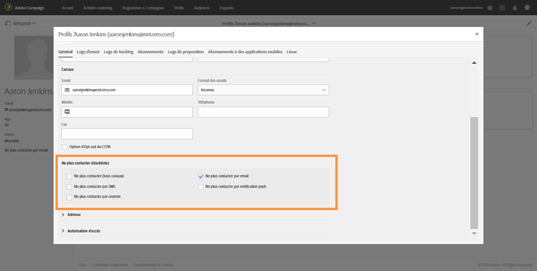
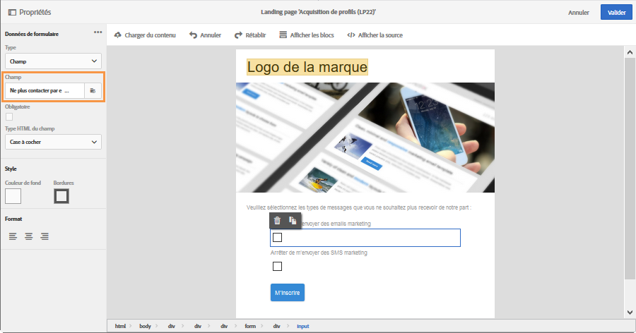
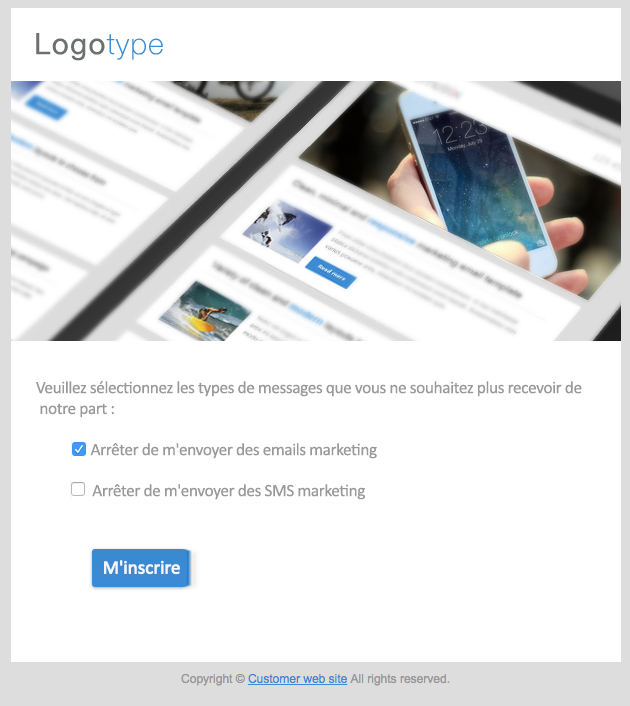
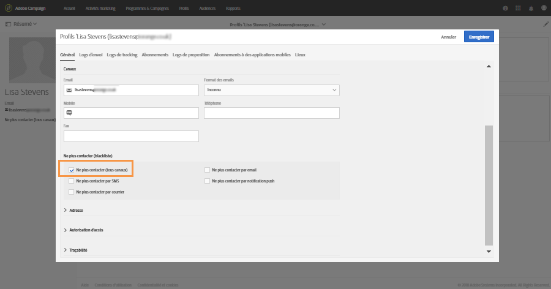

# Gestion des processus d’inscription et de désinscription dans Campaign{#managing-opt-in-and-opt-out-in-campaign}

## Gestion des processus d’inscription et de désinscription d’un profil {#managing-opt-in-and-opt-out-from-a-profile}

Les utilisateurs peuvent être inscrits ou désinscrits par un opérateur, directement depuis l’onglet **[!UICONTROL Général]** du profil.

Dans la section **[!UICONTROL Ne plus contacter (blackliste)]**, les cases à cocher sélectionnées correspondent aux canaux desquels l’utilisateur a décidé de se désinscrire. Sélectionnez les canaux en fonction des besoins de l’utilisateur.

## Configuration des landing pages d’inscription et de désinscription  {#setting-up-opt-in-and-opt-out-landing-pages}

Pour que les utilisateurs puissent s’inscrire ou se désinscrire, vous devez créer et publier une landing page **[!UICONTROL Acquisition de profils]**. Ils seront ensuite en mesure de choisir les canaux en fonction de leurs besoins. Pour ce faire, suivez les étapes suivantes.

Vous pouvez également configurer une landing page **[!UICONTROL Blackliste]**, qui permettra aux utilisateurs de se désinscrire de toutes les diffusions. Pour plus d’informations, consultez [Configuration d’une landing page pour désactiver toutes les diffusions](../../audiences/using/managing-opt-in-and-opt-out-in-campaign.md#setting-up-a-landing-page-to-opt-out-from-all-deliveries).

>[!NOTE]
>
>Les landing pages peuvent également être utilisées pour activer l’inscription aux services. Voir à ce propos [cette page](../../channels/using/designing-a-landing-page.md#linking-a-form-to-a-service).

1. Créez une landing page **[!UICONTROL Acquisition de profils]** (consulter [cette section](../../channels/using/about-landing-pages.md)).
1. Ajoutez une case à cocher au contenu de la landing page pour chaque canal souhaité, et reliez-la au champ correspondant de la base de données de Campaign.

   

1. Enregistrez la landing page et publiez-la.
1. Dans la landing page, les cases à cocher sont déjà sélectionnées en fonction de l’onglet **[!UICONTROL Général]** du profil. L’utilisateur peut sélectionner ou désélectionner les canaux en fonction de ses besoins et envoyer le formulaire.

   

1. Une fois le formulaire envoyé, l’onglet **[!UICONTROL Général]** du profil est mis à jour en fonction de la sélection de l’utilisateur.

   

### Configuration d’une landing page pour désactiver toutes les diffusions {#setting-up-a-landing-page-to-opt-out-from-all-deliveries}

Pour que les utilisateurs puissent s’inscrire ou se désinscrire de toutes les diffusions, vous devez créer et publier une landing page **[!UICONTROL Blackliste]**. Pour plus d’informations sur la création de landing pages, consultez [cette page](../../channels/using/about-landing-pages.md).

Lorsqu’un utilisateur clique sur le lien de la landing page, l’option **[!UICONTROL Ne plus contacter (tous canaux)]** du profil est automatiquement sélectionnée.

