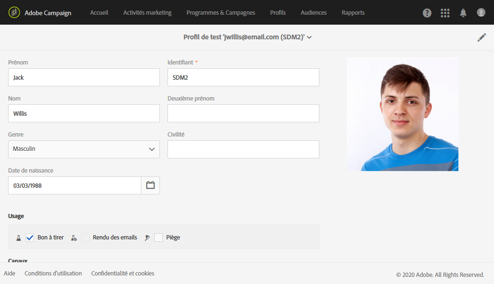
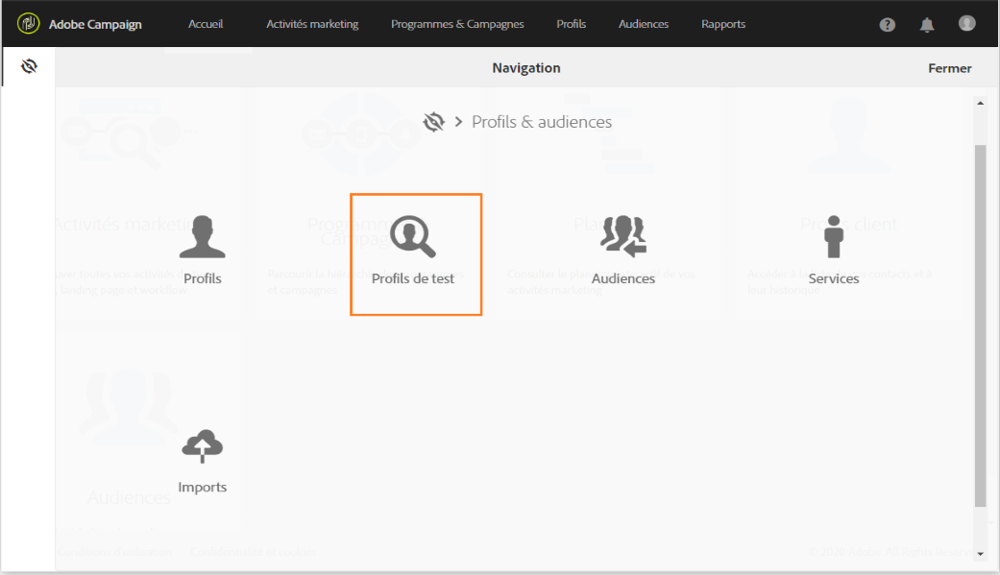
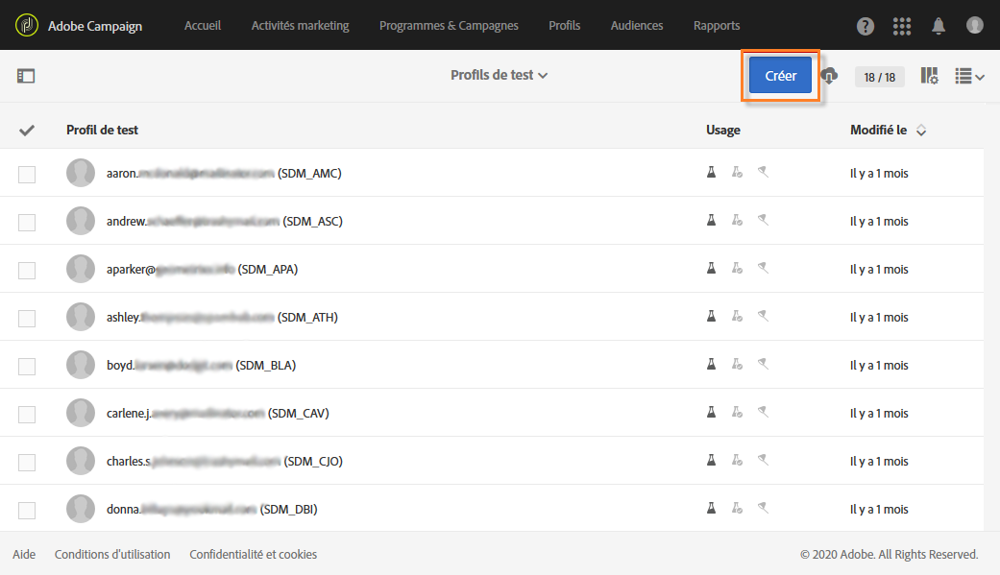
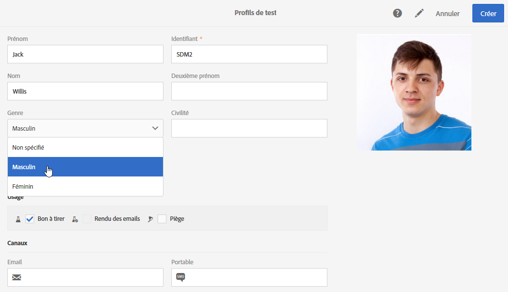
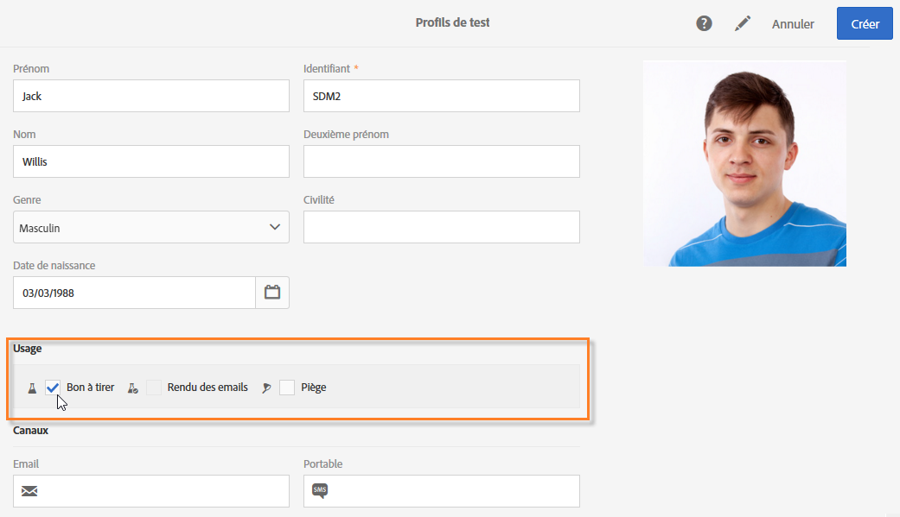
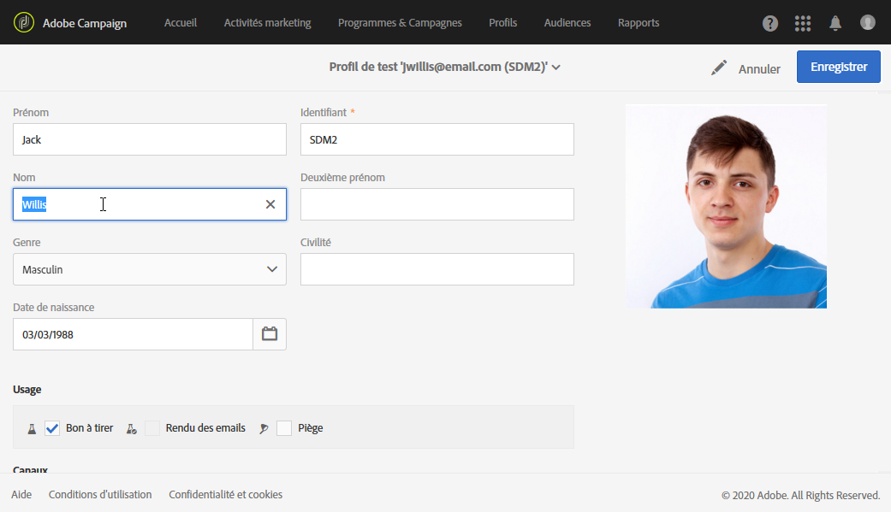

# Gestion des profils de test     {#managing-test-profiles}

## Profils de test {#about-test-profiles}

Les profils de test permettent de cibler des destinataires additionnels, qui ne correspondent pas aux critères de ciblage définis. Ils sont ajoutés à l&#39;audience d&#39;un message afin de détecter une utilisation frauduleuse de votre base de destinataire ou de contrôler la bonne réception de vos messages.

 [Découvrez cette fonctionnalité en vidéo](#video)

Vous pouvez gérer vos profils de test depuis le menu avancé **[!UICONTROL Profils &amp; audiences > Profils de test]**.

Un profil de test est un profil contenant des informations de contact fictives ou contrôlées par l&#39;expéditeur et pouvant être utilisé dans un message dans les contextes suivants :

* Pour envoyer un **Bon à tirer** : le bon à tirer (BAT) est un message spécifique qui permet de valider le message avant l&#39;envoi de la diffusion finalisée aux destinataires. Un profil de test de type Bon à tirer est chargé de la validation de la diffusion, tant sur son contenu que sur sa forme. Voir [Envoyer un bon à tirer](../../sending/using/sending-proofs.md).
* Pour le **Rendu des emails** : un profil de test de type Rendu des emails est utilisé pour contrôler l&#39;affichage d&#39;un message en fonction de la boîte de messagerie qui le réceptionne. Par exemple : webmail, service de messagerie, mobile, etc. Voir [Rendu des emails](../../sending/using/email-rendering.md).

   L&#39;usage **Rendu des emails** est en lecture seule. Des profils de test disposant de cet usage sont disponibles uniquement nativement dans Adobe Campaign.

* Comme **Piège** : le message est envoyé au profil de test tel qu&#39;il est envoyé à la cible principale. Voir [Utilisation de pièges](../../sending/using/using-traps.md).
* Pour la **Prévisualisation** des messages : un profil de test peut être sélectionné lors de la prévisualisation d&#39;un message afin de tester les éléments de personnalisation. Voir [Prévisualiser le message](/help/sending/using/previewing-messages.md).

## Créer un profil de test {#creating-test-profiles}

1. Pour accéder à la liste des profils de test, sélectionnez **Profils &amp; audiences > Profils de test** dans le menu de navigation (via le logo Adobe Campaign).

   

1. Depuis le tableau de bord des **[!UICONTROL Profils de test]**, cliquez sur **Créer**.

   

1. Renseignez les données de ce profil.

   

1. Sélectionnez l&#39;usage du profil de test.

   

1. Renseignez les canaux de contacts **[!UICONTROL Email, Téléphone, Mobile, Application mobile]**, ainsi que l&#39;adresse du profil de test si besoin.

   >[!NOTE]
   >
   >Vous pouvez définir une préférence de format d&#39;email : **[!UICONTROL Texte]** ou **[!UICONTROL HTML]**.

1. Spécifiez un type d&#39;événement et les données de cet événement si vous souhaitez utiliser ce profil de test pour tester la personnalisation d&#39;un message transactionnel.
1. Cliquez sur **[!UICONTROL Créer]** pour enregistrer le profil de test.

Le profil de test est alors ajouté dans la liste des profils.

## Editer un profil de test {#editing-test-profiles}

Pour éditer un profil de test et consulter les données qui lui sont associées, ou pour le modifier, les étapes sont les suivantes :

1. Sélectionnez le profil de test voulu en cliquant sur son image.
1. Consultez ou modifiez les champs.

   

1. Choisissez **[!UICONTROL Enregistrer]** si vous avez saisi des modifications ; ou sélectionnez le nom du profil de test puis **[!UICONTROL Profils de test]** dans la section supérieure de l&#39;écran pour revenir au tableau de bord des profils de test.

## Tutoriel vidéo {#video}

Cette vidéo montre comment créer un profil de test.

>[!VIDEO](https://video.tv.adobe.com/v/24094?quality=12)

D’autres vidéos pratiques sur Campaign Standard sont disponibles [ici](https://experienceleague.adobe.com/docs/campaign-standard-learn/tutorials/overview.html?lang=fr).
