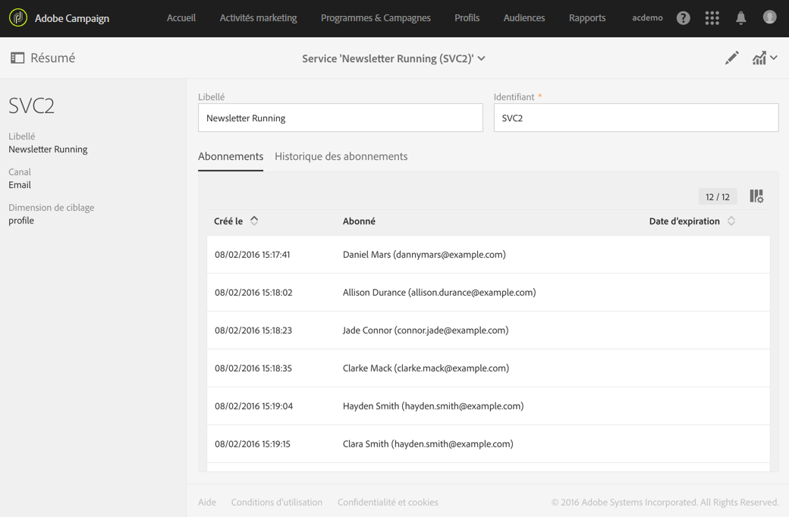
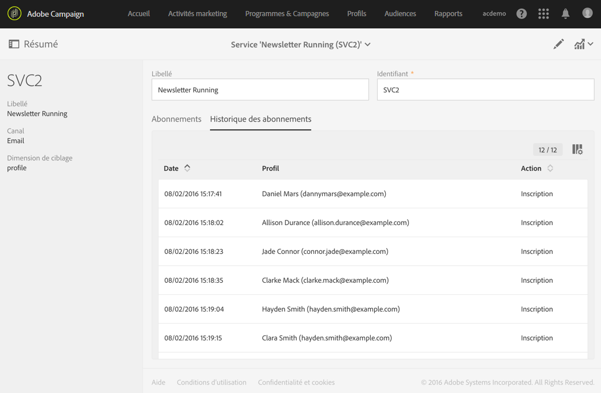
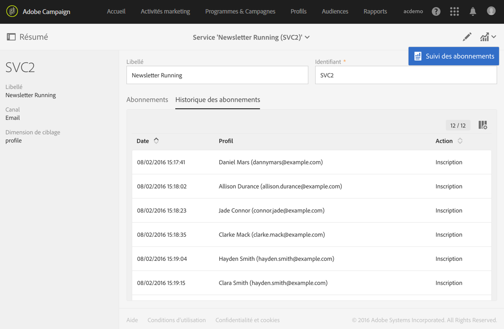
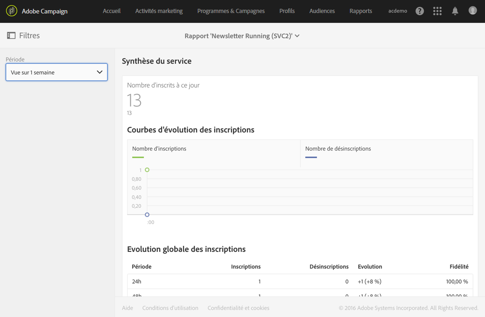
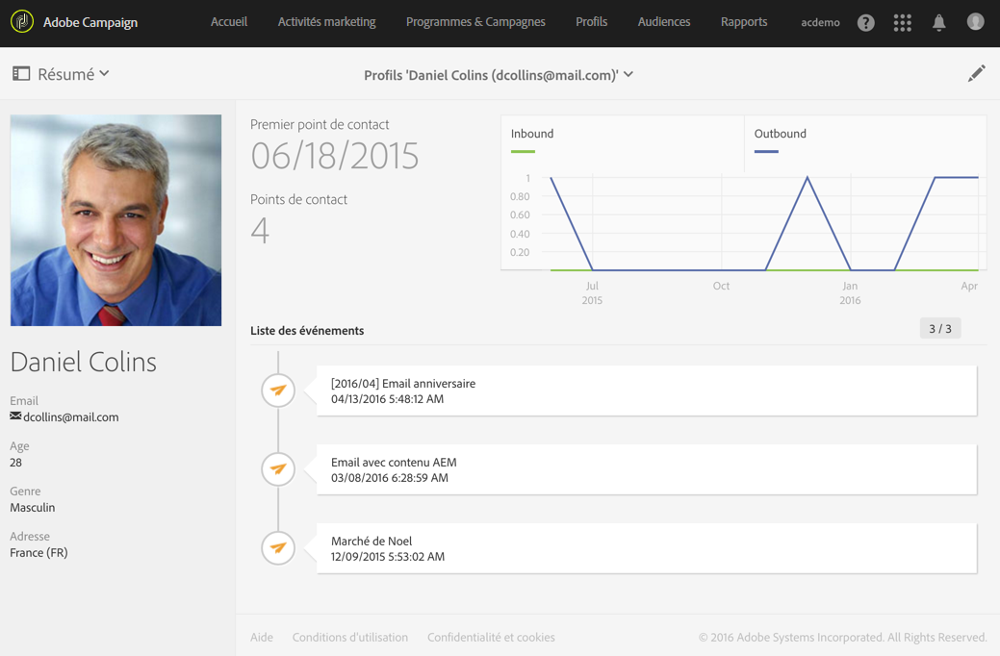

# Contrôler les inscriptions{#monitoring-subscriptions}

Utilisez l'interface d'Adobe Campaign pour tracker vos abonnés et mesurer le succès de vos services.

Vous disposez de plusieurs options pour contrôler les inscriptions et désinscriptions :

* Affichez la liste des personnes actuellement inscrites à votre service dans le tableau de bord du service. Voir [Tableau de bord du service](../../audiences/using/monitoring-subscriptions.md#service-dashboard).
* Consultez l'historique des abonnements et des désabonnements depuis l'onglet **Historique des abonnements** du tableau de bord du service. Voir [Historique des abonnements](../../audiences/using/monitoring-subscriptions.md#subscription-history).
* Affichez un rapport détaillant l'évolution des inscriptions et des désinscriptions dans les **Rapports** du service. Voir [Rapports du service](../../audiences/using/monitoring-subscriptions.md#service-reports).
* Recherchez la liste des services auxquels une personne a souscrit depuis son **Profil**. Voir [Historique des événements liés à un profil](../../audiences/using/monitoring-subscriptions.md#history-of-events-linked-to-a-profile).

## Tableau de bord du service  {#service-dashboard}

Pour visualiser la liste des personnes inscrites à un service :

1. Accédez à la liste des services via le menu avancé **Profils &amp; audiences** &gt; **Services**, accessible depuis le logo Adobe Campaign.
1. Sélectionnez le service de votre choix pour afficher le tableau de bord correspondant.
1. La liste des personnes inscrites au service figure sous l'onglet **Abonnements**.

## Applications mobiles  {#subscription-history}

Pour consulter l'historique des inscriptions et des désinscriptions au service :

1. Accédez à la liste des services via le menu avancé **Profils &amp; audiences** &gt; **Services**, accessible depuis le logo Adobe Campaign.
1. Sélectionnez le service de votre choix pour afficher le tableau de bord correspondant.
1. Sélectionnez l'onglet **Historique des abonnements** pour afficher les dates auxquelles chaque personne s'est inscrite et désinscrite.

## Rapports du service  {#service-reports}

Pour afficher un rapport présentant l'évolution des inscriptions et des désinscriptions :

1. Accédez à la liste des services via le menu avancé **Profils &amp; audiences** &gt; **Services**, accessible depuis le logo Adobe Campaign.
1. Sélectionnez le service de votre choix pour afficher le tableau de bord correspondant.
1. Cliquez sur le bouton **Rapports** dans la barre d'actions, puis sur **Contrôle des abonnements** dans l'écran de sélection.

   

1. Le rapport **Synthèse du service** présente le nombre d'inscrits, l'évolution globale des inscriptions et une courbe d'évolution dans le temps.

## Historique des événements liés à un profil  {#history-of-events-linked-to-a-profile}

Pour connaître la liste des services auxquels un contact s'est abonné, vous pouvez consulter son historique marketing. Voir à ce propos la section [Profil client intégré](../../audiences/using/integrated-customer-profile.md).

