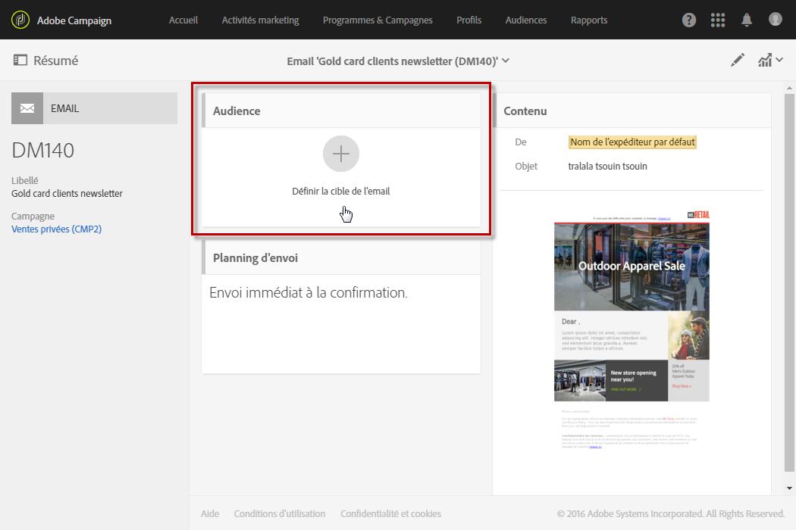
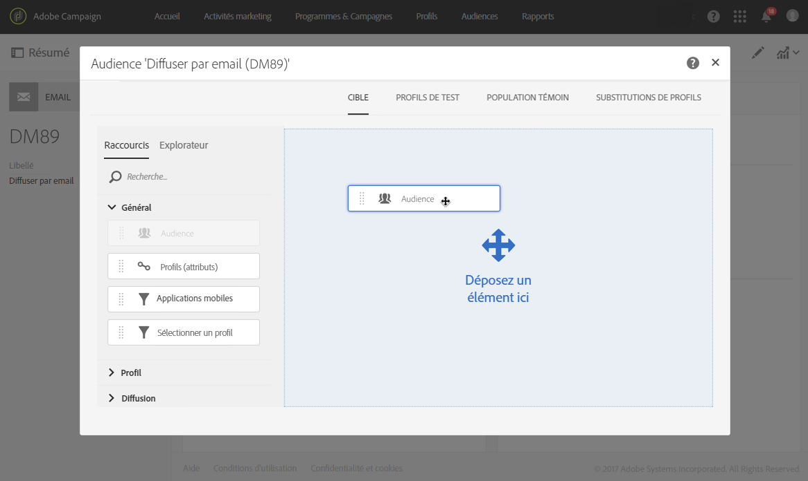
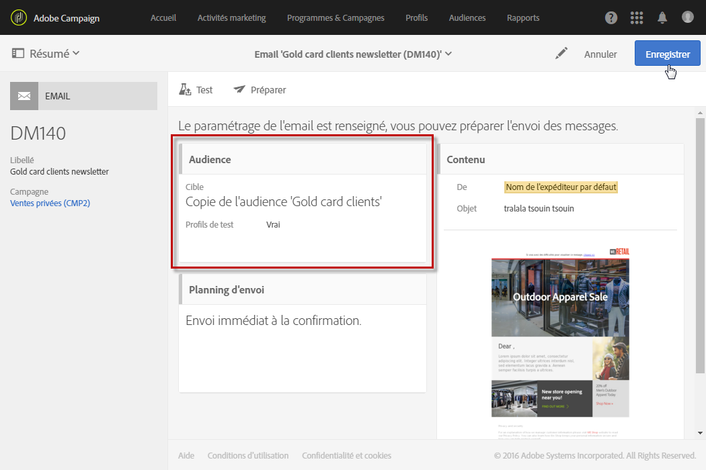

# Sélectionner une audience dans un message{#selecting-an-audience-in-a-message}

Adobe Campaign vous permet de paramétrer plusieurs types de profils dans les audiences d'un message.

Les audiences peuvent être définies au moment de la création du message via l'assistant de création ou depuis le tableau de bord du message s'il a déjà été créé.

>[!NOTE]
>
>Si l'audience a été créée dans un workflow et enrichie de données additionnelles, vous ne pourrez pas utiliser ces données pour personnaliser une diffusion autonome. Elles ne peuvent être utilisées qu'à partir d'une diffusion exécutée dans un workflow.

1. Depuis le tableau de bord, sélectionnez le bloc de définition des audiences.

   

   L'écran de définition des audiences s'ouvre. Il dispose de deux onglets permettant de définir distinctement la population de chaque type d'audience qui recevra le message :

   * Target
   * les profils de test.
   

1. Définissez la **[!UICONTROL cible]principale de l'email.** Il s'agit de l'audience cible standard de l'email.

   La cible est définie dans l'onglet **[!UICONTROL Cible]. Elle est constituée des profils identifiés de votre base de données.**

   Vous pouvez constituer votre cible principale à l'aide des fonctionnalités de l'[éditeur de requêtes](../../automating/using/editing-queries.md#creating-queries).

   Lorsque vous vous trouvez sur cet onglet, la palette **[!UICONTROL Raccourcis]contient uniquement les filtres prédéfinis et les audiences ayant été définis sur les profils identifiés.** L'onglet **[!UICONTROL Explorateur]vous permet d'accéder à des paramétrages supplémentaires.**

   Vous pouvez ainsi réutiliser et combiner des audiences existantes, leur appliquer des filtres supplémentaires, etc.

1. Définissez les **[!UICONTROL profils de test]que vous souhaitez utiliser pour l'email.** Les profils de test recevront les bons à tirer que vous pouvez envoyer pour tester l'email avant son envoi à la cible principale.

   Pour plus d'informations sur le paramétrage des profils de test, consultez la section [Profils de test](../../sending/using/managing-test-profiles-and-sending-proofs.md).

Le bloc des audiences est mis à jour et affiche qu'une cible ainsi que des profils de test ont été sélectionnés pour cet email.

