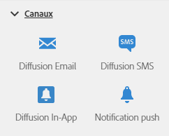

# À propos des activités des canaux{#about-channel-activities}

Depuis la palette, située à gauche de l&#39;écran, développez la section **[!UICONTROL Canaux]**.

Ces activités représentent les différents canaux de communication disponibles. Vous pouvez les combiner pour créer un workflow cross-canal.

La section **[!UICONTROL Canaux]** fournit les activités suivantes :

* [Diffusion e-mail](../../automating/using/email-delivery.md)
* [Diffusion SMS](../../automating/using/sms-delivery.md)
* [Diffusion notification push](../../automating/using/push-notification-delivery.md)
* [Diffusion courrier](../../automating/using/direct-mail-delivery.md)
* [Diffusion in-app](../../automating/using/in-app-delivery.md)
