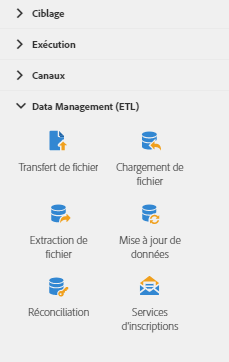

# A propos des activités de Data Management{#about-data-management-activities}

Depuis la palette, située à gauche de l'écran, développez la section **[!UICONTROL Data Management (ETL)].**

Ces activités vous permettent de manipuler les données. Elles permettent par exemple d'importer des données, d'effectuer des mises à jour en masse sur les champs de la base de données, de recevoir ou d'envoyer un fichier et d'associer des données non identifiées à des ressources existantes.

La section **[!UICONTROL Gestion des données (ETL)]fournit les activités suivantes :**

* [Mise à jour de données](../../automating/using/update-data.md)
* [Chargement de fichier](../../automating/using/load-file.md)
* [Transfert de fichier](../../automating/using/transfer-file.md)
* [Réconciliation](../../automating/using/reconciliation.md)
* [Extraction de fichier](../../automating/using/extract-file.md)
* [Services d'inscriptions](../../automating/using/subscription-services.md)

