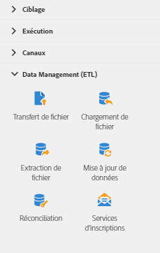

# À propos des activités de Data Management{#about-data-management-activities}

Depuis la palette, située à gauche de l&#39;écran, développez la section **[!UICONTROL Data Management (ETL)]**.

Ces activités vous permettent de manipuler les données. Elles permettent par exemple d&#39;importer des données, d&#39;effectuer des mises à jour en masse sur les champs de la base de données, de recevoir ou d&#39;envoyer un fichier et d&#39;associer des données non identifiées à des ressources existantes.

La section **[!UICONTROL Data Management (ETL)]** fournit les activités suivantes :

* [Mise à jour de données](../../automating/using/update-data.md)
* [Chargement de fichier](../../automating/using/load-file.md)
* [Transfert de fichier](../../automating/using/transfer-file.md)
* [Réconciliation](../../automating/using/reconciliation.md)
* [Extraction de fichier](../../automating/using/extract-file.md)
* [Services d’inscriptions](../../automating/using/subscription-services.md)

Les activités **[!UICONTROL Gestion des données (ETL)]** permettent de définir des **codes segment** pour leurs transitions sortantes. Vous pouvez ensuite créer des rapports à partir de ces codes segment pour mesurer l’efficacité des campagnes marketing. Voir à ce propos [cette section](../../reporting/using/creating-a-report-workflow-segment.md).
