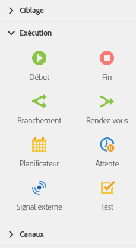

# A propos des activités d'exécution{#about-execution-activities}

Depuis la palette, située à gauche de l'écran, développez la section **[!UICONTROL Exécution]**.

Les activités ci-après sont spécifiques à l'organisation et à l'exécution du workflow. Leur principale tâche est de coordonner les autres activités.

La section **[!UICONTROL Exécution]** fournit les activités suivantes :

* [Début et Fin](../../automating/using/start-and-end.md)
* [Branchement](../../automating/using/fork.md)
* [Rendez-vous](../../automating/using/and-join.md)
* [Planificateur](../../automating/using/scheduler.md)
* [Attente](../../automating/using/wait.md)
* [Signal externe](../../automating/using/external-signal.md)
* [Test](../../automating/using/test.md)

