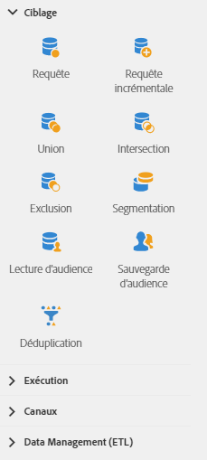

# A propos des activités de ciblage{#about-targeting-activities}

Depuis la palette, située à gauche de l'écran, développez la section **[!UICONTROL Ciblage]**.

Ces activités sont spécifiques à la réalisation d'un ciblage, à la manipulation et au filtrage de populations. Elles permettent de construire une ou plusieurs cibles en définissant des ensembles, puis en partitionnant ou en combinant ces ensembles à l'aide des opérations d'intersection, d'union ou d'exclusion.

La section **[!UICONTROL Ciblage]** fournit les activités suivantes :

* [Requête](../../automating/using/query.md)
* [Requête incrémentale](../../automating/using/incremental-query.md)
* [Union](../../automating/using/union.md)
* [Intersection](../../automating/using/intersection.md)
* [Exclusion](../../automating/using/exclusion.md)
* [Segmentation](../../automating/using/segmentation.md)
* [Lecture d'audience](../../automating/using/read-audience.md)
* [Sauvegarde d'audience](../../automating/using/save-audience.md)
* [Déduplication](../../automating/using/deduplication.md)
* [Enrichissement](../../automating/using/enrichment.md)

Les activités **[!UICONTROL Ciblage]** permettent de définir des **codes segment** pour leurs transitions sortantes. Vous pouvez ensuite créer des rapports à partir de ces codes segment pour mesurer l'efficacité des campagnes marketing. Voir à ce propos [cette section](../../reporting/using/creating-a-report-workflow-segment.md).
