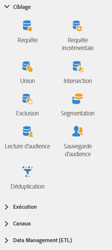

# À propos des activités de ciblage{#about-targeting-activities}

Depuis la palette, située à gauche de l&#39;écran, développez la section **[!UICONTROL Ciblage]**.

Ces activités sont spécifiques à la réalisation d&#39;un ciblage, à la manipulation et au filtrage de populations. Elles permettent de construire une ou plusieurs cibles en définissant des ensembles, puis en partitionnant ou en combinant ces ensembles à l&#39;aide des opérations d&#39;intersection, d&#39;union ou d&#39;exclusion.

La section **[!UICONTROL Ciblage]** fournit les activités suivantes :

* [Requête](../../automating/using/query.md)
* [Requête incrémentale](../../automating/using/incremental-query.md)
* [Union](../../automating/using/union.md)
* [Intersection](../../automating/using/intersection.md)
* [Exclusion](../../automating/using/exclusion.md)
* [Segmentation](../../automating/using/segmentation.md)
* [Lecture d&#39;audience](../../automating/using/read-audience.md)
* [Sauvegarde d&#39;audience](../../automating/using/save-audience.md)
* [Déduplication](../../automating/using/deduplication.md)
* [Enrichissement](../../automating/using/enrichment.md)

Les activités **[!UICONTROL Ciblage]** permettent de définir des **codes segment** pour leurs transitions sortantes. Vous pouvez ensuite créer des rapports à partir de ces codes segment pour mesurer l’efficacité des campagnes marketing. Voir à ce propos [cette section](../../reporting/using/creating-a-report-workflow-segment.md).

## Sélectionner les données {#selecting-data}

Vous pouvez sélectionner les données à l&#39;aide des activités suivantes :

* L’activité **[!UICONTROL Requête]** permet de filtrer et d’extraire une population d’éléments de la base de données Adobe Campaign. Consultez la section [Requête](../../automating/using/query.md).
* L&#39;activité **[!UICONTROL Requête incrémentale]** permet de filtrer et d&#39;extraire une population d&#39;éléments de la base de données Adobe Campaign. A chaque nouvelle exécution de cette activité, les résultats des exécutions précédentes sont exclus. Cela vous permet de cibler uniquement les nouveaux éléments. Voir la section [Requête incrémentale](../../automating/using/incremental-query.md).
* L’activité **[!UICONTROL Lecture d’audience]** permet de récupérer une audience existante et de l’affiner en y appliquant des conditions de filtrage supplémentaires.Pour plus d’informations, consultez la section [Lecture d’audience](../../automating/using/read-audience.md).

## Segmentation des données {#segmenting-data}

Adobe Campaign permet de traiter des ensembles de données entrantes. Il est ainsi possible de regrouper plusieurs populations, d’en exclure une partie ou de ne conserver que les données communes entre plusieurs cibles.

* L&#39;activité **[!UICONTROL Union]** permet de regrouper le résultat de plusieurs activités dans une même cible. Pour plus d&#39;informations, consultez la section [Union](../../automating/using/union.md).
* L&#39;activité **[!UICONTROL Intersection]** permet de ne conserver que les éléments communs aux différentes populations entrantes dans l&#39;activité. Pour plus d&#39;informations, consultez la section [Intersection](../../automating/using/intersection.md).
* L&#39;activité **[!UICONTROL Exclusion]** permet d&#39;exclure des éléments d&#39;une population selon certains critères. Pour plus d&#39;informations, consultez la section [Exclusion](../../automating/using/exclusion.md).
* L&#39;activité **[!UICONTROL Segmentation]** permet de créer un ou plusieurs segments à partir d&#39;une population calculée par des activités placées en amont. En sortie de l’activité, ils peuvent être traités dans une seule transition ou dans des transitions distinctes. Consultez la section [Segmentation](../../automating/using/segmentation.md).

## Enrichir des données {#enriching-data}

Les données identifiées et collectées peuvent être enrichies, regroupées et manipulées afin d&#39;optimiser la construction de la cible. Vous pouvez simplifier et optimiser les processus de ciblage en incluant des données qui ne sont pas modélisées dans le datamart.

L&#39;onglet **[!UICONTROL Données additionnelles]** des activités **[!UICONTROL Requête]** et **[!UICONTROL Requête incrémentale]** permet d&#39;enrichir les données ciblées par la requête et de transmettre ces données aux activités suivantes du workflow, où elles pourront être exploitées. Il est notamment possible d’ajouter :

* des données simples.
* des agrégats.
* des collections.

**Rubriques connexes :**

* [Cas pratique : personnaliser un email avec des données additionnelles](../../automating/using/personalizing-email-with-additional-data.md)
