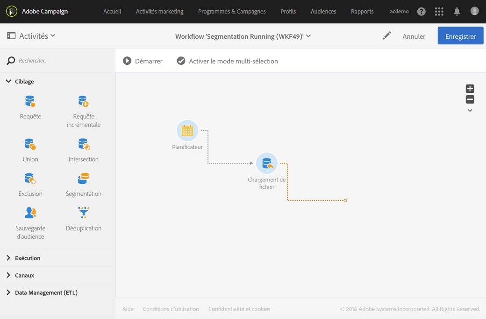

# À propos de l’exécution d’un workflow {#about-workflow-execution}

Un workflow est toujours démarré manuellement. Une fois lancé, il peut toutefois rester inactif selon les informations spécifiées via un [planificateur](../../automating/using/scheduler.md).

>[!IMPORTANT]
>
> Adobe recommande à ses clients de ne pas exécuter plus de 20 workflows actifs simultanément ainsi que de hiérarchiser et d&#39;étaler l&#39;exécution des workflows dans le temps. Pour en savoir plus, consultez les bonnes pratiques disponibles sur [cette page](../../automating/using/best-practices-workflows.md).

Les actions relatives à l’exécution (lancement, arrêt, pause, etc.) sont des processus **asynchrones** : la commande est enregistrée et sera effective dès que le serveur est disponible pour l’appliquer.

En général, dans un workflow, le résultat de chaque activité est transmis à l’activité suivante via une transition, représentée par une flèche.

Une transition est flottante si elle n’est pas rattachée à une activité de destination.

>[!NOTE]
>
>Un workflow contenant des transitions flottantes peut être exécuté : lors de l’activation d’une telle transition, l’exécution génère un avertissement et se trouve suspendue, mais aucune erreur n’est entraînée. Il est ainsi possible de démarrer un workflow sans en avoir terminé la conception et de le compléter au fur et à mesure.

Lorsqu’une activité a été exécutée, le nombre d’enregistrements transmis dans la transition est affiché au-dessus de cette dernière.

Vous pouvez ouvrir les transitions afin de vérifier que les données transmises sont correctes pendant ou après l’exécution du workflow. Vous pouvez visualiser les données présentes ainsi que leur structure.

Pour pouvoir accéder au détail des transitions intermédiaires (autres que la dernière transition du workflow), vous devez cocher l’option **[!UICONTROL Conserver les résultats intermédiaires]** dans la section **[!UICONTROL Exécution]** des propriétés du workflow avant de démarrer le workflow.

>[!NOTE]
>
>Cette option consomme beaucoup de mémoire et a été conçue pour vous aider à construire un workflow et à vous assurer que sa configuration et son comportement sont corrects. Laissez-la décochée sur les instances de production.

Lorsqu’une transition est ouverte, vous pouvez modifier son **[!UICONTROL Libellé]** ou lui associer un **[!UICONTROL Code segment]**. Pour cela, éditez les champs correspondants et validez vos modifications.

Les API REST Campaign Standard vous permettent de **démarrer**, **mettre en pause**, **reprendre** et **arrêter** un workflow. Vous trouverez plus d’informations et d’exemples d’appels REST dans la [documentation de l’API.](../../api/using/controlling-a-workflow.md)
