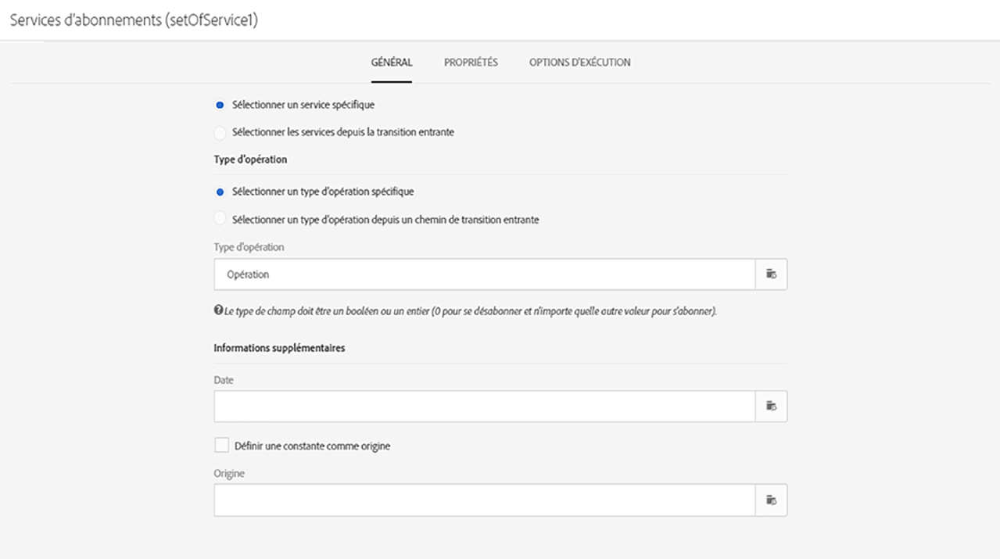
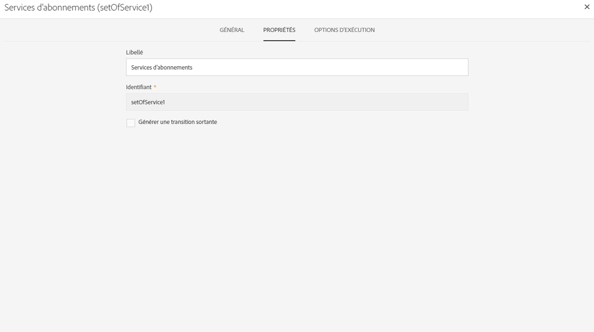

# Gestion des propriétés des activités {#activity-properties}

## Propriétés globales d’une activité {#global-properties-of-an-activity}

Chaque activité dispose d’un onglet **[!UICONTROL Général]** qui permet de modifier les paramètres généraux propres à l’activité.

L’onglet **[!UICONTROL Propriétés]** permet de modifier les paramètres globaux de l’activité, notamment le libellé et l’identifiant. La configuration de cet onglet est facultative.

## Gestion des transitions sortantes d’une activité       {#managing-an-activity-s-outbound-transitions}

Par défaut, certaines activités ne possèdent pas de transition sortante. Vous pouvez en ajouter à partir de l’onglet **[!UICONTROL Transitions]** ou de l’onglet **[!UICONTROL Propriétés]** de l’activité afin d’appliquer d’autres traitements à votre population dans un même workflow.

En fonction des activités, vous pouvez ajouter plusieurs types de transitions sortantes :

* **Transition standard** : population calculée par l’activité.
* **Transition sans population** : ce type de transition sortante peut être ajouté pour continuer le workflow et ne contient pas de population afin de ne pas occuper d’espace inutilement sur le système.
* **Rejets** : population rejetée. Par exemple, si des données en entrée d’une activité n’ont pas pu être traitées car incorrectes ou non complètes.
* **Complémentaire** : population restante après exécution de l’activité. Par exemple, si une activité de segmentation est paramétrée pour ne conserver qu’un pourcentage de la population entrante.

Vous pouvez indiquer un **[!UICONTROL Code segment]** pour la transition sortante d’une l’activité. Ce code segment permet d’identifier d’où viennent les sous-ensembles de la population cible finale, et peut par la suite servir à des fins de personnalisation dans un message.

## Options d’exécution d’une activité       {#activity-execution-options}

L’écran des propriétés d’une activité comporte un onglet **[!UICONTROL Options d’exécution]** vous permettant notamment de définir son mode d’exécution et le comportement en cas d’erreur.

Pour y accéder, sélectionnez l’activité de votre choix dans un workflow, puis ouvrez-la à l’aide du bouton  de la barre d’actions.

Le champ **[!UICONTROL Exécution]** vous permet de définir l’action à effectuer au moment du déclenchement de la tâche. Trois options sont disponibles :

* **Normale** : l’activité est exécutée normalement.
* **Activer mais ne pas exécuter** : l’activité est mise en pause, de même que, par voie de conséquence, les futurs traitements qui en découlent. Cela peut s’avérer utile si vous souhaitez assister au déclenchement de la tâche.
* **Ne pas activer** : l’activité n’est pas exécutée, de même que, par voie de conséquence, toutes celles qui lui succèdent (dans la même branche).

Le champ **[!UICONTROL En cas d’erreur]** vous permet de définir l’action à effectuer lorsque l’activité a rencontré une erreur. Deux options sont disponibles :

* **Suspendre le processus** : le workflow est automatiquement suspendu. Le statut du workflow est alors **En erreur** et la couleur qui lui est associée passe au rouge. Lorsque le problème est résolu, relancez le workflow.
* **Ignorer** : l’activité n’est pas exécutée, de même que, par voie de conséquence, toutes celles qui lui succèdent (dans la même branche). Cela peut s’avérer utile dans le cas de tâches récurrentes. Si la branche comporte un planificateur placé en amont, celui-ci se déclenchera normalement à sa prochaine date d’exécution.

Le champ **[!UICONTROL Comportement]** vous permet de définir la marche à suivre en cas de tâches asynchrones. Deux options sont disponibles :

* **Plusieurs tâches autorisées** : plusieurs tâches peuvent être exécutées en même temps, même si la première n’est pas terminée.
* **La tâche en cours est prioritaire** : lorsqu’une tâche est en cours, celle-ci est prioritaire. Tant qu’une tâche est toujours en cours, aucune autre tâche ne sera exécutée.

Le champ **[!UICONTROL Durée max. d’exécution]** vous permet d’indiquer une durée de type &quot;30s&quot; ou &quot;1h&quot;. Si l’activité n’est pas terminée une fois cette durée écoulée, une alerte est déclenchée, ce qui n’a par ailleurs aucun impact sur le fonctionnement du workflow.

Le champ **[!UICONTROL Affinité]** vous permet de forcer l’exécution d’un workflow ou d’une activité de workflow sur une machine en particulier. Vous devez pour cela définir une ou plusieurs affinités au niveau du workflow ou de l’activité concernée.

Le champ **[!UICONTROL Fuseau horaire]** vous permet de sélectionner le fuseau horaire de l’activité. Adobe Campaign permet de gérer les décalages horaires entre plusieurs pays concernés par la même instance. La configuration appliquée est paramétrée lors de la création de l’instance.

>[!NOTE]
>
>Par défaut, si aucun fuseau horaire n’est sélectionné, l’activité utilise le fuseau horaire défini dans les propriétés du workflow.

Le champ **Commentaire** est un champ libre vous permettant d’ajouter une note.
