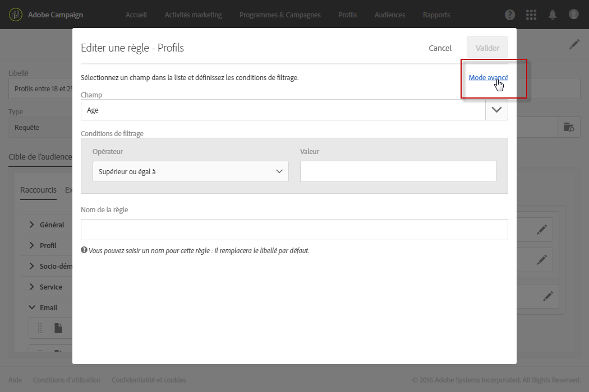

# Edition avancée d'expressions{#advanced-expression-editing}

## A propos de l'édition avancée d'expressions {#about-advanced-expression-editing}

L'édition d'une expression consiste à saisir manuellement des conditions pour former une règle.

Ce mode permet d'utiliser des fonctions avancées. Ces fonctions permettent de manipuler les valeurs utilisées afin de réaliser des requêtes spécifiques : manipulation de dates, de chaînes, de champs numériques, tris, etc.

Il est également possible d'utiliser des variables d'événements lors de l'édition d'une expression. Voir à ce propos la section [Personnaliser les activités avec des variables d'événements](../../automating/using/calling-a-workflow-with-external-parameters.md#customizing-activities-with-events-variables).

L'édition d'expressions peut être utilisée lors des opérations suivantes :

* définition d'une requête, via l'option **[!UICONTROL Mode avancé]disponible lors de l'ajout d'une règle.**

   

* édition d'une expression dans un workflow. Par exemple pour ajouter des données additionnelles dans une activité.
* édition d'une condition de visibilité pour définir l'affichage d'un bloc de l'éditeur de contenus HTML. Dans ce cas, l'expression est éditée au format JavaScript et ne propose pas l'utilisation des fonctions avancées standard.

## Editer une expression {#edit-an-expression}

L'édition avancée d'expressions vous permet de définir manuellement une expression répondant spécifiquement à vos besoins.

L'édition des expressions peut être utilisée dans la fenêtre Audience lors de la création d'un email ou dans une activité de type Requête lors de la création d'un workflow.

1. Accédez à la fenêtre d'édition d'expression par l'un des moyens décrits dans la section [A propos de l'édition avancée d'expressions](../../automating/using/advanced-expression-editing.md#about-advanced-expression-editing). Elle se compose des éléments suivants :

   * un champ de saisie, dans lequel l'expression est définie
   * la liste des champs disponibles, utilisables dans l'expression, et correspondant à la dimension de ciblage de la requête (voir [Dimensions de ciblage et ressources](../../automating/using/query.md#targeting-dimensions-and-resources)).
   * la liste des fonctions disponibles, triées par catégorie.
   

1. Editez l'expression en saisissant directement une expression dans le champ correspondant ou en vous aidant de la liste des champs ainsi que de la liste des fonctions disponibles.

   En double-cliquant sur un champ ou une fonction, celui-ci est ajouté à l'expression à l'endroit où est placé le curseur de saisie.

   Il est possible d'utiliser les variables d'événements des workflows pour créer une expression. Voir à ce propos la section [Personnaliser les activités avec des variables d'événements](../../automating/using/calling-a-workflow-with-external-parameters.md#customizing-activities-with-events-variables).

1. Si besoin, donnez à votre règle un nom spécifique. Le nom saisi apparaîtra au niveau de la règle dans l'espace de travail de l'outil d'édition de requêtes.

L'édition d'une expression vous permet de personnaliser l'expression Audiences afin de cibler votre population selon vos besoins.

**Rubriques connexes :**

* [Syntaxe des expressions](../../automating/using/advanced-expression-editing.md#expression-syntax)
* [Liste des fonctions](../../automating/using/list-of-functions.md)

## Syntaxe des expressions {#expression-syntax}

### Syntaxe standard {#standard-syntax}

Les expressions standard sont composées d'une ou plusieurs conditions, respectant les éléments de syntaxe suivants :

* Chaque condition est de la forme **&lt;valeur1&gt; &lt;opérateur de comparaison&gt; &lt;valeur2&gt;** où :

   * **&lt;valeur1&gt;** est un champ ou une fonction. Par exemple **@created** pour la date de création d'un profil ou **Year(@created)** pour l'année de création d'un profil.
   * **&lt;opérateur de comparaison&gt;** est l'un des opérateurs listés dans la section [Opérateurs de comparaison](../../automating/using/advanced-expression-editing.md#comparison-operators). Cet opérateur définit la méthode de comparaison entre **&lt;valeur1&gt;** et **&lt;valeur2&gt;**.
   * **&lt;valeur2&gt;** est un champ, une fonction ou une valeur saisie manuellement.
   >[!NOTE]
   >
   >Le type de données de **&lt;valeur1&gt;** et de **&lt;valeur2&gt;** doit être identique. Par exemple, si **&lt;valeur1&gt;** est une date, alors **&lt;valeur2&gt;** doit également être une date.

* Si vous souhaitez utiliser plusieurs conditions, elles peuvent être combinées à l'aide d'opérateurs logiques.

   * **[!UICONTROL AND]** : intersection des deux conditions
   * **[!UICONTROL OR]** : union des deux conditions.

Par exemple :

```
Year(@created) = Year(GetDate()) AND Month(@created) = Month(GetDate())
```

Dans cet exemple sont ciblés les profils dont la date de création correspond au mois et à l'année courants.

### Syntaxe JavaScript {#javascript-syntax}

Lors de la définition des conditions de visibilité d'un bloc de type texte de l'éditeur de contenus HTML, vous devez utiliser une expression dont la syntaxe est de type JavaScript.

Les expressions JavaScript sont composées d'une ou plusieurs conditions, respectant les éléments de syntaxe suivants :

* Chaque condition est de la forme **&lt;contexte&gt; &lt;opérateur de comparaison&gt; &lt;valeur2&gt;** où :

   * **&lt;contexte&gt;** correspond à un champ ou une fonction permettant de préciser le contexte. Par exemple, **context.profile.@email** pour l'adresse email d'un profil ou **context.profile.firstName.length()** pour le nombre de caractères du prénom d'un profil.
   * **&lt;opérateur de comparaison&gt;** est l'un des opérateurs listés dans la section [Opérateurs de comparaison](../../automating/using/advanced-expression-editing.md#comparison-operators). Cet opérateur définit la méthode de comparaison entre **&lt;contexte&gt;** et **&lt;valeur2&gt;**.
   * **&lt;valeur2&gt;** est un champ, une fonction ou une valeur saisie manuellement.
   >[!NOTE]
   Le type de données de **&lt;contexte&gt;** et de **&lt;valeur2&gt;** doit être identique. Par exemple, si **&lt;contexte&gt;** est une date, alors **&lt;valeur2&gt;** doit également être une date.

* Si vous souhaitez utiliser plusieurs conditions, elles peuvent être combinées à l'aide d'opérateurs logiques.

   * **[!UICONTROL &amp; &amp;]**: deux conditions sont intersectées.
   * **[!UICONTROL ||]**: union des deux conditions.

Par exemple :

```
context.profile.age > 21 && context.profile.firstName.length() > 0
```

Dans cet exemple sont ciblés les profils de plus de 21 ans et dont le prénom est bien renseigné (symbolisé par le fait que le champ **firstName** contienne au moins un caractère).

## Opérateurs de comparaison {#comparison-operators}

Pour certaines règles, l'éditeur de requêtes vous permet de choisir une valeur afin de définir votre condition.

Les conditions doivent être liées aux valeurs à l'aide de l'un des opérateurs ci-après.

<table> 
 <thead> 
  <tr> 
   <th> Opérateur<br /> </th> 
   <th> Syntaxe standard<br /> </th> 
   <th> Syntaxe JavaScript<br /> </th> 
   <th> Description<br /> </th> 
   <th> Exemple<br /> </th> 
  </tr> 
 </thead> 
 <tbody> 
  <tr> 
   <td> <span class="uicontrol">Egal à</span> <br /> </td> 
   <td> =<br /> </td> 
   <td> ==<br /> </td> 
   <td> La première valeur doit être rigoureusement identique à la seconde valeur.<br /> </td> 
   <td> <strong>@lastName = Martin</strong> permet de retrouver les profils dont le nom est 'Martin', avec les seuls caractères indiqués.<br /> </td> 
  </tr> 
  <tr> 
   <td> <span class="uicontrol">Supérieur à</span> <br /> </td> 
   <td> &gt;<br /> </td> 
   <td> &gt;<br /> </td> 
   <td> La première valeur doit être strictement supérieure à la seconde valeur.<br /> </td> 
   <td> <strong>@age &gt; 50</strong> permet de retrouver les profils dont l'âge est supérieur à 50, donc 51, 52, etc.<br /> </td> 
  </tr> 
  <tr> 
   <td> <span class="uicontrol">Inférieur à</span> <br /> </td> 
   <td> &lt;<br /> </td> 
   <td> &lt;<br /> </td> 
   <td> La première valeur doit être strictement inférieure à la seconde valeur.<br /> </td> 
   <td> <strong>@created &lt; DaysAgo(100)</strong> permet de retrouver tous les profils créés dans la base de données il y a moins de 100 jours.<br /> </td> 
  </tr> 
  <tr> 
   <td> <span class="uicontrol">Supérieur ou égal à</span> <br /> </td> 
   <td> &gt;=<br /> </td> 
   <td> &gt;=<br /> </td> 
   <td> La première valeur doit être supérieure ou égale à la seconde valeur.<br /> </td> 
   <td> <strong>@age &gt;= 30</strong> permet de retrouver les profils âgés de 30 ans et plus.<br /> </td> 
  </tr> 
  <tr> 
   <td> <span class="uicontrol">Inférieur ou égal à</span> <br /> </td> 
   <td> &lt;=<br /> </td> 
   <td> &lt;=<br /> </td> 
   <td> La première valeur doit être inférieure ou égale à la seconde valeur.<br /> </td> 
   <td> <strong>@age &lt;= 60</strong> permet de retrouver les profils âgés de 60 ans ou moins.<br /> </td> 
  </tr> 
  <tr> 
   <td> <span class="uicontrol">Différentes </span> <br /> </td> 
   <td> !=<br /> </td> 
   <td> !=<br /> </td> 
   <td> La première valeur doit être différente de la seconde valeur.<br /> </td> 
   <td> <strong>@Langue != Anglais</strong> permet de retrouver les profils n'étant pas définis comme anglophones.<br /> </td> 
  </tr> 
  <tr> 
   <td> <span class="uicontrol">Contient</span> <br /> </td> 
   <td> IN<br /> </td> 
   <td> N/A<br /> </td> 
   <td> La première valeur doit contenir la seconde valeur.<br /> </td> 
   <td> <strong>@domain IN mail</strong>. Ici, tous les noms de domaine comportant la valeur 'mail' sont retournés en résultat. Par conséquent, le nom de domaine 'gmail.com' fera partie des résultats retournés.<br /> </td> 
  </tr> 
  <tr> 
   <td> <span class="uicontrol">Comme</span> <br /> </td> 
   <td> LIKE<br /> </td> 
   <td> N/A<br /> </td> 
   <td> <span class="uicontrol">Comme</span> est quasiment identique à l'opérateur <span class="uicontrol">Contient. </span> Il permet d'insérer un caractère de substitution <span class="uicontrol">%</span> dans la valeur recherchée.<br /> </td> 
   <td> <strong>@lastName LIKE Mart%n</strong>. Ici, le caractère <strong>%</strong> de substitution sert de "joker" afin de retrouver le nom "Martin" dans le cas hypothétique où l'orthographe d'une valeur n'est pas certaine.<br /> </td> 
  </tr> 
  <tr> 
   <td> <span class="uicontrol">Pas comme</span> <br /> </td> 
   <td> NOT<br /> </td> 
   <td> N/A<br /> </td> 
   <td> Similaire à <span class="uicontrol">Comme</span>. Permet de ne pas obtenir la valeur renseignée. La valeur renseignée doit ici aussi comporter le caractère de substitution <span class="uicontrol">%</span>.<br /> </td> 
   <td> <strong>@lastName NOT Smi%h</strong>. Ici, les destinataires répondant au nom de 'Smi%h' (donc Smith, etc.) ne sont pas retournés en résultat.<br /> </td> 
  </tr> 
  <tr> 
   <td> <span class="uicontrol">Est vide</span> <br /> </td> 
   <td> IS NULL<br /> </td> 
   <td> N/A<br /> </td> 
   <td> La première valeur doit correspondre à une valeur vide.<br /> </td> 
   <td> <strong>@mobilePhone IS NULL</strong> permet de retrouver tous les profils dont le numéro de téléphone portable n'est pas renseigné.<br /> </td> 
  </tr> 
 </tbody> 
</table>

