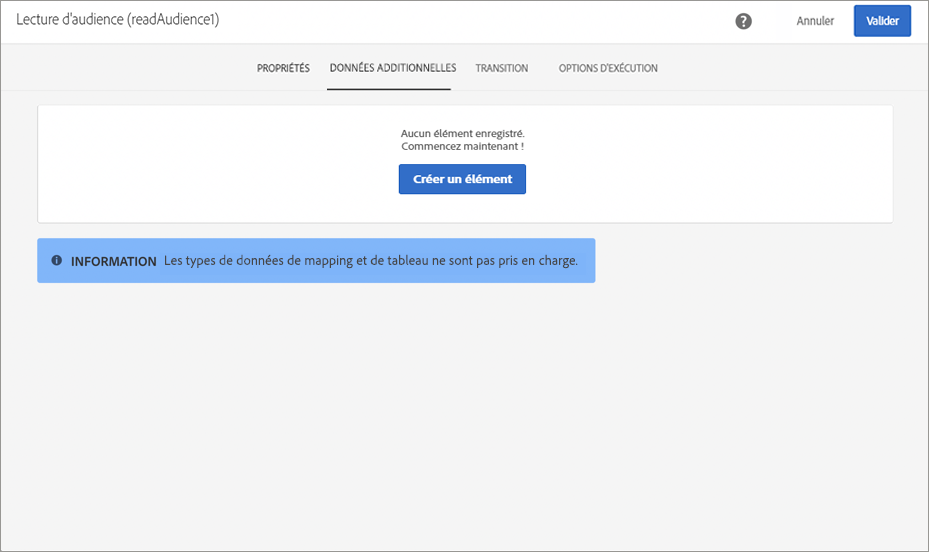
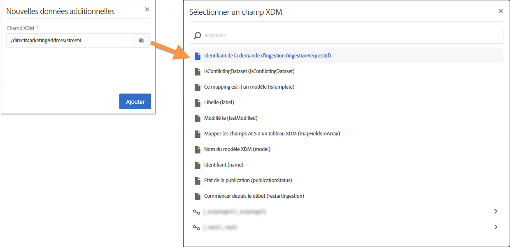

# Personnalisation des campagnes à l’aide des attributs d’Adobe Experience Platform {#personalizing-campaigns-using-aep-attributes}

>[!IMPORTANT]
>
>Le service Audience Destinations est actuellement en version bêta et peut être fréquemment mis à jour sans préavis. Les clients doivent être hébergés sur Azure (actuellement en version bêta en Amérique du Nord uniquement) pour accéder à ces fonctionnalités. Contactez l’Assistance clientèle d’Adobe si vous souhaitez y accéder.
>
>Les canaux **push** et **In-App** ne sont pas encore disponibles pour la personnalisation à l’aide de données contextuelles issues d’Adobe Experience Platform.

Une fois votre workflow configuré avec une [audience Adobe Experience Platform](../../audiences/using/aep-about-audience-destinations-service.md), vous pouvez personnaliser les messages à l’aide des attributs de profil présents exclusivement dans Experience Data Model (XDM).

Pour ce faire, vous devez ajouter ces attributs à l’activité **[!UICONTROL Lecture d’audience]** :

1. Ouvrez l’activité **[!UICONTROL Lecture d’audience]**. Dans l’onglet **[!UICONTROL Données additionnelles]**, cliquez sur le bouton **[!UICONTROL Créer un élément]**.

   Notez que l’onglet **[!UICONTROL Données additionnelles]** n’est disponible qu’après la sélection d’une audience Adobe Experience Platform.

   

   >[!NOTE]
   >
   >Les types de données tableau et carte ne sont pas pris en charge dans cette fonctionnalité. En outre, seules les données du schéma d’union s’affichent dans le sélecteur.

1. Sélectionnez un champ XDM dans la liste, puis cliquez sur **[!UICONTROL Confirmer]**.

   

1. Cliquez sur le bouton **[!UICONTROL Ajouter]** pour l’ajouter à la liste des données additionnelles.

   

1. Répétez ces étapes pour chaque champ XDM que vous souhaitez ajouter à votre workflow.

   >[!NOTE]
   >
   >Vous pouvez ajouter 20 champs XDM au maximum dans une activité **[!UICONTROL Lecture d’audience]**.

1. Une fois tous les champs ajoutés, cliquez sur le bouton **[!UICONTROL Confirmer]** pour enregistrer les modifications. Les champs sont désormais à votre disposition pour personnaliser les diffusions.

Pour plus d’informations sur la création et la personnalisation de diffusions, voir la documentation de Campaign Standard :

* [Découvrir les canaux de communication](../../channels/using/get-started-communication-channels.md)
* [A propos des activités des canaux](../../automating/using/about-channel-activities.md)
* [Personnaliser les diffusions](../../designing/using/personalization.md)
