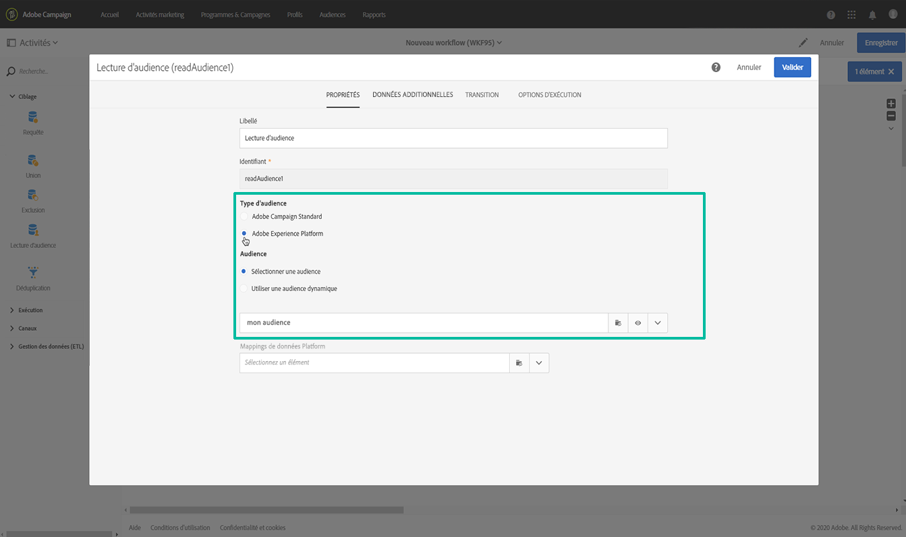
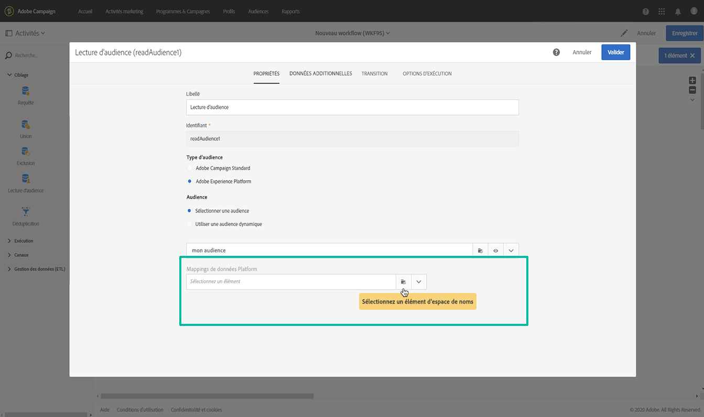
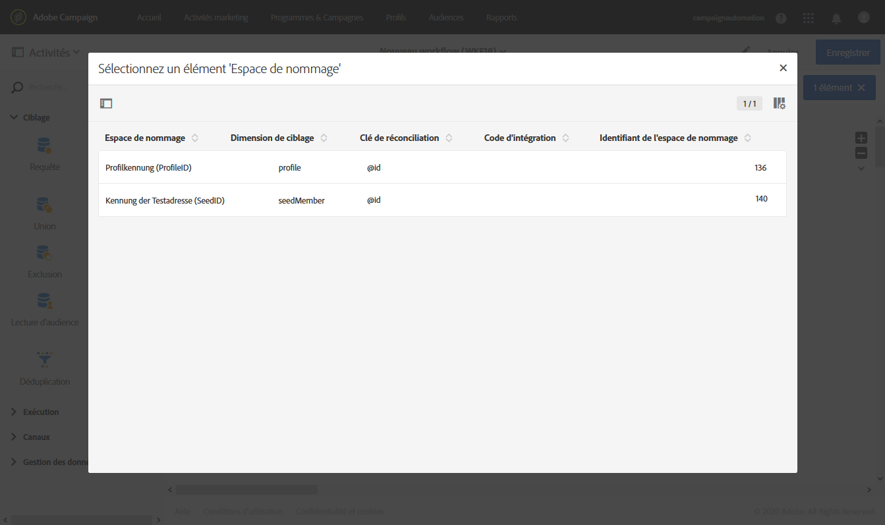
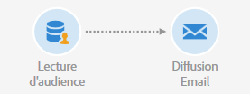

# Ciblage des audiences d’Adobe Experience Platform {#targeting-aep-audiences}

>[!IMPORTANT]
>
>Le service Destinations d’audience est actuellement en version bêta, qui peut faire l’objet de fréquentes mises à jour sans préavis. Les clients doivent être hébergés sur Azure (actuellement en version bêta pour l&#39;Amérique du Nord uniquement) pour accéder à ces fonctionnalités. Contactez le service à la clientèle d’Adobe si vous souhaitez y accéder.

Une fois que vous avez créé une audience  Adobe Experience Platform à l’aide du créateur de segments de profil unifié, vous pouvez l’utiliser de la même manière que pour une audience de campagne dans les processus pour personnaliser et envoyer des messages.

Pour activer une audience Adobe Experience Platform dans vos processus, procédez comme suit :

1. Ajoutez une activité **[!UICONTROL Lire l’audience]**dans le processus, puis ouvrez-la.

1. Sélectionnez l’option **[!UICONTROL Adobe Experience Platform]**sous**[!UICONTROL  Type d’audience]**, puis ajoutez l’audience de votre choix.

   

1. (Facultatif) Une fois l’audience sélectionnée, vous pouvez cliquer sur le bouton en forme d’oeil pour revoir et/ou modifier la définition de segment (veillez à enregistrer vos modifications à nouveau).

   En cliquant sur le bouton d’oeil, vous accédez simplement au créateur de segments unifiés (dans un autre onglet) associé à l’audience sélectionnée dans Campaign.

1. Sélectionnez un élément de mappage **[!UICONTROL de données de]**plateforme pour spécifier la dimension de ciblage souhaitée pour l’audience Adobe Experience Platform sélectionnée.

   Par défaut, la clé principale (iRecipientID pour la table Profil, iAppSubscriptionID pour la table AppSubscription) utilisée pour la réconciliation sera automatiquement disponible dans la liste déroulante. Pour cibler en dehors de la clé primaire, vous devez créer un espace de **noms** personnalisé.

   >[!NOTE]
   >
   >Pour les cibles en dehors de la clé principale, vous devez également créer un mappage Target personnalisé qui correspond à l’espace de noms personnalisé. For more information on Target Mapping, refer to [this section](../../administration/using/target-mappings-in-campaign.md).

   

   Cette liste contient tous les mappages XDM (Experience Data Model) qui ont été configurés sur votre instance. Pour plus d’informations sur Adobe Experience Platform Data Connector, reportez-vous à [ce document](../../administration/using/aep-about-data-connector.md)dédié.

   

1. Une fois les dimensions d’audience et de ciblage configurées correctement, cliquez sur le bouton **[!UICONTROL Confirmer]**pour enregistrer vos modifications.

Vous pouvez désormais configurer votre processus avec d’autres activités. Vous pouvez, par exemple, lier une activité de diffusion **[!UICONTROL de]**courrier électronique pour envoyer un courrier électronique à l’audience sélectionnée.

>[!NOTE]
>
>Campaign Standard permet de cibler les audiences de la plateforme Adobe Experience Platform dans tous les canaux de diffusion : Courriers électroniques, messages SMS, messages de messagerie directe, notifications Push et messages in-app.

Pour plus d’informations sur l’utilisation des processus et des livraisons, reportez-vous aux sections suivantes :

* [Présentation des workflows](../../automating/using/discovering-workflows.md)
* [Construire un workflow](../../automating/using/building-a-workflow.md)
* [Découvrir les canaux de communication](../../channels/using/discovering-communication-channels.md)
* [A propos des activités des canaux](../../automating/using/about-channel-activities.md)
