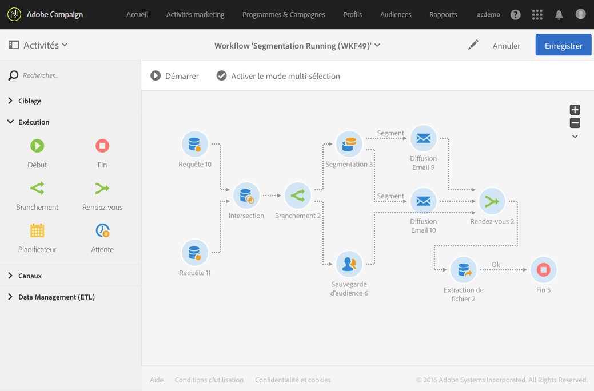

# Rendez-vous{#and-join}

## Description {#description}

L'activité **[!UICONTROL Rendez-vous]** permet de synchroniser plusieurs branches d'exécution d'un workflow.

## Contexte d'utilisation {#context-of-use}

L'activité **[!UICONTROL Rendez-vous]** ne déclenche sa transition sortante qu'une fois toutes les transitions entrantes activées, c'est-à-dire quand toutes les activités précédentes sont terminées.

## Configuration {#configuration}

1. Placez dans votre workflow plusieurs activités telles que des requêtes pour former au moins deux branches d'exécution distinctes.
1. Placez une activité **[!UICONTROL Rendez-vous]** dans votre workflow.
1. Connectez-la à la suite des différentes branches que vous souhaitez synchroniser.
1. Sélectionnez l'activité puis ouvrez-la à l'aide du bouton , disponible dans les actions rapides qui s'affichent.
1. Sélectionnez l'ensemble principal à conserver dans la transition sortante. Si vous ne choisissez aucun ensemble, la population transmise en sortie de l'activité est aléatoire.
1. Validez le paramétrage de l'activité et enregistrez le workflow.

## Exemple  {#example}

L'exemple suivant montre l'exécution de deux branches d'un workflow avant qu'elles ne se rejoignent avec l'activité **[!UICONTROL Rendez-vous]**. L'extraction de fichier ne pourra avoir lieu que lorsque les trois transitions entrantes de l'activité **[!UICONTROL Rendez-vous]** seront activées.

