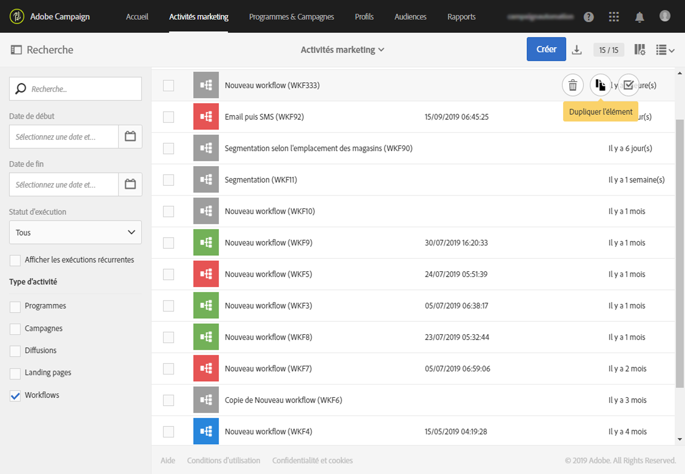
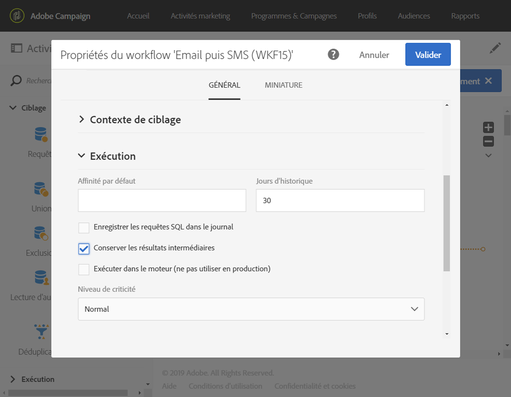
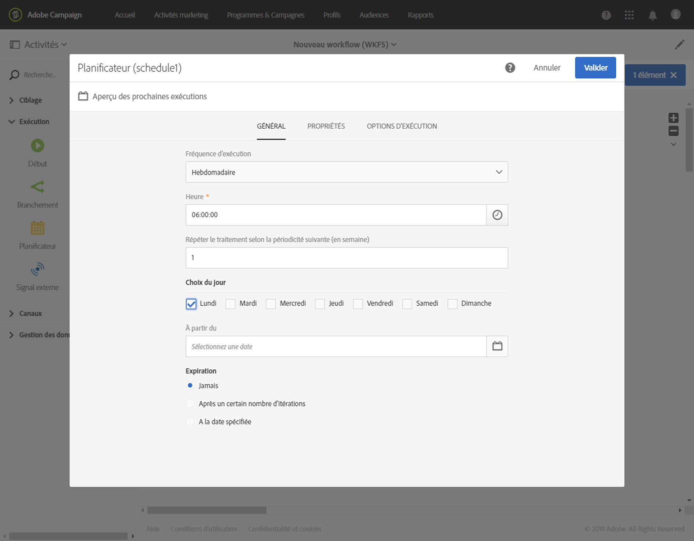

# Meilleures pratiques du flux de travail{#workflow-best-practices}

Avec Adobe Campaign, vous pouvez configurer tous les types de processus pour effectuer une grande étendue de tâches. Toutefois, lors de la conception et de l'exécution de vos flux de travail, vous devez être très prudent car une implémentation incorrecte peut entraîner de mauvaises performances, erreurs et problèmes de plateforme. Vous trouverez ci-dessous une liste des bonnes pratiques et des conseils de dépannage.

>[!NOTE]
>
>La conception et l'exécution du flux de travail doivent être effectuées par un utilisateur avancé Adobe Campaign.

## Attribution d'un nom{#naming}

Pour faciliter le dépannage du flux de travail, Adobe conseille de nommer et d'étiqueter explicitement vos flux de travail. Renseignez le champ Description du processus pour résumer le processus à exécuter afin que l'opérateur puisse facilement le comprendre.
Si le processus fait partie d'un processus impliquant plusieurs flux de travail, vous pouvez utiliser des nombres lors de la saisie d'un libellé pour les classer clairement.

Par exemple :

* 001 - Importation - Destinataires
* 002 - Importation - Importation de ventes
* 003 - Importation - Importer des détails sur les ventes
* 010 - Exportation - Journaux de diffusion Exporter
* 011 - Exportation - Journaux de suivi Exporter

## Duplication de processus{#duplicating-workflows}

Vous pouvez dupliquer des processus. Dans les activités **[!UICONTROL marketing]**, passez la souris sur le processus et cliquez **[!UICONTROL sur Dupliquer l'élément]**. Une fois dupliqué, les modifications du processus ne sont pas transférées à la copie du processus. La copie du processus peut être modifiée.

## Exécution{#execution}

### Nombre de processus

Par défaut, nous recommandons de ne pas exécuter simultanément plus de 20 processus actifs. Après avoir atteint cette limite, les flux de travaux sont mis en file d'attente afin de ne pas affecter les performances. De même, Adobe vous recommande d'étaler votre sortie de flux de travail au fil du temps.
Dans des contextes spécifiques, vous devrez peut-être exécuter plus de 20 processus. Elle ne s'applique pas aux processus qui attendent une exécution planifiée. Si tel est le cas, vous devez vérifier les cas d'utilisation avec un expert de campagne et contacter le service à la clientèle Adobe pour augmenter la limite.

### Fréquence

Un processus ne peut pas être exécuté automatiquement plus souvent qu'une fois toutes les dix minutes.
La Fréquence de répétition de l'activité ne peut pas être inférieure à 10 minutes, Si la fréquence de répétition est définie sur 0 (valeur par défaut), cette option n'est pas prise en compte et le processus s'exécute selon la fréquence d'exécution.

### Processus en pause

Les flux de travaux en pause ou en échec pendant plus de 7 jours sont arrêtés pour consommer moins d'espace disque. La tâche de nettoyage s'affiche dans les journaux de flux de travaux.

### Transitions

Un flux de travail contenant des transitions non terminées peut toujours être exécuté : elle génère un message d'avertissement et le processus s'interrompt une fois la transition atteinte, mais ne génère pas d'erreur. Vous pouvez également démarrer un flux de travail sans terminer la conception et le terminer au fur et à mesure que vous avancez.

Pour plus d'informations, voir [Exécution de processus](../../automating/using//executing-a-workflow.md).

## Activité{#activity}

### Conception de processus

Pour vous assurer que le processus se termine correctement, utilisez une **[!UICONTROL activité de fin]**. Evitez de quitter la dernière transition d'un processus.

To access the detail view of the transitions, check the **[!UICONTROL Keep interim results]** option in the Execution section of the workflow properties.

>[!CAUTION]
>
>Cette option consomme beaucoup d'espace disque et est conçue pour vous aider à créer un flux de travaux et à assurer une configuration et un comportement corrects. Laissez-la décochée sur les instances de production.

### d'autres activités d'étiquetage{#activity-labeling}

Lors du développement de votre flux de travail, un nom est généré pour chaque activité, comme pour tous les objets Adobe Campaign. Bien que le nom d'une activité soit généré par l'outil et ne puisse pas être modifié, il est recommandé de le nommer avec un nom explicite lors de sa configuration.

### Duplicating activities{#activity-duplicating}

Pour dupliquer des activités existantes, vous pouvez utiliser copier-coller. Ainsi, vous conservez les paramètres qui étaient définis à l'origine. For more information, refer to [Duplicating workflow activities](../../automating/using/workflow-interface.md).

### Scheduler activity{#acheduler-activity}

When building your workflow, only use one **[!UICONTROL Scheduler activity]** per branch. Si la même branche d'un flux de travail comporte plusieurs planificateurs (liés les uns aux autres), le nombre de tâches à exécuter sera multiplié de manière exponentielle, ce qui surcharge considérablement la base de données.

Vous pouvez prévisualiser les dix prochaines exécutions de vos flux de travail en cliquant **[!UICONTROL sur Aperçu des exécutions suivantes]**.

Pour plus d'informations, reportez-vous à l'activité [Planificateur](../../automating/using/scheduler.md).

## Appel de workflow avec des paramètres{#workflow-with-parameters}

Assurez-vous que le nom et le nombre de paramètres correspondent à ce qui est défini lors de l'appel du workflow (voir [Définir les paramètres lors de l'appel du workflow](../../automating/using/calling-a-workflow-with-external-parameters.md#defining-the-parameters-when-calling-the-workflow)). Les types de paramètres doivent également être cohérents avec les valeurs attendues.

Veillez à ce que tous les paramètres soient déclarés dans l'activité **[!UICONTROL Signal externe]**. Dans le cas contraire, une erreur se produira lors de l'exécution de l'activité.

Pour plus d'informations, voir [Appel d'un flux de travail avec des paramètres externes](../../automating/using/calling-a-workflow-with-external-parameters.md).

## Exportation de packages{#exporting-packages}

Pour exporter des packages, les ressources exportées ne doivent pas contenir d'ID par défaut. Par conséquent, les ID des ressources exportables doivent être modifiés en utilisant un autre nom parmi ceux fournis par Adobe Campaign Standard.
Pour plus d'informations, voir [Gestion des packages](../../automating/using/managing-packages.md).

## Export de listes{#exporting-lists}

L'option d'export de liste permet d'exporter un maximum de 100 000 lignes par défaut et est définie par l'option **Nms_ExportListLimit**. This option can be managed by the functional administrator, under **[!UICONTROL Administration]** &gt; **[!UICONTROL Application settings]** &gt; **[!UICONTROL Options]**.
Pour plus d'informations, voir [Exportation de listes](../../automating/using/exporting-lists.md).

## Résolution des problèmes{#workflow-troubleshooting}

Adobe Campaign propose divers journaux pour mieux comprendre vos problèmes de flux de travaux.

### Utilisation des journaux de processus{#using-workflow-logs}

Vous pouvez accéder aux journaux de flux de travaux pour surveiller l'exécution de vos activités. Il répertorie par ordre chronologique les opérations réalisées et les erreurs d'exécution. L'onglet Journaux se compose de l'historique de l'exécution de toutes ou d'activités sélectionnées.
L'onglet Tâches permet de voir le séquencement de l'exécution des activités. Pour obtenir plus d'informations sur une activité, cliquez sur une tâche.
Pour plus d'informations, consultez [l'exécution du flux de travail Surveillance](../../automating/using/executing-a-workflow.md#monitoring).

#### Troubleshooting data management activities{#troubleshooting-data-management-activities}

Vous pouvez analyser les requêtes SQL dans l'onglet Journal.

1. Dans l'espace de travail de flux de travail, cliquez **[!UICONTROL sur Modifier les propriétés]**.
1. En général ******[!UICONTROL , cochez la case]****[!UICONTROL Enregistrer les requêtes SQL dans le journal]** et **[!UICONTROL Exécuter dans les options du moteur]** et cliquez **[!UICONTROL sur Confirmer]**.

**Pour afficher les requêtes SQL dans le journal :**
1. Cliquez **[!UICONTROL sur Journal et tâches]**.
1. Dans l'onglet **[!UICONTROL Journaux,]** ouvrez le panneau **[!UICONTROL Rechercher]** .
1. Check **[!UICONTROL Display SQL logs only]**.

La requête est affichée dans la colonne **[!UICONTROL Message]** des journaux.

### Utilisation des journaux de diffusion{#using-delivery-logs}

Les journaux de diffusion permettent de surveiller le succès de vos remises. Les journaux d'exclusion renvoient des messages exclus lors de la préparation de l'envoi. L'envoi de journaux fournit l'état de la diffusion pour chaque profil.
Pour plus d'informations, voir [Compréhension des échecs de remise](../../sending/using/understanding-delivery-failures.md).

### Utilisation des alertes de diffusion{#delivery-alerting}

La fonctionnalité Alertes de diffusion est un système de gestion des alertes qui permet à un groupe d'utilisateurs de recevoir automatiquement des notifications contenant des informations sur l'exécution de leurs diffusions.
Pour plus d'informations, voir Alertes [de diffusion](../../sending/using/receiving-alerts-when-failures-happen.md).

**Rubriques connexes :**

* [Gestion des erreurs](../../automating/using/executing-a-workflow.md#error-management)
