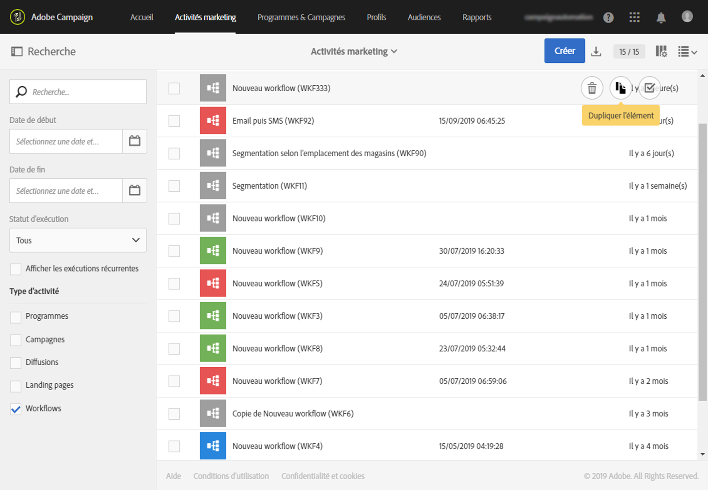
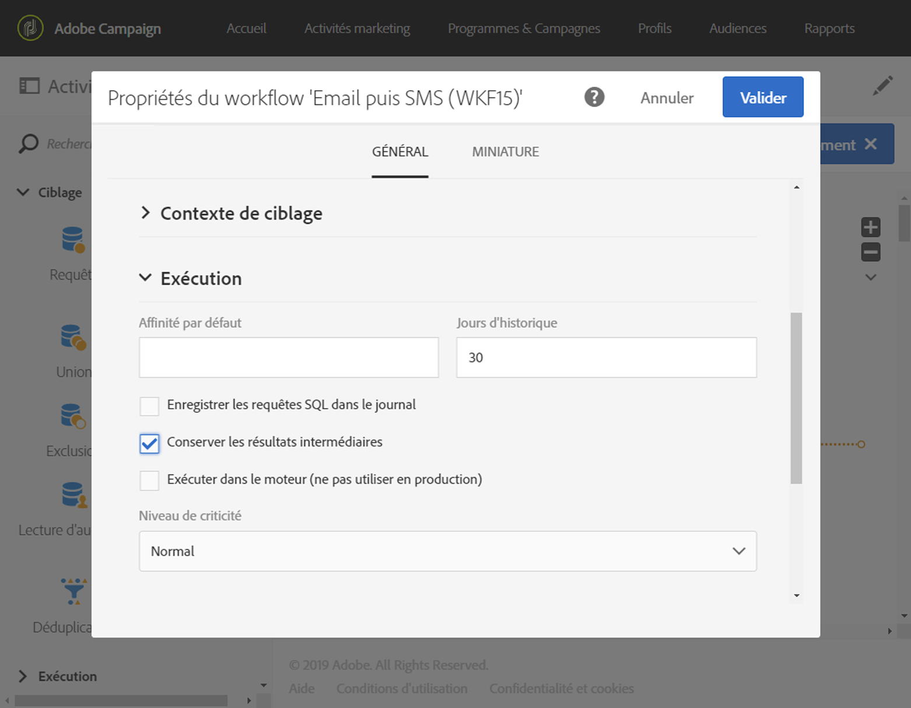
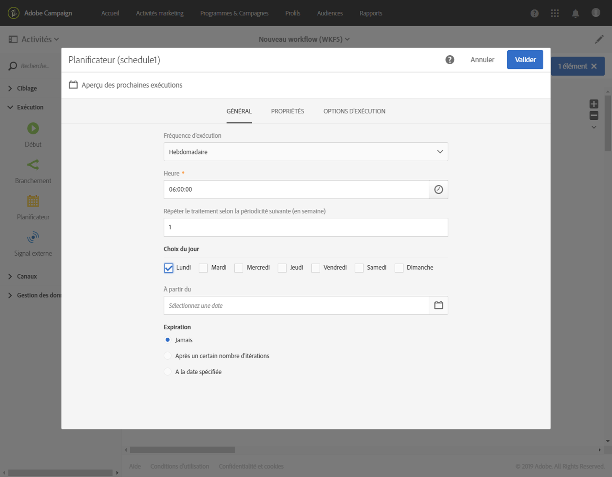

# Bonnes pratiques relatives aux workflows{#workflow-best-practices}

Avec Adobe Campaign, vous pouvez configurer tous les types de workflows pour effectuer une vaste étendue de tâches. Toutefois, lors de la conception et de l&#39;exécution de vos workflows, vous devez faire très attention, car une mauvaise implémentation peut entraîner de faibles performances, des erreurs et des problèmes de plateforme. Vous trouverez ci-dessous une liste de bonnes pratiques et de conseils de dépannage.

>[!NOTE]
>
>La conception et l&#39;exécution des workflows doivent être effectuées par un utilisateur expérimenté Adobe Campaign.

## Attribution d&#39;un nom{#naming}

Pour faciliter la résolution des problèmes de workflow, Adobe recommande de nommer et de libeller explicitement vos workflows. Renseignez le champ de description du workflow pour résumer le processus à effectuer afin que l’opérateur ou l’opératrice puisse facilement le comprendre.
Si le workflow fait partie d’un processus impliquant plusieurs workflows, vous pouvez utiliser des nombres lors de la saisie d’un libellé afin de les classer clairement.

Par exemple :

* 001 - Import - Import des destinataires
* 002 - Import - Import de ventes
* 003 - Import - Import des détails sur les ventes
* 010 - Export - Export des logs de diffusion
* 011 - Export - Export des logs de tracking

## Duplication des workflows{#duplicating-workflows}

Vous pouvez dupliquer des workflows. Dans **[!UICONTROL Activités marketing]**, pointez sur le workflow et cliquez sur **[!UICONTROL Dupliquer l&#39;élément]**. Une fois le workflow dupliqué, ses modifications ne sont pas appliquées à la copie de celui-ci. La copie du workflow peut être éditée.

## Exécution{#execution}

### Nombre de workflows

Par défaut, nous recommandons de **ne pas exécuter plus de 20 workflows actifs simultanément** (cela ne s&#39;applique pas aux workflows en attente d&#39;une exécution planifiée). Lorsque cette limite est atteinte, les workflows sont placés en file d&#39;attente afin de ne pas impacter les performances.

Dans des contextes spécifiques, vous devrez peut-être exécuter plus de 20 workflows. Si tel est le cas, vous devez vérifier les possibilités avec un expert de Campaign et contacter l&#39;assistance clientèle d&#39;Adobe pour augmenter la limite.

>[!IMPORTANT]
>
>Même si vous n&#39;atteignez pas le seuil des 20 workflows, Adobe vous recommande d&#39;**étaler l&#39;exécution des workflows dans le temps**. L&#39;étalement de l&#39;exécution de vos workflows améliore les performances de votre instance.

Avant de démarrer un workflow, [!DNL Campaign Standard] vérifie si la mémoire physique système est suffisante pour exécuter le workflow. Si ce n’est pas le cas, un message vous informe que l&#39;exécution du workflow sera retardée jusqu&#39;à ce que la charge sur le serveur diminue et que la mémoire système augmente.

### Fréquence

Un workflow ne peut pas s’exécuter automatiquement plus d’une fois toutes les dix minutes.
La fréquence de répétition de l’activité ne peut pas être inférieure à 10 minutes. Si la fréquence de répétition est paramétrée sur 0 (également valeur par défaut), cette option n’est pas prise en compte et le workflow s’exécute selon la fréquence d’exécution définie.

### Workflows en pause

Les workflows en pause ou en échec pendant plus de 7 jours sont arrêtés afin de consommer moins d&#39;espace disque. La tâche de nettoyage s&#39;affiche dans les logs de workflow.

### Transitions

Un workflow contenant des transitions flottantes peut être exécuté : il génère un avertissement et est suspendu une fois qu’il atteint la transition, mais aucune erreur n’est générée. Il est aussi possible de démarrer un workflow sans en avoir terminé la conception et de le compléter au fur et à mesure.

Pour plus d&#39;informations, voir [Exécution de workflows](../../automating/using/about-workflow-execution.md).

### Time zone

Les propriétés du workflow vous permettent de définir un fuseau horaire spécifique qui sera utilisé par défaut dans toutes les activités. Par défaut, le fuseau horaire du workflow est celui défini pour l’opérateur de Campaign actuel.

## Activité{#activity}

### Nombre d&#39;activités par workflow {#number-activities}

Nous vous recommandons d’utiliser jusqu’à 100 activités dans un seul workflow. Si vous en utilisez plus, vous pouvez rencontrer des problèmes de performances lors de la conception et de la configuration de votre workflow.

### Conception des workflows

Pour vous assurer que le workflow se termine correctement, évitez de laisser seule la dernière transition d’un workflow en utilisant une activité **[!UICONTROL Fin]**.

Pour accéder au détail des transitions, cochez l&#39;option Conserver les résultats intermédiaires **[!UICONTROL dans la section]** Exécution des propriétés du workflow.

>[!CAUTION]
>
>Cette option consomme beaucoup d’espace disque. De plus, elle a été conçue pour vous aider à créer un workflow et à garantir une configuration et un comportement corrects. Laissez-la décochée sur les instances de production.

### Activités d&#39;attribution de libellé{#activity-labeling}

Lors du développement de votre workflow, un nom est généré pour chaque activité, comme pour tous les objets Adobe Campaign. Bien que le nom d&#39;une activité soit généré par l&#39;outil et ne puisse pas être modifié, il est recommandé de lui attribuer un nom explicite lors de sa configuration.

### Duplication des activités{#activity-duplicating}

Pour dupliquer des activités existantes, vous pouvez effectuer un copier-coller. Ainsi, vous conservez les paramètres qui étaient définis à l&#39;origine. Pour plus d&#39;informations, consultez [Duplication des activités de workflow](../../automating/using/workflow-interface.md).

### Activité Planificateur{#acheduler-activity}

Lors de la construction de votre workflow, n&#39;utilisez qu&#39;une seule **[!UICONTROL activité Planificateur]** par branche. Si une même branche d&#39;un workflow comporte plusieurs planificateurs (liés les uns aux autres), le nombre de tâches à exécuter sera multiplié de manière exponentielle, ce qui surchargerait considérablement la base.

Vous pouvez prévisualiser les dix prochaines exécutions de vos workflows en cliquant sur **[!UICONTROL Aperçu des prochaines exécutions]**.

Pour plus d’informations, consultez [Activité planificateur](../../automating/using/scheduler.md).

Lors de la conception d’un workflow planifié incluant plusieurs activités, vous devez vous assurer que le workflow n’est pas replanifié tant qu’il n’est pas terminé. Pour ce faire, vous devez configurer votre workflow afin d’empêcher son exécution si une ou plusieurs tâches d’une exécution précédente sont toujours en attente. Pour plus d’informations, consultez [cette page](../../automating/using/scheduled-workflows-execution.md).

## Appel d’un workflow avec des paramètres{#workflow-with-parameters}

Veillez à ce que le nom et le nombre de paramètres soient identiques à ce qui est défini lors de l&#39;appel du workflow (voir [cette page](../../automating/using/defining-parameters-calling-workflow.md)). De plus, les types des paramètres doivent être cohérents par rapport aux valeurs attendues.

Veillez à ce que tous les paramètres soient déclarés dans l&#39;activité **[!UICONTROL Signal externe]**. Dans le cas contraire, une erreur se produira lors de l&#39;exécution de l&#39;activité.

Pour plus d&#39;informations, voir [Appeler un workflow avec des paramètres externes](../../automating/using/calling-a-workflow-with-external-parameters.md).

## Export de packages{#exporting-packages}

Pour exporter des packages, les ressources exportées ne doivent pas contenir d’identifiants par défaut. Il est donc obligatoire de modifier les identifiants des ressources exportables en s’éloignant des modèles livrés par Adobe Campaign Standard.
Pour plus d’informations, consultez [Gestion des packages](../../automating/using/managing-packages.md).

## Export de listes{#exporting-lists}

L’option d’export de liste permet d’exporter un maximum de 100 000 lignes par défaut et est définie par l’**option Nms_ExportListLimit**. Cette option peut être gérée par la personne chargée de l’administration fonctionnelle, sous **[!UICONTROL Administration]** > **[!UICONTROL Paramètres de l’application]** > **[!UICONTROL Options]**.
Pour plus d’informations, consultez [Export de listes](../../automating/using/exporting-lists.md).

## Résolution des problèmes{#workflow-troubleshooting}

Adobe Campaign propose divers logs pour mieux comprendre les problèmes liés aux workflows.

### Utilisation des logs de workflow{#using-workflow-logs}

Vous pouvez accéder aux logs de workflow pour surveiller l’exécution de vos activités. Ils répertorient par ordre chronologique les opérations réalisées et les erreurs d’exécution. L’onglet Logs affiche l’historique de l’exécution de toutes les activités sélectionnées ou de certaines d’entre elles.
L’onglet Tâches permet de voir le séquencement de l’exécution des activités. Pour obtenir plus d’informations sur une activité, cliquez sur une tâche.
Pour plus d’informations, consultez [Surveillance de l’exécution des workflows](../../automating/using/monitoring-workflow-execution.md).

#### Résolution des problèmes liés aux activités Data Management{#troubleshooting-data-management-activities}

Vous pouvez analyser les requêtes SQL dans l&#39;onglet Log.

1. Dans l&#39;espace de travail du workflow, cliquez sur **[!UICONTROL Editer les propriétés]**.
1. Dans **[!UICONTROL Général]** > **[!UICONTROL Exécution]**, cochez les options **[!UICONTROL Enregistrer les requêtes SQL dans le log]** et **[!UICONTROL Exécuter dans le moteur]**, puis cliquez sur **[!UICONTROL Confirmer]**.

**Pour voir les requêtes SQL dans Log :**
1. Cliquez sur **[!UICONTROL Log et tâches]**.
1. Dans l&#39;onglet **[!UICONTROL Logs]**, ouvrez le panneau **[!UICONTROL Recherche]**.
1. Cochez l&#39;option **[!UICONTROL Afficher les logs SQL uniquement]**.

La requête est affichée dans la colonne **[!UICONTROL Message]** des logs.

### Utilisation des logs de diffusion{#using-delivery-logs}

Les logs de diffusion permettent de surveiller le succès de vos diffusions. Les logs d’exclusion renvoient des messages exclus lors de la préparation de l’envoi. Les logs d’envoi fournissent le statut de la diffusion pour chaque profil.
Pour plus d’informations, consultez [Comprendre les diffusions en échec](../../sending/using/understanding-delivery-failures.md).

### Utilisation des alertes de diffusion{#delivery-alerting}

La fonctionnalité Alertes de diffusion est un système de gestion des alertes qui permet à un groupe d’utilisateurs et d’utilisatrices de recevoir automatiquement des notifications contenant des informations sur l’exécution de leurs diffusions.
Pour plus d’informations, consultez [Alertes de diffusion](../../sending/using/receiving-alerts-when-failures-happen.md).

**Rubriques connexes :**

* [Gestion des erreurs](../../automating/using/monitoring-workflow-execution.md)
