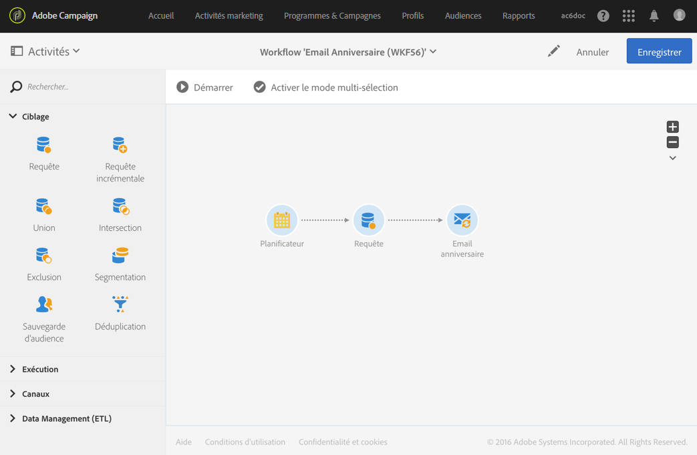
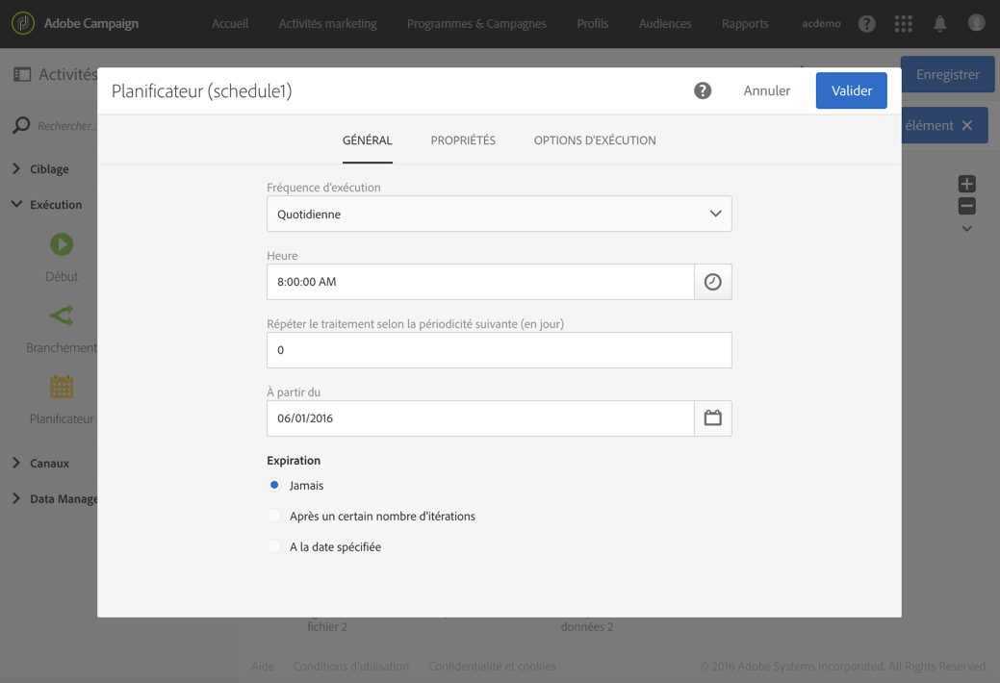
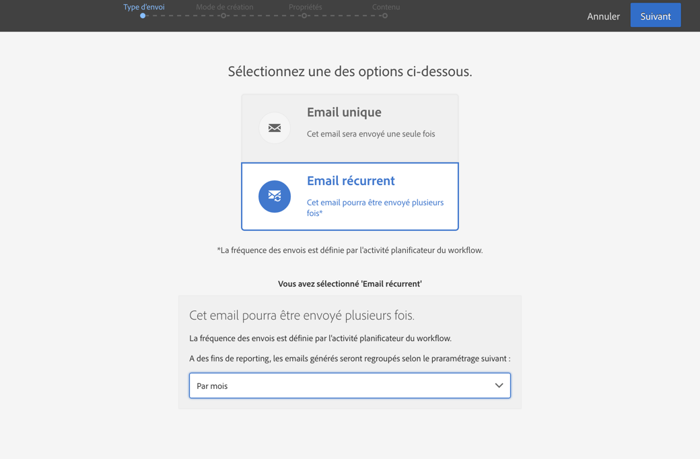

# Diffusion d’anniversaire {#birthday-delivery}

Cet exemple représente un workflow d&#39;anniversaire. Un email est envoyé chaque jour aux profils dont l&#39;anniversaire a lieu le jour même.

Pour créer le workflow, procédez comme suit :

* Le [Planificateur](../../automating/using/scheduler.md) permet de lancer le workflow chaque jour à 8h00.

   

* La [Requête](../../automating/using/query.md) permet de calculer à chaque exécution du workflow les profils dont c&#39;est l&#39;anniversaire et dont l&#39;adresse email est renseignée. Le calcul de l&#39;anniversaire est réalisé grâce à un filtre prédéfini disponible dans la palette de l&#39;outil d&#39;édition de requêtes.

   

* La [Diffusion Email](../../automating/using/email-delivery.md) est de type récurrent. Les envois sont agrégés par mois. Ainsi, tous les emails envoyés dans un mois sont agrégés dans une seule vue. En un an, 365 diffusions sont donc exécutées mais sont regroupées dans 12 vues (aussi appelés **exécutions récurrentes**) dans l&#39;interface d&#39;Adobe Campaign. Le détail des historiques et des rapports est ainsi affiché sur une base mensuelle et non pour chaque envoi.

   
