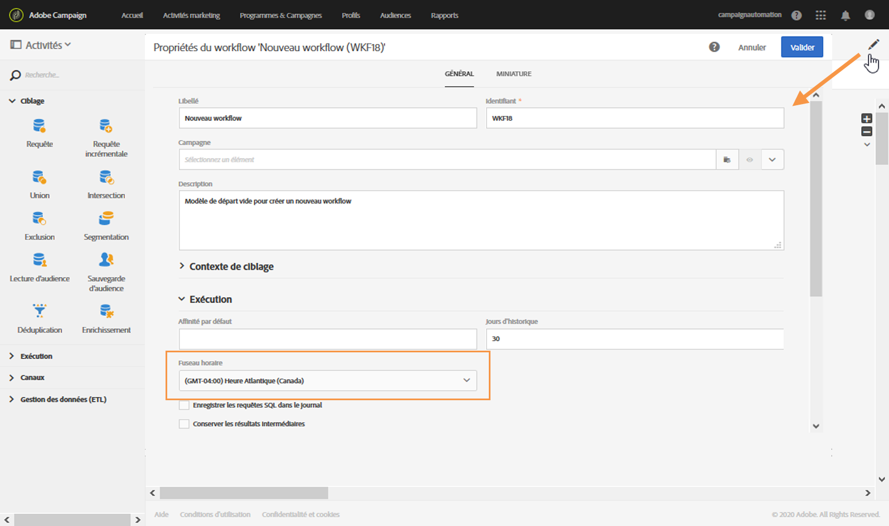

# Construire un workflow{#building-a-workflow}

Cette section détaille les principes généraux et les bonnes pratiques pour la création d’un workflow.

## Principes de fonctionnement des workflows{#workflow-operating-principles}

Un workflow est un **enchaînement d&#39;activités paramétrables**. Chaque activité possède un rôle précis dans le processus. Le résultat de chaque activité est transmis à l&#39;activité suivante via une **transition**, représentée par une flèche.

Le type des données transmises d&#39;une activité à une autre peut influer sur le paramétrage des activités suivantes. Par exemple, si une population est définie avant une activité de diffusion d&#39;email, elle peut servir de cible pour l&#39;email en question.

Vous pouvez ouvrir les activités afin d&#39;en vérifier ou modifier les paramètres avant ou après l&#39;exécution du workflow.

Vous pouvez ouvrir les transitions afin de vérifier que les données transmises sont correctes pendant ou après l’exécution du workflow. Pour accéder au détail des transitions, vous devez cocher l&#39;option **[!UICONTROL Conserver les résultats intermédiaires]** dans la section **[!UICONTROL Exécution]** des propriétés du workflow.

>[!CAUTION]
>
>Cette option consomme beaucoup d’espace disque. De plus, elle a été conçue pour vous aider à créer un workflow et à garantir une configuration et un comportement corrects. Laissez-la décochée sur les instances de production.

## Créer un workflow         {#creating-a-workflow}

La création d’un workflow est possible au sein d’un programme ou d’une campagne, ou dans la liste des activités marketing.

 [Découvrez comment créer un workflow en vidéo](#video)

La création d’une activité marketing est présentée dans la section [Créer une activité marketing](../../start/using/marketing-activities.md#creating-a-marketing-activity).

1. Une fois que vous avez commencé la création d’une activité marketing de type workflow, choisissez le modèle que vous souhaitez utiliser.

   

   >[!NOTE]
   >
   >Chaque activité marketing propose plusieurs types par défaut. Ceux-ci permettent de pré-configurer certains paramètres en fonction de vos besoins. Voir à ce propos la section [Gestion des modèles](../../start/using/marketing-activity-templates.md).

1. Renseignez les propriétés générales du workflow.

   

   Vous pouvez saisir un nom dans le champ **Libellé** et modifier l’identifiant. Le nom de l’activité et son identifiant apparaissent dans l’interface, mais ne sont pas visibles par les destinataires des messages.

   >[!NOTE]
   >
   >A partir de la liste des activités marketing, vous pouvez créer votre workflow à l’intérieur d’une campagne parente. Sélectionnez celle-ci parmi les campagnes déjà créées.

   Vous pouvez ajouter une description, qui sera visible par l’utilisateur dans le contenu de la campagne.

   Pour trouver plus facilement les workflows qui ne fonctionnent pas de la manière attendue et résoudre les problèmes, Adobe recommande d’attribuer aux workflows des libellés et des noms adéquats. Renseignez également le champ de description du workflow pour que l’opérateur puisse facilement comprendre son objectif.

1. Validez la création de l’activité, dont le tableau de bord s’affiche alors. Voir à ce propos la section [Interface des workflows](../../automating/using/workflow-interface.md).

1. Une fois le workflow prêt à être configuré, vous pouvez accéder à d’autres options en cliquant sur le bouton **[!UICONTROL Éditer les propriétés]**.

   Vous pouvez, par exemple, définir un fuseau horaire spécifique à utiliser par défaut dans toutes les activités du workflow. Par défaut, le fuseau horaire du workflow est celui défini pour l’opérateur de Campaign actuel.

   Pour plus d’informations sur les propriétés de workflow, consultez [cette page](../../automating/using/managing-execution-options.md).

   

## Ajouter et relier les activités {#adding-and-linking-activities}

Vous devez maintenant définir les différentes activités et les relier entre elles dans un diagramme.

>[!NOTE]
>
>Si la palette n’est pas visible, cliquez sur le premier bouton de la barre d’outils pour l’afficher.

Les activités sont regroupées par catégories dans les différentes sections de la palette.

* La première section contient les [activités de ciblage](../../automating/using/about-targeting-activities.md)
* La deuxième section regroupe les [activités d’exécution](../../automating/using/about-execution-activities.md) : elles servent principalement à coordonner les autres activités.
* La troisième section regroupe des activités qui peuvent être utilisées pour envoyer les messages sur différents [canaux](../../automating/using/about-channel-activities.md). Les activités de cette section peuvent varier en fonction des canaux activés sur votre instance.
* La quatrième section regroupe les [activités de Data Management et de manipulation de fichiers](../../automating/using/about-data-management-activities.md).

Pour construire le diagramme :

1. Ajoutez une activité en la sélectionnant dans la palette et en la relâchant dans le diagramme.

   Par exemple, positionnez une activité de type **[Début](../../automating/using/start-and-end.md)**, puis une activité de type **[Diffusion Email](../../automating/using/email-delivery.md)** sur le diagramme.

1. Reliez les deux activités en sélectionnant la transition de l’activité **Début** et en la relâchant sur l’activité **Diffusion Email**.

   >[!NOTE]
   >
   >Vous pouvez relier automatiquement une activité à celle qui la précède en déposant la nouvelle activité directement sur l’extrémité de la transition de la précédente.

1. Ajoutez les activités dont vous avez besoin et reliez-les entre elles pour finaliser le workflow.

   >[!NOTE]
   >
   >Vous pouvez également dupliquer les activités existantes en les copiant et en les collant. Ainsi, vous conservez les paramètres qui étaient définis à l’origine. Voir à ce propos [Duplication des activités de workflow](../../automating/using/workflow-interface.md#duplicating-workflow-activities).

Une fois vos activités de workflow reliées, vous pouvez personnaliser les transitions entre elles avec le **libellé** de votre choix. Pour cela, double-cliquez sur la transition pour accéder à ses propriétés.

De plus, les activités **[!UICONTROL Ciblage]** et **[!UICONTROL Gestion des données (ETL)]** permettent de définir des **codes segment** pour leurs transitions sortantes. Vous pouvez ensuite créer des rapports à partir de ces codes segment pour mesurer l’efficacité des campagnes marketing. Voir à ce propos [cette section](../../reporting/using/creating-a-report-workflow-segment.md).

**Cas pratiques de workflow :**

* [Cas pratique : création d’une diffusion email hebdomadaire](../../automating/using/workflow-weekly-offer.md)
* [Cas pratique : création d’une diffusion segmentée sur la localisation](../../automating/using/workflow-segmentation-location.md)
* [Cas pratique : création de diffusions avec un complément](../../automating/using/workflow-created-query-with-complement.md)
* [Cas pratique : workflow de reciblage envoyant une nouvelle diffusion aux personnes n’ayant pas ouvert l’email](../../automating/using/workflow-cross-channel-retargeting.md)

## Configurer les activités {#configuring-activities}

Par défaut, les activités ne sont pas définies et ne traiteront pas correctement les données si elles ne sont pas configurées. Chaque activité contient plusieurs onglets permettant de gérer des configurations spécifiques et des options génériques telles que les transitions sortantes, les libellés, etc.

1. Vérifiez que toutes les activités sont correctement reliées entre elles. Certaines activités doivent détecter la structure ou la nature des données entrantes pour proposer les options de configuration adéquates.
1. Double-cliquez sur une activité ou sélectionnez-la et cliquez sur l’action contextuelle **[!UICONTROL Editer]** pour ouvrir sa fenêtre de configuration.
1. Editez le libellé de l’activité.
1. Définissez toutes les différentes options dont vous avez besoin pour traiter les données. Pour découvrir les options possibles pour chaque activité, reportez-vous à la section spécifique à l’activité dans cette documentation.
1. Enregistrez l’activité et répétez ces opérations pour chaque activité du workflow.
1. Enregistrez le workflow.

## Tutoriel vidéo {#video}

Cette vidéo montre comment créer un workflow.

>[!VIDEO](https://video.tv.adobe.com/v/23937?quality=12&captions=fre_fr)

D’autres vidéos pratiques sur Campaign Standard sont disponibles [ici](https://experienceleague.adobe.com/docs/campaign-standard-learn/tutorials/overview.html?lang=fr).
