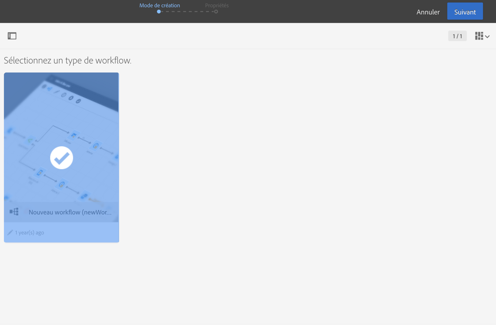
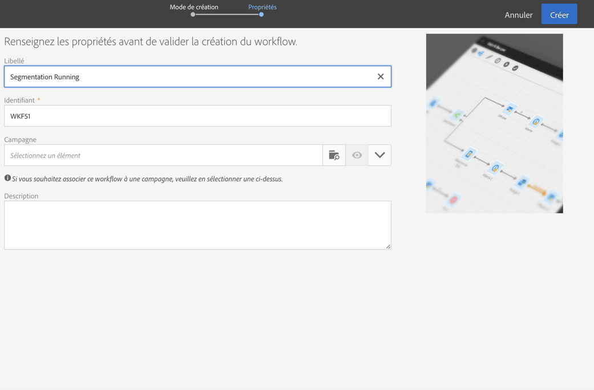

# Construire un workflow{#building-a-workflow}

Cette section détaille les principes généraux et les bonnes pratiques pour la création d'un nouveau workflow :

* Créer un workflow.
* Ajouter et enchaîner les activités.
* Configurer les activités.

## Créer un workflow {#creating-a-workflow}

La création d'un workflow est possible au sein d'un programme ou d'une campagne, ou dans la liste des activités marketing.

La création d'une activité marketing est présentée dans la section [Créer une activité marketing](../../start/using/marketing-activities.md#creating-a-marketing-activity).

1. Une fois que vous avez commencé la création d'une activité marketing de type workflow, choisissez le modèle que vous souhaitez utiliser.

   

   >[!NOTE]
   >
   >Chaque activité marketing propose plusieurs types par défaut. Ceux-ci permettent de pré-configurer certains paramètres en fonction de vos besoins. Voir à ce propos la section [Gestion des modèles](../../start/using/about-templates.md).

1. Renseignez les propriétés générales du workflow.

   

   Vous pouvez saisir un nom dans le champ **Libellé** et modifier l'identifiant. Le nom de l'activité et son identifiant apparaissent dans l'interface, mais ne sont pas visibles par les destinataires des messages.

   >[!NOTE]
   >
   >A partir de la liste des activités marketing, vous pouvez créer votre workflow à l'intérieur d'une campagne parente. Sélectionnez celle-ci parmi les campagnes déjà créées.

   Vous pouvez ajouter une description, qui sera visible par l'utilisateur dans le contenu de la campagne.

   Pour trouver plus facilement les workflows qui ne fonctionnent pas de la manière attendue et résoudre les problèmes, Adobe recommande d'attribuer aux workflows des libellés et des noms adéquats. Renseignez également le champ de description du workflow pour que l'opérateur puisse facilement comprendre son objectif.

1. Validez la création de l'activité, dont le tableau de bord s'affiche alors. Voir à ce propos la section [Interface des workflows](../../automating/using/workflow-interface.md).

**Rubrique connexe :**

Vidéo [Créer un workflow](https://helpx.adobe.com/campaign/kt/acs/using/acs-create-workflow-feature-video-use.html)

## Ajouter et relier les activités {#adding-and-linking-activities}

Vous devez maintenant définir les différentes activités et les relier entre elles dans un diagramme.

>[!NOTE]
>
>Si la palette n'est pas visible, cliquez sur le premier bouton de la barre d'outils pour l'afficher.

Les activités sont regroupées par catégories dans les différentes sections de la palette.

* La première section regroupe les activités de ciblage.
* La deuxième section regroupe les activités d'exécution : elles servent principalement à coordonner les autres activités.
* La troisième section regroupe des activités qui peuvent être utilisées pour envoyer les messages sur différents canaux. Les activités de cette section peuvent varier en fonction des canaux activés sur votre instance.
* La quatrième section regroupe les activités de Data Management et de manipulation de fichiers.

Pour construire le diagramme :

1. Ajoutez une activité en la sélectionnant dans la palette et en la relâchant dans le diagramme.

   Par exemple, positionnez une activité de type **Début**, puis une activité de type **Diffusion Email** sur le diagramme.

1. Reliez les deux activités en sélectionnant la transition de l'activité **Début** et en la relâchant sur l'activité **Diffusion Email**.

   >[!NOTE]
   >
   >Vous pouvez relier automatiquement une activité à celle qui la précède en déposant la nouvelle activité directement sur l'extrémité de la transition de la précédente.

1. Ajoutez les activités dont vous avez besoin et reliez-les entre elles pour finaliser le workflow.

   >[!NOTE]
   >
   >Vous pouvez également dupliquer les activités existantes en les copiant et en les collant. Ainsi, vous conservez les paramètres qui étaient définis à l'origine. Voir à ce propos [Duplication des activités de workflow](../../automating/using/workflow-interface.md#duplicating-workflow-activities).

Once your workflow activities are linked together, you can personalize the transitions between them with the **label** of your choice. Pour ce faire, double-cliquez sur la transition pour accéder à ses propriétés.

Moreover, **[!UICONTROL Targeting]** and **[!UICONTROL Data management (ETL)]** activities allows you to define **segment codes** for their outbound transitions. Vous pouvez ensuite créer des rapports basés sur ces codes de segments afin de mesurer l'efficacité des campagnes de marketing. Voir à ce propos [cette section](../../reporting/using/creating-a-report-workflow-segment.md).

## Configurer les activités {#configuring-activities}

Par défaut, les activités ne sont pas définies et ne traiteront pas correctement les données si elles ne sont pas configurées. Chaque activité contient plusieurs onglets permettant de gérer des configurations spécifiques et des options génériques telles que les transitions sortantes, les libellés, etc.

1. Vérifiez que toutes les activités sont correctement reliées entre elles. Certaines activités doivent détecter la structure ou la nature des données entrantes pour proposer les options de configuration adéquates.
1. Double-cliquez sur une activité ou sélectionnez-la et cliquez sur l'action contextuelle **[!UICONTROL Editer]pour ouvrir sa fenêtre de configuration.**
1. Editez le libellé de l'activité.
1. Définissez toutes les différentes options dont vous avez besoin pour traiter les données. Pour découvrir les options possibles pour chaque activité, reportez-vous à la section spécifique à l'activité dans cette documentation.
1. Enregistrez l'activité et répétez ces opérations pour chaque activité du workflow.
1. Enregistrez le workflow.

