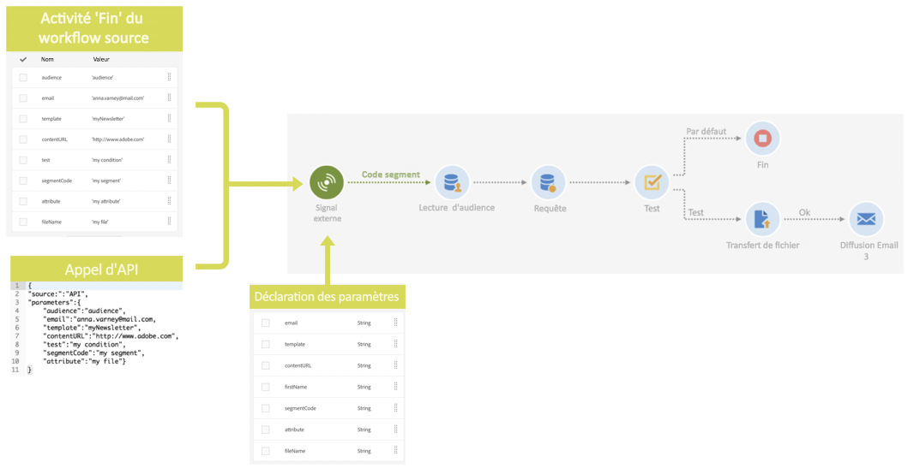

# Vue d&#39;ensemble {#calling-a-workflow-with-external-parameters}

Campaign Standard vous permet d&#39;appeler un workflow avec des paramètres (un nom d&#39;audience à cibler, un nom de fichier à importer, un contenu de message, etc.). De cette façon, vous pouvez facilement intégrer vos automatisations Campaign avec votre système externe.

Prenons l’exemple suivant où nous voulons envoyer des emails directement à partir d’un CMS. Dans ce cas, vous pouvez configurer votre système afin de sélectionner l’audience et le contenu email dans le CMS. Cliquer sur Envoyer appellera ensuite un workflow Campaign avec ces paramètres, vous permettant de les utiliser dans le workflow de manière à définir l’audience et le contenu d’URL à utiliser dans la diffusion.

Le processus pour appeler un workflow avec des paramètres est le suivant :

1. Déclarez les paramètres dans l’activité **[!UICONTROL Signal externe]**. Voir [Déclarer les paramètres dans l’activité Signal externe](../../automating/using/declaring-parameters-external-signal.md).
1. Configurez l’activité **[!UICONTROL Fin]** ou l’appel API pour définir les paramètres et déclencher l’activité **[!UICONTROL Signal externe]** du workflow. Voir [cette page](../../automating/using/defining-parameters-calling-workflow.md).
1. Une fois le workflow déclenché, les paramètres sont ingérés dans les variables d&#39;événements du workflow et peuvent être utilisés au sein de ce dernier. Voir [cette page](../../automating/using/customizing-workflow-external-parameters.md).

