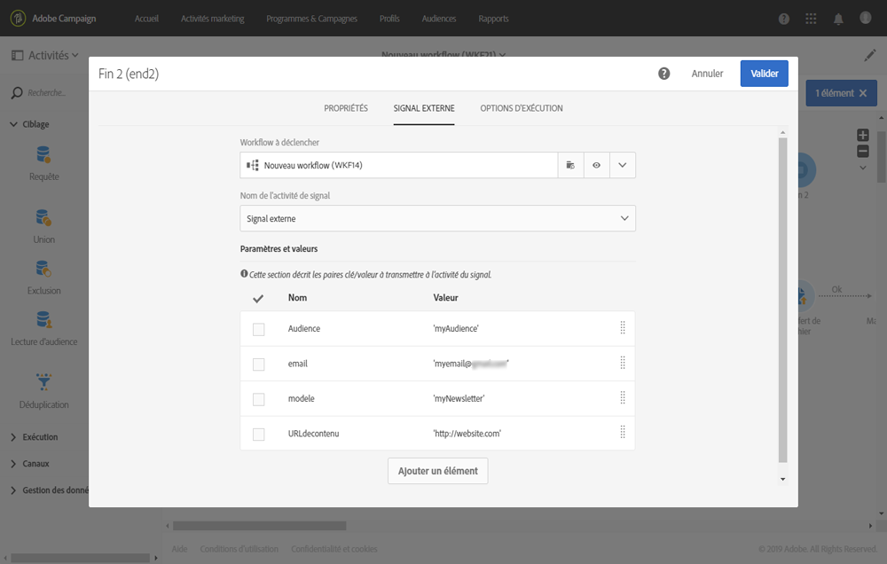

# Appeler un workflow avec des paramètres externes{#calling-a-workflow-with-external-parameters}

Campaign Standard vous permet d'appeler un workflow avec des paramètres (un nom d'audience à cibler, un nom de fichier à importer, un contenu de message, etc.). De cette façon, vous pouvez facilement intégrer vos automatisations Campaign avec votre système externe.

Prenons l'exemple suivant où nous voulons envoyer des emails directement à partir d'un CMS. Dans ce cas, vous pouvez configurer votre système afin de sélectionner l'audience et le contenu email dans le CMS. Cliquer sur Envoyer appellera ensuite un workflow Campaign avec ces paramètres, vous permettant de les utiliser dans le workflow de manière à définir l'audience et le contenu d'URL à utiliser dans la diffusion.

Le processus pour appeler un workflow avec des paramètres est le suivant :

1. Déclarez les paramètres dans l'activité **[!UICONTROL Signal externe]**. Voir [Déclarer les paramètres dans l'activité Signal externe](../../automating/using/calling-a-workflow-with-external-parameters.md#declaring-the-parameters-in-the-external-signal-activity).
1. Configurez l'activité **[!UICONTROL Fin]** ou l'appel API pour définir les paramètres et déclencher l'activité **[!UICONTROL Signal externe]** du workflow.

Une fois le workflow déclenché, les paramètres sont ingérés dans les variables d'événements du workflow et peuvent être utilisés au sein du workflow. Voir [Personnaliser un workflow avec des paramètres externes](../../automating/using/calling-a-workflow-with-external-parameters.md#customizing-a-workflow-with-external-parameters).


## Déclarer les paramètres dans l'activité Signal externe   {#declaring-the-parameters-in-the-external-signal-activity}

Pour appeler un workflow avec des paramètres, la première étape consiste à les déclarer dans une activité **[!UICONTROL Signal externe]**.

1. Ouvrez l'activité **[!UICONTROL Signal externe]** et sélectionnez ensuite l'onglet **[!UICONTROL Paramètres]**.
1. Cliquez sur le bouton **[!UICONTROL Créer un élément]**, puis spécifiez le nom et le type de chaque paramètre.

   >[!CAUTION]
   >
   >Assurez-vous que le nom et le nombre de paramètres correspondent à ce qui est défini lors de l'appel du workflow (voir [Définir les paramètres lors de l'appel du workflow](../../automating/using/calling-a-workflow-with-external-parameters.md#defining-the-parameters-when-calling-the-workflow)). De plus, les types des paramètres doivent être cohérents par rapport aux valeurs attendues.

   

1. Une fois les paramètres déclarés, terminez la configuration du workflow, puis exécutez-le.

## Définir les paramètres lors de l'appel du workflow   {#defining-the-parameters-when-calling-the-workflow}

Cette section explique comment définir des paramètres lors de l'appel d'un workflow. Pour plus d'informations sur l'exécution de cette opération à partir d'un appel API, consultez la [documentation des API REST](https://docs.campaign.adobe.com/doc/standard/en/api/ACS_API.html).

Avant de définir les paramètres, vérifiez les éléments suivants :

* Les paramètres ont été déclarés dans l'activité **[!UICONTROL Signal externe]**. Voir [Déclarer les paramètres dans l'activité Signal externe](../../automating/using/calling-a-workflow-with-external-parameters.md#declaring-the-parameters-in-the-external-signal-activity).
* Le workflow contenant l'activité Signal est en cours d'exécution.

Pour configurer l'activité **[!UICONTROL Fin]**, suivez les étapes ci-dessous :

1. Ouvrez l'activité **[!UICONTROL Fin]**, puis sélectionnez l'onglet **[!UICONTROL Signal externe]**.
1. Sélectionnez le workflow et l'activité Signal externe que vous voulez appeler.
1. Cliquez sur le bouton **[!UICONTROL Créer un élément]** pour ajouter un paramètre, puis indiquez son nom et sa valeur.

   * **[!UICONTROL Nom]** : nom déclaré dans l’activité **[!UICONTROL Signal externe]** (voir [Déclarer les paramètres dans l'activité Signal externe](../../automating/using/calling-a-workflow-with-external-parameters.md#declaring-the-parameters-in-the-external-signal-activity)).
   * **[!UICONTROL Valeur]** : valeur que vous souhaitez assigner au paramètre. La valeur doit respecter la **syntaxe standard**, décrite dans [cette section](../../automating/using/advanced-expression-editing.md#standard-syntax).
   

   >[!CAUTION]
   >
   >Veillez à ce que tous les paramètres soient déclarés dans l'activité **[!UICONTROL Signal externe]**. Dans le cas contraire, une erreur se produira lors de l'exécution de l'activité.

1. Une fois les paramètres définis, confirmez l'activité, puis enregistrez votre workflow.

## Suivi des variables d'événements   {#monitoring-the-events-variables}

Il est possible de suivre les variables d'événements disponibles dans le workflow, y compris les paramètres externes déclarés. Pour ce faire, procédez comme suit :

1. Sélectionnez l'activité qui suit l'activité **[!UICONTROL Signal externe]**, puis cliquez sur le bouton **[!UICONTROL Journal et tâches]**.
1. Dans l'onglet **[!UICONTROL Tâches]**, cliquez sur le bouton .

   

1. Le contexte d'exécution de la tâche s'affiche (ID, état, durée, etc.), y compris toutes les variables d'événements actuellement disponibles dans le workflow.

   

## Personnaliser un workflow avec des paramètres externes   {#customizing-a-workflow-with-external-parameters}

Une fois le workflow déclenché, les paramètres sont ingérés dans les variables d'événements et peuvent être utilisés pour personnaliser les activités du workflow.

Ils peuvent, par exemple, permettre de définir l'audience à lire dans l'activité **[!UICONTROL Lecture d'audience]**, le nom du fichier à transférer dans l'activité **[!UICONTROL Transfert de fichier]**, etc.

Les activités personnalisables avec des variables d'événements sont présentées dans [cette section](../../automating/using/calling-a-workflow-with-external-parameters.md#customizing-activities-with-events-variables).

### Utiliser des variables d'événements   {#using-events-variables}

Les variables d'événements sont utilisées dans une expression qui doit respecter la **[syntaxe standard](../../automating/using/advanced-expression-editing.md#standard-syntax)**.

Pour utiliser des variables d'événements, la syntaxe doit suivre le format ci-dessous et utiliser le nom du paramètre défini dans l'activité **[!UICONTROL Signal externe]** (voir [Déclarer les paramètres dans l'activité Signal externe](../../automating/using/calling-a-workflow-with-external-parameters.md#declaring-the-parameters-in-the-external-signal-activity)) :

```
$(vars/@parameterName)
```

Dans cette syntaxe, la fonction **$** renvoie le type de données **chaîne**. Si vous souhaitez spécifier un autre type de données, utilisez les fonctions suivantes :

* **$long** : nombre entier.
* **$float** : nombre décimal.
* **$boolean** : vrai/faux.
* **$datetime** : horodatage.

Si vous utilisez une variable dans une activité, l'interface vous aide à l'appeler.


*  : sélectionnez la variable d'événements parmi toutes les variables disponibles dans le workflow (voir ).

   

*  : éditez les expressions en associant des variables et des fonctions. Pour plus d'informations sur l'éditeur d'expression, voir [cette section](../../automating/using/advanced-expression-editing.md).

   

**Rubriques connexes :**

* [Editer une expression ](../../automating/using/advanced-expression-editing.md#edit-an-expression)
* [Syntaxe standard](../../automating/using/advanced-expression-editing.md#standard-syntax)
* [Liste des fonctions](../../automating/using/list-of-functions.md)

### Personnaliser les activités avec des variables d'événements   {#customizing-activities-with-events-variables}

Les variables d'événements peuvent servir à personnaliser plusieurs activités, répertoriées dans la section ci-dessous. Pour plus d'informations sur la façon d'appeler une variable à partir d'une activité, consultez [cette section](../../automating/using/calling-a-workflow-with-external-parameters.md#using-events-variables).

**[!UICONTROL Activité Lecture d'audience]** : définissez l'audience à cibler en fonction de variables d'événements.

Pour plus d'informations sur la façon d'utiliser l'activité, consultez la [section dédiée](../../automating/using/read-audience.md).


**[!UICONTROL Activité Test]** : créez des conditions reposant sur des variables d'événements.

Pour plus d'informations sur la façon d'utiliser l'activité, consultez la [section dédiée](../../automating/using/test.md).


**[!UICONTROL Activité Transfert de fichier]** : personnalisez le fichier à transférer en fonction des variables d'événements.

Pour plus d'informations sur la façon d'utiliser l'activité, consultez la [section dédiée](../../automating/using/transfer-file.md).


**[!UICONTROL Activité Requête]** : les paramètres peuvent être référencés dans une requête en faisant appel à des expressions associant des variables d'événements et des fonctions. Pour ce faire, ajoutez une règle, puis cliquez sur le lien **[!UICONTROL Mode avancé]** afin d'accéder à la fenêtre d'édition d'expression (voir [Edition avancée d'expressions](../../automating/using/advanced-expression-editing.md)).

Pour plus d'informations sur la façon d'utiliser l'activité, consultez la [section dédiée](../../automating/using/query.md).


**[!UICONTROL Activités Canaux]** : personnalisez des diffusions en fonction de variables d'événements.

>[!NOTE]
>
>Les valeurs des paramètres de diffusion sont récupérées chaque fois que la diffusion est préparée.
>
>La préparation des diffusions récurrentes repose sur la **période d'agrégation** de diffusion. Par exemple, si la période d'agrégation est "par jour", la diffusion n'est repréparée qu'une fois par jour. Si la valeur d'un paramètre de diffusion est modifiée pendant la journée, elle n'est pas mise à jour dans la diffusion, car celle-ci a déjà été préparée une fois.
>
>Si vous envisagez d'appeler le workflow plusieurs fois par jour, utilisez l'option [!UICONTROL Pas d'agrégation] pour que les paramètres de diffusion soient mis à jour chaque fois. Pour plus d'informations sur la configuration des diffusions récurrentes, consultez [cette section](/help/automating/using/email-delivery.md#configuration).

Pour personnaliser une diffusion en fonction de variables d'événements, vous devez tout d'abord déclarer dans l'activité de diffusion les variables que vous voulez utiliser :

1. Sélectionnez l'activité, puis cliquez sur le bouton  afin d'accéder aux paramètres.
1. Sélectionnez l'onglet **[!UICONTROL Général]**, puis ajoutez les variables d'événements qui seront disponibles dans la diffusion sous la forme de champs de personnalisation.

   

1. Cliquez sur le bouton **[!UICONTROL Confirmer].**

Les variables d'événements déclarées sont à présent disponibles dans la liste des champs de personnalisation. Vous pouvez les utiliser dans la diffusion de façon à réaliser les actions ci-dessous :

* Définissez le nom du modèle à utiliser pour la diffusion.

   >[!NOTE]
   >
   >Cette action est disponible uniquement pour les diffusions **récurrentes**.

   

* Personnalisez la diffusion : lorsque vous sélectionnez un champ de personnalisation pour configurer une diffusion, des variables d'événements sont disponibles dans l'élément **[!UICONTROL Paramètres de workflow]**. Vous pouvez les utiliser comme tout autre champ de personnalisation, par exemple pour définir l'objet de la diffusion, l'expéditeur, etc.

   La personnalisation de la diffusion est présentée dans [cette section](../../designing/using/about-personalization.md).

   

**Codes segment** : définissez le code segment en fonction des variables d'événements.

>[!NOTE]
>
>Cette action peut être réalisée à partir de n'importe quelle activité qui vous permet de définir un code segment, tel que des activités **[!UICONTROL Requête]** ou **[!UICONTROL Segmentation]**.


**Libellé de la diffusion** : définissez le libellé de la diffusion en fonction des variables d'événements.


## Utilisation :{#use-case}

Le cas pratique ci-dessous vous présente comment appeler un workflow avec des paramètres au sein de vos workflows.

L'objectif est de déclencher un workflow à partir d'un appel API avec des paramètres externes. Ce workflow chargera des données dans votre base de données à partir d'un fichier et créera une audience associée. Une fois l'audience créée, un deuxième workflow sera déclenché pour envoyer un message personnalisé avec les paramètres externes définis dans l'appel API.

Pour mettre en place ce cas pratique, vous devez réaliser les actions ci-dessous :

1. **Effectuez un appel API** pour déclencher le workflow 1 avec des paramètres externes. Voir [Etape 1 : configurer l'appel API](../../automating/using/calling-a-workflow-with-external-parameters.md#step-1--configuring-the-api-call).
1. **Créez le workflow 1** : le workflow transférera un fichier et le chargera dans la base de données. Il effectuera ensuite un test pour déterminer si les données sont vides et finira par enregistrer les profils dans une audience. Enfin, il déclenchera le workflow 2. Voir [Etape 2 : configurer le workflow 1](../../automating/using/calling-a-workflow-with-external-parameters.md#step-2--configuring-workflow-1).
1. **Créez le workflow 2** : le workflow lira l'audience créée dans le workflow 1, puis il enverra un message personnalisé aux profils, avec un code segment personnalisé au moyen des paramètres. Voir [Etape 3 : configurer le workflow 2](../../automating/using/calling-a-workflow-with-external-parameters.md#step-3--configuring-workflow-2).


### Prérequis {#prerequisites}

Avant de configurer les workflows, vous devez créer les workflows 1 et 2 avec une activité **[!UICONTROL Signal externe]** dans chacun d'eux. Ce faisant, vous pourrez cibler ces activités Signal lors de l'appel des workflows.

### Etape 1 : configurer l'appel API   {#step-1--configuring-the-api-call}

Effectuez un appel API pour déclencher le workflow 1 avec des paramètres. Pour plus d'informations sur la syntaxe de l'appel API, consultez la [documentation des API REST Campaign Standard](https://docs.campaign.adobe.com/doc/standard/en/api/ACS_API.html).

Dans notre cas, nous souhaitons appeler le workflow avec les paramètres ci-dessous :

* **fileToTarget** : nom du fichier que nous voulons importer dans la base de données.
* **discountDesc** : description que nous voulons afficher dans la diffusion pour la remise.

```
-X POST https://mc.adobe.io/<ORGANIZATION>/campaign/<TRIGGER_URL>
-H 'Authorization: Bearer <ACCESS_TOKEN>' 
-H 'Cache-Control: no-cache' 
-H 'X-Api-Key: <API_KEY>' 
-H 'Content-Type: application/json;charset=utf-8' 
-H 'Content-Length:79' 
-i
-d {
-d "source:":"API",
-d "parameters":{
-d "fileToTarget":"profile.txt",
-d "discountDesc":"Running shoes"
-d } 
```

### Etape 2 : configurer le workflow 1   {#step-2--configuring-workflow-1}

Le workflow 1 sera créé tel que ci-dessous :

* **[!UICONTROL Activité Signal externe]** : où les paramètres externes doivent être déclarés afin d'être utilisés au sein du workflow.
* **[!UICONTROL Activité Transfert de fichier]** : importe le fichier avec le nom défini dans les paramètres.
* **[!UICONTROL Activité Chargement de fichier]** : charge dans la base de données les données du fichier importé.
* **[!UICONTROL Activité Mise à jour de données]** : ajoute les données du fichier importé à la base de données ou la met à jour avec ces données.
* **[!UICONTROL Activité Test]** : vérifie si des données sont importées.
* **[!UICONTROL Activité Sauvegarde d'audience]** : si le fichier contient des données, enregistre les profils dans une audience.
* **[!UICONTROL Activité Fin]** : appelle le workflow 2 avec les paramètres que vous voulez utiliser dans celui-ci.


Suivez les étapes ci-dessous pour configurer le workflow :

1. Déclarez les paramètres qui ont été définis dans l'appel API. Pour ce faire, ouvrez l'activité **[!UICONTROL Signal externe]**, puis ajoutez les noms et les types de paramètres.

   

1. Ajoutez une activité **[!UICONTROL Transfert de fichier]** afin d'importer des données dans la base de données. Pour cela, faites glisser et déposez l'activité, ouvrez-la, puis sélectionnez l'onglet **[!UICONTROL Protocole]**.
1. Sélectionnez l'option **[!UICONTROL Utiliser un chemin d'accès au fichier dynamique]**, puis utilisez le paramètre **fileToTarget** comme fichier à transférer :

   ```
   $(vars/@fileToTarget)
   ```

   

1. Chargez les données du fichier dans la base de données.

   Pour ce faire, faites glisser une activité **[!UICONTROL Chargement de fichier]** et déposez-la dans le workflow, puis configurez-la selon vos besoins.

1. Insérez les données du fichier importé dans la base de données ou mettez-la à jour avec ces données.

   Pour cela, faites glisser et déposez une activité **[!UICONTROL Mise à jour de données]**, puis sélectionnez l'onglet **[!UICONTROL Identification]** afin d'ajouter un critère de réconciliation (dans notre cas, le champ **email**).

   

1. Sélectionnez l'onglet **[!UICONTROL Champs à mettre à jour]**, puis spécifiez les champs à mettre à jour dans la base de données (dans notre cas, les champs **firstname** et **email**).

   

1. Vérifiez si des données sont récupérées à partir du fichier. Pour ce faire, faites glisser une activité **[!UICONTROL Test]** et déposez-la dans le workflow, puis cliquez sur le bouton **[!UICONTROL Ajouter un élément]** afin d'ajouter une condition.
1. Nommez et définissez la condition. Dans notre cas, nous voulons tester si la transition sortante contient des données avec la syntaxe ci-dessous :

   ```
   $long(vars/@recCount)>0
   ```

   

1. Si des données sont récupérées, enregistrez-les dans une audience. Pour cela, ajoutez une activité **[!UICONTROL Sauvegarde d'audience]** à la transition **Cible non vide**, puis ouvrez-la.
1. Sélectionnez l'option **[!UICONTROL Utiliser un libellé dynamique]**, puis utilisez le paramètre **fileToTarget** comme libellé de l'audience :

   ```
   $(vars/@fileToTarget)
   ```

   

1. Faites glisser et déposez une activité **[!UICONTROL Fin]** qui appellera le workflow 2 avec des paramètres, puis ouvrez-la.
1. Sélectionnez l'onglet **[!UICONTROL Signal externe]**, puis spécifiez le workflow à déclencher et son activité Signal associée.
1. Définissez les paramètres que vous voulez utiliser au sein du workflow 2 ainsi que leurs valeurs associées.

   Dans notre cas, nous souhaitons transmettre les paramètres initialement définis dans l'appel API (**fileToTarget** et **discountDesc**), de même qu'un paramètre **segmentCode** supplémentaire avec une valeur constante ("remise de 20 %").

   

Le workflow 1 est configuré, et vous pouvez maintenant créer le workflow 2. Voir à ce propos [cette section](../../automating/using/calling-a-workflow-with-external-parameters.md#step-3--configuring-workflow-2).

### Etape 3 : configurer le workflow 2   {#step-3--configuring-workflow-2}

Le workflow 2 sera créé tel que ci-dessous :

* **[!UICONTROL Activité Signal externe]** : où les paramètres doivent être déclarés afin d'être utilisés au sein du workflow.
* **[!UICONTROL Activité Lecture d'audience]** : lit l'audience enregistrée dans le workflow 1.
* **[!UICONTROL Activité Diffusion Email]** : envoie un message récurrent à l'audience ciblée, personnalisée avec des paramètres.


Suivez les étapes ci-dessous pour configurer le workflow :

1. Déclarez les paramètres qui ont été définis dans le workflow 1.

   Pour ce faire, ouvrez l’activité **[!UICONTROL Signal externe]**, puis ajoutez le nom et le type de chaque paramètre défini dans l'activité **[!UICONTROL Fin]** du workflow 1.

   

1. Utilisez l'audience qui a été enregistrée dans le workflow 1. Pour cela, faites glisser une activité **[!UICONTROL Lecture d'audience]** et déposez-la dans le workflow, puis ouvrez-la.
1. Sélectionnez l'option **[!UICONTROL Utiliser une audience dynamique]**, puis utilisez le paramètre **fileToTarget** comme nom de l'audience à lire :

   ```
   $(vars/@fileToTarget)
   ```

   

1. Nommez la transition sortante selon le paramètre **segmentCode**.

   Pour ce faire, sélectionnez l'onglet **[!UICONTROL Transition]**, puis l'option **[!UICONTROL Utiliser un code segment dynamique]**.

1. Utilisez le paramètre **segmentCode** comme nom de la transition sortante :

   ```
   $(vars/@segmentCode)
   ```

   

1. Faites glisser et déposez une activité **[!UICONTROL Diffusion Email]** pour envoyer un message à l'audience.
1. Identifiez les paramètres à utiliser dans le message afin de le personnaliser avec le paramètre **discountDesc**. Pour cela, ouvrez les options avancées de l'activité, puis ajoutez le nom et la valeur du paramètre.

   

1. Vous pouvez à présent configurer le message. Ouvrez l'activité, puis sélectionnez **[!UICONTROL Email récurrent]**.

   

1. Sélectionnez le modèle à utiliser, puis définissez les propriétés d'email selon vos besoins.
1. Utilisez le paramètre **discountDesc** en tant que champ de personnalisation. Pour ce faire, sélectionnez-le dans la liste des champs de personnalisation.

   

1. Vous pouvez maintenant terminer la configuration du message et l'envoyer ensuite de manière habituelle.

   

### Exécuter les workflows   {#executing-the-workflows}

Une fois les workflows créés, vous pouvez les exécuter. Assurez-vous que les deux workflows sont démarrés avant d'effectuer l'appel API. 
