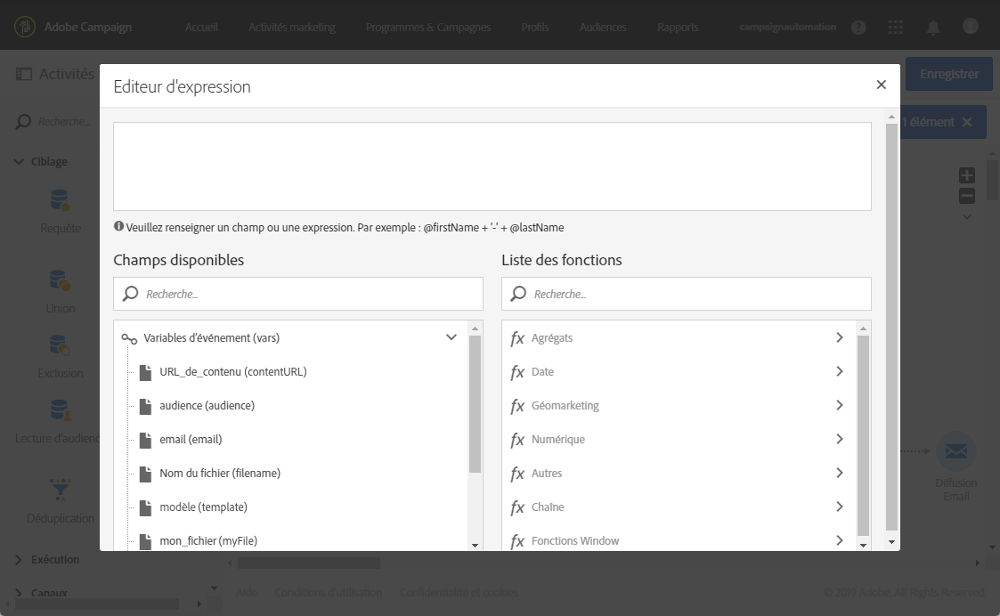
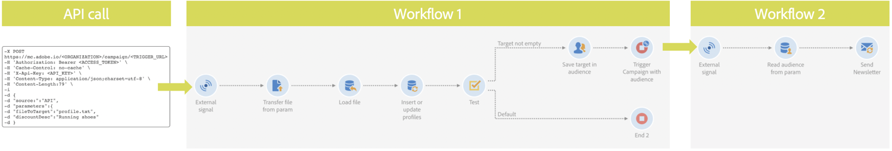

# Appeler un workflow avec des paramètres externes{#calling-a-workflow-with-external-parameters}

Campaign Standard vous permet d&#39;appeler un workflow avec des paramètres (un nom d&#39;audience à cibler, un nom de fichier à importer, un contenu de message, etc.). De cette façon, vous pouvez facilement intégrer vos automatisations Campaign avec votre système externe.

Prenons l&#39;exemple suivant où nous voulons envoyer des emails directement à partir d&#39;un CMS. Dans ce cas, vous pouvez configurer votre système afin de sélectionner l&#39;audience et le contenu email dans le CMS. Cliquer sur Envoyer appellera ensuite un workflow Campaign avec ces paramètres, vous permettant de les utiliser dans le workflow de manière à définir l&#39;audience et le contenu d&#39;URL à utiliser dans la diffusion.

Le processus pour appeler un workflow avec des paramètres est le suivant :

1. Déclarez les paramètres dans le  . **[!UICONTROL External signal]** Voir [Déclarer les paramètres dans l&#39;activité Signal externe](../../automating/using/calling-a-workflow-with-external-parameters.md#declaring-the-parameters-in-the-external-signal-activity).
1. Configure the **[!UICONTROL End]** activity or the API call to define the parameters and trigger the workflow **[!UICONTROL External signal]** activity.

Une fois le workflow déclenché, les paramètres sont ingérés dans les variables d&#39;événements du workflow et peuvent être utilisés au sein du workflow. Voir [Personnaliser un workflow avec des paramètres externes](../../automating/using/calling-a-workflow-with-external-parameters.md#customizing-a-workflow-with-external-parameters).


## Déclarer les paramètres dans l&#39;activité Signal externe  {#declaring-the-parameters-in-the-external-signal-activity}

The first step to call a workflow with parameters is to declare them in an **[!UICONTROL External signal]** activity.

1. Ouvrez le  , puis sélectionnez l’ **[!UICONTROL External signal]** **[!UICONTROL Parameters]** onglet.
1. Click the **[!UICONTROL Create element]** button, then specify the name and type of each parameter.

   >[!CAUTION]
   >
   >Assurez-vous que le nom et le nombre de paramètres correspondent à ce qui est défini lors de l&#39;appel du workflow (voir [Définir les paramètres lors de l&#39;appel du workflow](../../automating/using/calling-a-workflow-with-external-parameters.md#defining-the-parameters-when-calling-the-workflow)). De plus, les types des paramètres doivent être cohérents par rapport aux valeurs attendues.

   

1. Une fois les paramètres déclarés, terminez la configuration du workflow, puis exécutez-le.

## Définir les paramètres lors de l&#39;appel du workflow  {#defining-the-parameters-when-calling-the-workflow}

Cette section explique comment définir des paramètres lors de l&#39;appel d&#39;un workflow. Pour plus d&#39;informations sur l&#39;exécution de cette opération à partir d&#39;un appel API, consultez la [documentation des API REST](../../api/using/triggering-a-signal-activity.md).

Avant de définir les paramètres, vérifiez les éléments suivants :

* The parameters have been declared in the **[!UICONTROL External Signal]** activity. Voir [Déclarer les paramètres dans l&#39;activité Signal externe](../../automating/using/calling-a-workflow-with-external-parameters.md#declaring-the-parameters-in-the-external-signal-activity).
* Le workflow contenant l&#39;activité Signal est en cours d&#39;exécution.

To configure the **[!UICONTROL End]** activity, follow the steps below:

1. Ouvrez le  , puis sélectionnez l’ **[!UICONTROL End]** **[!UICONTROL External signal]** onglet.
1. Sélectionnez le workflow et l&#39;activité Signal externe que vous voulez appeler.
1. Click the **[!UICONTROL Create element]** button to add a parameter, then fill in its name and value.

   * **[!UICONTROL Name]**: nom qui a été déclaré dans le   (voir **[!UICONTROL External signal]** Déclaration des paramètres dans le signal externe  le [](../../automating/using/calling-a-workflow-with-external-parameters.md#declaring-the-parameters-in-the-external-signal-activity)).
   * **[!UICONTROL Value]**: valeur que vous souhaitez affecter au paramètre. La valeur doit respecter la **syntaxe standard**, décrite dans [cette section](../../automating/using/advanced-expression-editing.md#standard-syntax).
   

   >[!CAUTION]
   >
   >Make sure that all the parameters have been declared in the **[!UICONTROL External signal]** activity. Dans le cas contraire, une erreur se produira lors de l&#39;exécution de l&#39;activité.

1. Une fois les paramètres définis, confirmez l&#39;activité, puis enregistrez votre workflow.

## Suivi des variables d&#39;événements  {#monitoring-the-events-variables}

Il est possible de suivre les variables d&#39;événements disponibles dans le workflow, y compris les paramètres externes déclarés. Pour cela, procédez comme suit :

1. Sélectionnez le   qui suit le **[!UICONTROL External signal]** , puis cliquez sur le **[!UICONTROL Log and tasks]** bouton.
1. In the **[!UICONTROL Tasks]** tab, click  button.

   

1. Le contexte d&#39;exécution de la tâche s&#39;affiche (ID, état, durée, etc.), y compris toutes les variables d&#39;événements actuellement disponibles dans le workflow.

   

## Personnaliser un workflow avec des paramètres externes  {#customizing-a-workflow-with-external-parameters}

Une fois le workflow déclenché, les paramètres sont ingérés dans les variables d&#39;événements et peuvent être utilisés pour personnaliser les activités du workflow.

They can, for example, be used to define which audience to read in the **[!UICONTROL Read audience]** activity, the name of the file to transfer in the **[!UICONTROL Transfer file]** activity, etc.

Les activités personnalisables avec des variables d&#39;événements sont présentées dans [cette section](../../automating/using/calling-a-workflow-with-external-parameters.md#customizing-activities-with-events-variables).

### Utiliser des variables d&#39;événements  {#using-events-variables}

Les variables d&#39;événements sont utilisées dans une expression qui doit respecter la **[syntaxe standard](../../automating/using/advanced-expression-editing.md#standard-syntax)**.

The syntax to use events variables must follow the format below, and use the parameter&#39;s name that has been defined in the **[!UICONTROL External signal]** activity (see [Declaring the parameters in the External signal activity](../../automating/using/calling-a-workflow-with-external-parameters.md#declaring-the-parameters-in-the-external-signal-activity)):

```
$(vars/@parameterName)
```

Dans cette syntaxe, la fonction **$** renvoie le type de données **chaîne**. Si vous souhaitez spécifier un autre type de données, utilisez les fonctions suivantes :

* **$long** : nombre entier.
* **$float** : nombre décimal.
* **$boolean** : vrai/faux.
* **$datetime** : horodatage.

Si vous utilisez une variable dans une activité, l&#39;interface vous aide à l&#39;appeler.


* : sélectionnez la variable de  parmi toutes les variables disponibles dans le flux de travaux.

   

*  : éditez les expressions en associant des variables et des fonctions. Pour plus d&#39;informations sur l&#39;éditeur d&#39;expression, voir [cette section](../../automating/using/advanced-expression-editing.md).

   

**Rubriques connexes :**

* [Editer une expression ](../../automating/using/advanced-expression-editing.md#edit-an-expression)
* [Syntaxe standard](../../automating/using/advanced-expression-editing.md#standard-syntax)
* [Liste des fonctions](../../automating/using/list-of-functions.md)

### Personnaliser les activités avec des variables d&#39;événements  {#customizing-activities-with-events-variables}

Les variables d&#39;événements peuvent servir à personnaliser plusieurs activités, répertoriées dans la section ci-dessous. Pour plus d&#39;informations sur la façon d&#39;appeler une variable à partir d&#39;une activité, consultez [cette section](../../automating/using/calling-a-workflow-with-external-parameters.md#using-events-variables).

**[!UICONTROL Read audience]**   : définissez le   à  en fonction des variables de.

Pour plus d&#39;informations sur la façon d&#39;utiliser l&#39;activité, consultez la [section dédiée](../../automating/using/read-audience.md).


**[!UICONTROL Test]** Activité  :  : créez des conditions reposant sur des variables d&#39;événements.

Pour plus d&#39;informations sur la façon d&#39;utiliser l&#39;activité, consultez la [section dédiée](../../automating/using/test.md).


**[!UICONTROL Transfer file]**   : personnalisez le fichier à transférer en fonction de variables .

Pour plus d&#39;informations sur la façon d&#39;utiliser l&#39;activité, consultez la [section dédiée](../../automating/using/transfer-file.md).


**[!UICONTROL Query]**   : peuvent être référencés dans un , en utilisant , en combinant des variables et des fonctions de. To do this, add a rule then click the **[!UICONTROL Advanced mode]** link to access the expression editing window (see [Advanced expression editing](../../automating/using/advanced-expression-editing.md)).

Pour plus d&#39;informations sur la façon d&#39;utiliser l&#39;activité, consultez la [section dédiée](../../automating/using/query.md).


**[!UICONTROL Channels]**   : personnalisez les  en fonction des variables .

>[!NOTE]
>
>Les valeurs des paramètres de diffusion sont récupérées chaque fois que la diffusion est préparée.
>
>La préparation des diffusions récurrentes repose sur la **période d&#39;agrégation** de diffusion. Par exemple, si la période d&#39;agrégation est &quot;par jour&quot;, la diffusion n&#39;est repréparée qu&#39;une fois par jour. Si la valeur d&#39;un paramètre de diffusion est modifiée pendant la journée, elle n&#39;est pas mise à jour dans la diffusion, car celle-ci a déjà été préparée une fois.
>
>If you plan on calling the workflow multiple times a day, use the [!UICONTROL No aggregation] option, so that the delivery parameters are updated each time. Pour plus d&#39;informations sur la configuration des diffusions récurrentes, consultez [cette section](/help/automating/using/email-delivery.md#configuration).

Pour personnaliser une diffusion en fonction de variables d&#39;événements, vous devez tout d&#39;abord déclarer dans l&#39;activité de diffusion les variables que vous voulez utiliser :

1. Sélectionnez l&#39;activité, puis cliquez sur le bouton  afin d&#39;accéder aux paramètres.
1. Select the **[!UICONTROL General]** tab, then add the events variables that will be available as personalization fields in the delivery.

   

1. Cliquez sur le **[!UICONTROL Confirm]** bouton.

Les variables d&#39;événements déclarées sont à présent disponibles dans la liste des champs de personnalisation. Vous pouvez les utiliser dans la diffusion de façon à réaliser les actions ci-dessous :

* Définissez le nom du modèle à utiliser pour la diffusion.

   >[!NOTE]
   >
   >Cette action est disponible uniquement pour les diffusions **récurrentes**.

   

* Personalize the delivery: when selecting a personalization field to configure a delivery, events variables are available in the **[!UICONTROL Workflow parameters]** element. Vous pouvez les utiliser comme tout autre champ de personnalisation, par exemple pour définir l&#39;objet de la diffusion, l&#39;expéditeur, etc.

   La personnalisation de la diffusion est présentée dans [cette section](../../designing/using/personalization.md).

   

**Codes segment** : définissez le code segment en fonction des variables d&#39;événements.

>[!NOTE]
>
>This action can be performed from any activity that lets you define a segment code like, for example, **[!UICONTROL Query]** or **[!UICONTROL Segmentation]** activities.


**Libellé de la diffusion** : définissez le libellé de la diffusion en fonction des variables d&#39;événements.


## Utilisation :{#use-case}

Le cas pratique ci-dessous vous présente comment appeler un workflow avec des paramètres au sein de vos workflows.

L&#39;objectif est de déclencher un workflow à partir d&#39;un appel API avec des paramètres externes. Ce workflow chargera des données dans votre base de données à partir d&#39;un fichier et créera une audience associée. Une fois l&#39;audience créée, un deuxième workflow sera déclenché pour envoyer un message personnalisé avec les paramètres externes définis dans l&#39;appel API.

Pour mettre en place ce cas pratique, vous devez réaliser les actions ci-dessous :

1. **Effectuez un appel API** pour déclencher le workflow 1 avec des paramètres externes. Voir [Etape 1 : configurer l&#39;appel API](../../automating/using/calling-a-workflow-with-external-parameters.md#step-1--configuring-the-api-call).
1. **Créez le workflow 1** : le workflow transférera un fichier et le chargera dans la base de données. Il effectuera ensuite un test pour déterminer si les données sont vides et finira par enregistrer les profils dans une audience. Enfin, il déclenchera le workflow 2. Voir [Etape 2 : configurer le workflow 1](../../automating/using/calling-a-workflow-with-external-parameters.md#step-2--configuring-workflow-1).
1. **Créez le workflow 2** : le workflow lira l&#39;audience créée dans le workflow 1, puis il enverra un message personnalisé aux profils, avec un code segment personnalisé au moyen des paramètres. Voir [Etape 3 : configurer le workflow 2](../../automating/using/calling-a-workflow-with-external-parameters.md#step-3--configuring-workflow-2).



### Prérequis {#prerequisites}

Before configuring the workflows, you need to create Workflow 1 and 2 with an **[!UICONTROL External signal]** activity in each of them. Ce faisant, vous pourrez cibler ces activités Signal lors de l&#39;appel des workflows.

### Etape 1 : configurer l&#39;appel API  {#step-1--configuring-the-api-call}

Effectuez un appel API pour déclencher le workflow 1 avec des paramètres. Pour plus d&#39;informations sur la syntaxe de l&#39;appel API, consultez la [documentation des API REST Campaign Standard](../../api/using/triggering-a-signal-activity.md).

Dans notre cas, nous souhaitons appeler le workflow avec les paramètres ci-dessous :

* **fileToTarget** : nom du fichier que nous voulons importer dans la base de données.
* **discountDesc** : description que nous voulons afficher dans la diffusion pour la remise.

```
-X POST https://mc.adobe.io/<ORGANIZATION>/campaign/<TRIGGER_URL>
-H 'Authorization: Bearer <ACCESS_TOKEN>' 
-H 'Cache-Control: no-cache' 
-H 'X-Api-Key: <API_KEY>' 
-H 'Content-Type: application/json;charset=utf-8' 
-H 'Content-Length:79' 
-i
-d {
-d "source:":"API",
-d "parameters":{
-d "fileToTarget":"profile.txt",
-d "discountDesc":"Running shoes"
-d } 
```

### Etape 2 : configurer le workflow 1  {#step-2--configuring-workflow-1}

Le workflow 1 sera créé tel que ci-dessous :

* **[!UICONTROL External signal]**   : où les paramètres externes doivent être déclarés pour être utilisés dans le flux de travaux.
* **[!UICONTROL Transfer file]**   : importe le fichier avec le nom défini dans les paramètres.
* **[!UICONTROL Load file]**   : charge les données du fichier importé dans la base de données.
* **[!UICONTROL Update data]**   : insérez ou mettez à jour la base de données avec les données du fichier importé.
* **[!UICONTROL Test]** Activité  :  : vérifie si des données sont importées.
* **[!UICONTROL Save audience]**   : si le fichier contient des données, enregistre le  dans un  de.
* **[!UICONTROL End activity]**   : appelle Workflow 2 avec les paramètres que vous souhaitez utiliser.


Suivez les étapes ci-dessous pour configurer le workflow :

1. Déclarez les paramètres qui ont été définis dans l&#39;appel API. To do this, open the **[!UICONTROL External signal]** activity, then add the parameters&#39; names and types.

   

1. Add a **[!UICONTROL Transfer file]** activity to import data into the database.To do this, drag and drop the activity, open it, then select the **[!UICONTROL Protocol]** tab.
1. Sélectionnez l’ **[!UICONTROL Use a dynamic file path]** option, puis utilisez le paramètre **fileToTarget** comme fichier à transférer :

   ```
   $(vars/@fileToTarget)
   ```

   

1. Chargez les données du fichier dans la base de données.

   To do this, drag and drop a **[!UICONTROL Load file]** activity into the workflow, then configure it according to your needs.

1. Insérez les données du fichier importé dans la base de données ou mettez-la à jour avec ces données.

   To do this, drag and drop an **[!UICONTROL Update data]** activity, then select the **[!UICONTROL Identification]** tab to add a reconciliation criteria (in our case the **email** field).

   

1. Select the **[!UICONTROL Fields to update]** tab, then specify the fields to update in the database (in our case the **firstname** and **email** fields).

   

1. Vérifiez si des données sont récupérées à partir du fichier. To do this, drag and drop a **[!UICONTROL Test]** activity into the workflow, then click the **[!UICONTROL Add an element]** button to add a condition.
1. Nommez et définissez la condition. Dans notre cas, nous voulons tester si la transition sortante contient des données avec la syntaxe ci-dessous :

   ```
   $long(vars/@recCount)>0
   ```

   

1. Si des données sont récupérées, enregistrez-les dans une audience. To do this, add a **[!UICONTROL Save audience]** activity to the **Target not empty** transition, then open it.
1. Select the **[!UICONTROL Use a dynamic label]** option, then use the **fileToTarget** parameter as the label of the audience:

   ```
   $(vars/@fileToTarget)
   ```

   

1. Drag and drop an **[!UICONTROL End]** activity that will call Workflow 2 with parameters, then open it.
1. Select the **[!UICONTROL External signal]** tab, then specify the workflow to trigger and its associated signal activity.
1. Définissez les paramètres que vous voulez utiliser au sein du workflow 2 ainsi que leurs valeurs associées.

   Dans notre cas, nous souhaitons transmettre les paramètres initialement définis dans l&#39;appel API (**fileToTarget** et **discountDesc**), de même qu&#39;un paramètre **segmentCode** supplémentaire avec une valeur constante (&quot;remise de 20 %&quot;).

   

Le workflow 1 est configuré, et vous pouvez maintenant créer le workflow 2. Voir à ce propos [cette section](../../automating/using/calling-a-workflow-with-external-parameters.md#step-3--configuring-workflow-2).

### Etape 3 : configurer le workflow 2  {#step-3--configuring-workflow-2}

Le workflow 2 sera créé tel que ci-dessous :

* **[!UICONTROL External signal]**   : où les paramètres doivent être déclarés pour être utilisés dans le flux de travaux.
* **[!UICONTROL Read audience]**   : lit le   enregistré dans le flux de travail 1.
* **[!UICONTROL Email delivery]**   : envoie un message récurrent au  ciblé , personnalisé avec des paramètres.


Suivez les étapes ci-dessous pour configurer le workflow :

1. Déclarez les paramètres qui ont été définis dans le workflow 1.

   To do this, open the **[!UICONTROL External signal]** activity, then add the name and type of each parameter defined in the **[!UICONTROL End]** activity of Workflow 1.

   

1. Utilisez l&#39;audience qui a été enregistrée dans le workflow 1. To do this, drag and drop a **[!UICONTROL Read audience]** activity into the workflow, then open it.
1. Select the **[!UICONTROL Use a dynamic audience]** option, then use the **fileToTarget** parameter as the name of the audience to read:

   ```
   $(vars/@fileToTarget)
   ```

   

1. Nommez la transition sortante selon le paramètre **segmentCode**.

   Pour ce faire, sélectionnez l’ **[!UICONTROL Transition]** onglet, puis l’ **[!UICONTROL Use a dynamic segment code]** option.

1. Utilisez le paramètre **segmentCode** comme nom de la transition sortante :

   ```
   $(vars/@segmentCode)
   ```

   

1. Drag and drop an **[!UICONTROL Email delivery]** activity to send a message to the audience.
1. Identifiez les paramètres à utiliser dans le message afin de le personnaliser avec le paramètre **discountDesc**. Pour cela, ouvrez les options avancées de l&#39;activité, puis ajoutez le nom et la valeur du paramètre.

   

1. Vous pouvez à présent configurer le message. Ouvrez le  , puis sélectionnez **[!UICONTROL Recurring email]**.

   

1. Sélectionnez le modèle à utiliser, puis définissez les propriétés d&#39;email selon vos besoins.
1. Utilisez le paramètre **discountDesc** en tant que champ de personnalisation. Pour ce faire, sélectionnez-le dans la liste des champs de personnalisation.

   

1. Vous pouvez maintenant terminer la configuration du message et l&#39;envoyer ensuite de manière habituelle.

   

### Exécuter les workflows  {#executing-the-workflows}

Une fois les workflows créés, vous pouvez les exécuter. Assurez-vous que les deux workflows sont démarrés avant d&#39;effectuer l&#39;appel API.
