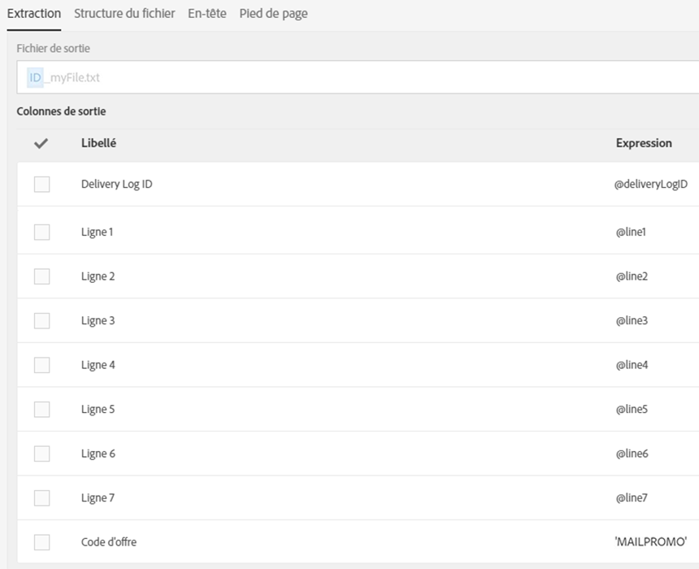
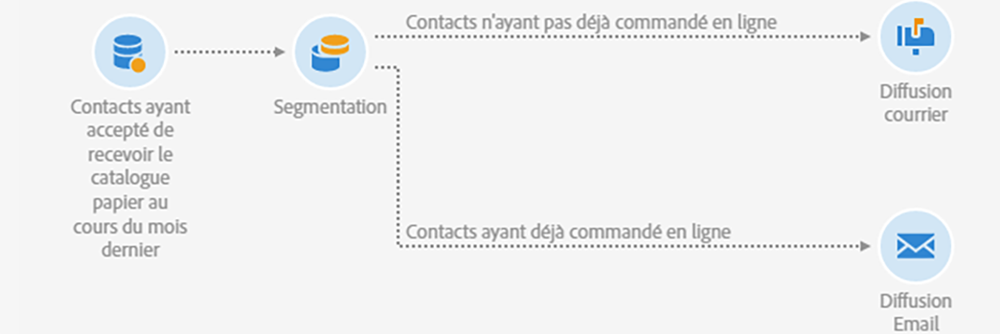

# Diffusions conjointes d’emails et de courriers {#coupling-email-direct-mail}

En tant que marketeur, vous souhaitez envoyer un catalogue papier par courrier. Celui-ci contient des remises de 10 % sur certaines pages qui sont associées à un code de promotion et un lien pour acheter le produit sur le site Web.

L&#39;utilisation conjointe des canaux off-line et on-line est intéressante, car certains clients souhaitent consulter les produits sur catalogue papier et passer leur commande en ligne.

Voici un exemple de modèle de courrier qui peut être utilisé.

Voici un exemple de workflow qui mélange les canaux Courrier et Email.

**Rubriques connexes :**

* [Activité de diffusion courrier](../../automating/using/direct-mail-delivery.md)
* [A propos du canal Courrier](../../channels/using/about-direct-mail.md)
