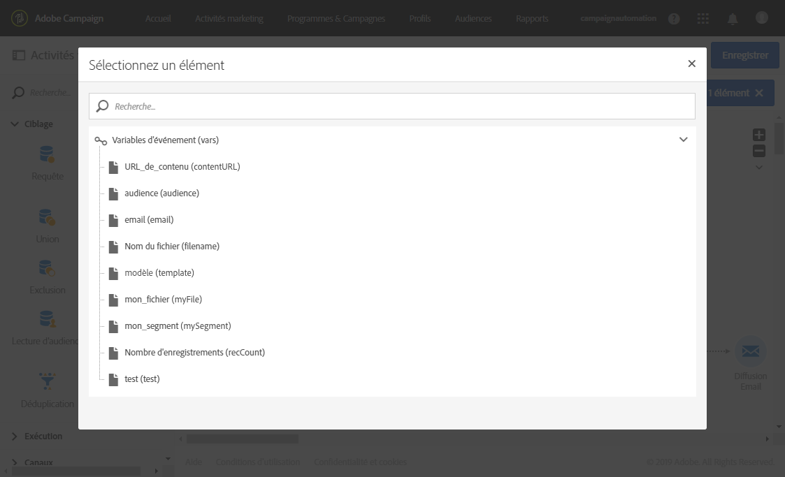
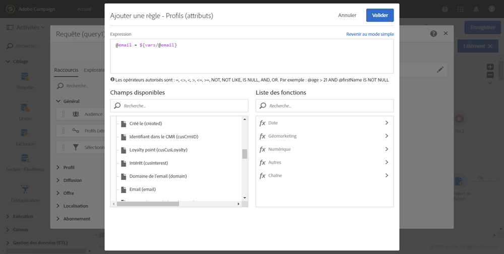
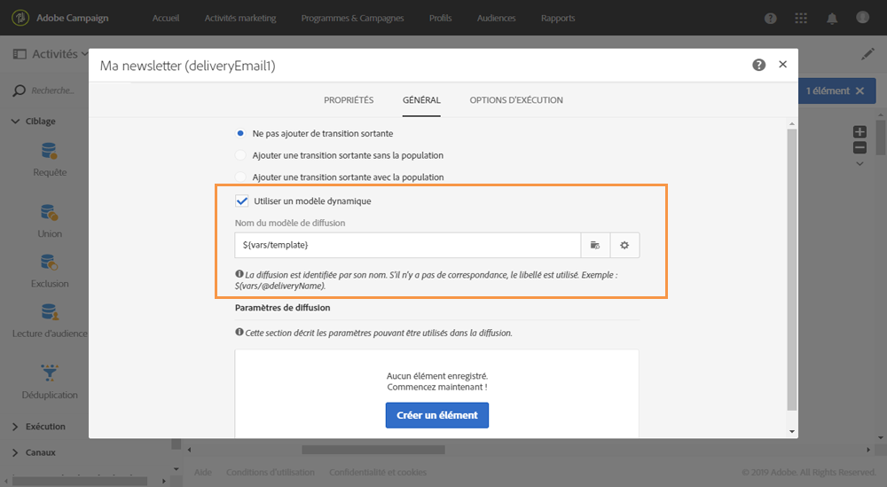

# Personnaliser un workflow avec des paramètres externes   {#customizing-a-workflow-with-external-parameters}

Une fois le processus déclenché, les paramètres sont incorporés dans les variables de événement et peuvent être utilisés pour personnaliser les activités du processus.

Ils peuvent, par exemple, permettre de définir l’audience à lire dans l’activité **[!UICONTROL Lecture d’audience]**, le nom du fichier à transférer dans l’activité **[!UICONTROL Transfert de fichier]**, etc. (see [](../../automating/using/customizing-workflow-external-parameters.md)).

## Utiliser des variables d’événements   {#using-events-variables}

Les variables d’événements sont utilisées dans une expression qui doit respecter la [syntaxe standard](../../automating/using/advanced-expression-editing.md#standard-syntax).

Pour utiliser des variables d’événements, la syntaxe doit suivre le format ci-dessous et utiliser le nom du paramètre défini dans l’activité **[!UICONTROL Signal externe]** (voir [Déclarer les paramètres dans l’activité Signal externe](../../automating/using/declaring-parameters-external-signal.md)) :

```
$(vars/@parameterName)
```

Dans cette syntaxe, la fonction **$** renvoie le type de données **chaîne**. Si vous souhaitez spécifier un autre type de données, utilisez les fonctions suivantes :

* **$long** : nombre entier.
* **$float** : nombre décimal.
* **$boolean** : vrai/faux.
* **$datetime** : horodatage.

Si vous utilisez une variable dans une activité, l’interface vous aide à l’appeler.


*  : sélectionnez la variable d’événement parmi toutes les variables disponibles dans le workflow.

   

*  : éditez les expressions en associant des variables et des fonctions. Pour plus d’informations sur l’éditeur d’expression, voir [cette section](../../automating/using/advanced-expression-editing.md).

   

**Rubriques connexes :**

* [Editer une expression ](../../automating/using/advanced-expression-editing.md#edit-an-expression)
* [Syntaxe standard](../../automating/using/advanced-expression-editing.md#standard-syntax)
* [Liste des fonctions](../../automating/using/list-of-functions.md)

## Personnaliser les activités avec des variables d’événements   {#customizing-activities-with-events-variables}

Les variables d’événements peuvent servir à personnaliser plusieurs activités, répertoriées dans la section ci-dessous. Pour plus d’informations sur la façon d’appeler une variable à partir d’une activité, consultez [cette section](../../automating/using/customizing-workflow-external-parameters.md#using-events-variables).

**[!UICONTROL Activité Lecture d’audience]** : définissez l’audience à cibler en fonction de variables d’événements.

Pour plus d’informations sur la façon d’utiliser l’activité, consultez la [section dédiée](../../automating/using/read-audience.md).


**[!UICONTROL Activité Test]** : créez des conditions reposant sur des variables d’événements.

Pour plus d’informations sur la façon d’utiliser l’activité, consultez la [section dédiée](../../automating/using/test.md).


**[!UICONTROL Activité Transfert de fichier]** : personnalisez le fichier à transférer en fonction des variables d’événements.

Pour plus d’informations sur la façon d’utiliser l’activité, consultez la [section dédiée](../../automating/using/transfer-file.md).


**[!UICONTROL Activité Requête]** : les paramètres peuvent être référencés dans une requête en faisant appel à des expressions associant des variables d’événements et des fonctions. Pour ce faire, ajoutez une règle, puis cliquez sur le lien **[!UICONTROL Mode avancé]** afin d’accéder à la fenêtre d’édition d’expression (voir [Edition avancée d’expressions](../../automating/using/advanced-expression-editing.md)).

Pour plus d’informations sur la façon d’utiliser l’activité, consultez la [section dédiée](../../automating/using/query.md).



**[!UICONTROL Activités Canaux]** : personnalisez des diffusions en fonction de variables d’événements.

>[!NOTE]
>
>Les valeurs des paramètres de diffusion sont récupérées chaque fois que la diffusion est préparée.
>
>La préparation des diffusions récurrentes repose sur la **période d’agrégation** de diffusion. Par exemple, si la période d’agrégation est &quot;par jour&quot;, la diffusion n’est repréparée qu’une fois par jour. Si la valeur d’un paramètre de diffusion est modifiée pendant la journée, elle n’est pas mise à jour dans la diffusion, car celle-ci a déjà été préparée une fois.
>
>Si vous envisagez d’appeler le workflow plusieurs fois par jour, utilisez l’option [!UICONTROL Pas d’agrégation] pour que les paramètres de diffusion soient mis à jour chaque fois. Pour plus d’informations sur la configuration des diffusions récurrentes, consultez [cette section](/help/automating/using/email-delivery.md#configuration).

Pour personnaliser une diffusion en fonction de variables d’événements, vous devez tout d’abord déclarer dans l’activité de diffusion les variables que vous voulez utiliser :

1. Sélectionnez l’activité, puis cliquez sur le bouton  afin d’accéder aux paramètres.
1. Sélectionnez l’onglet **[!UICONTROL Général]**, puis ajoutez les variables d’événements qui seront disponibles dans la diffusion sous la forme de champs de personnalisation.

   

1. Cliquez sur le bouton **[!UICONTROL Confirmer.]**

Les variables d’événements déclarées sont à présent disponibles dans la liste des champs de personnalisation. Vous pouvez les utiliser dans la diffusion de façon à réaliser les actions ci-dessous :

* Définissez le nom du modèle à utiliser pour la diffusion.

   >[!NOTE]
   >
   >Cette action est disponible uniquement pour les diffusions **récurrentes**.

   

* Personnalisez la diffusion : lorsque vous sélectionnez un champ de personnalisation pour configurer une diffusion, des variables d’événements sont disponibles dans l’élément **[!UICONTROL Paramètres de workflow]**. Vous pouvez les utiliser comme tout autre champ de personnalisation, par exemple pour définir l’objet de la diffusion, l’expéditeur, etc.

   La personnalisation de la diffusion est présentée dans [cette section](../../designing/using/personalization.md).

   

**Codes segment** : définissez le code segment en fonction des variables d’événements.

>[!NOTE]
>
>Cette action peut être réalisée à partir de n’importe quelle activité qui vous permet de définir un code segment, tel que des activités **[!UICONTROL Requête]** ou **[!UICONTROL Segmentation]**.


**Libellé de la diffusion** : définissez le libellé de la diffusion en fonction des variables d’événements.


