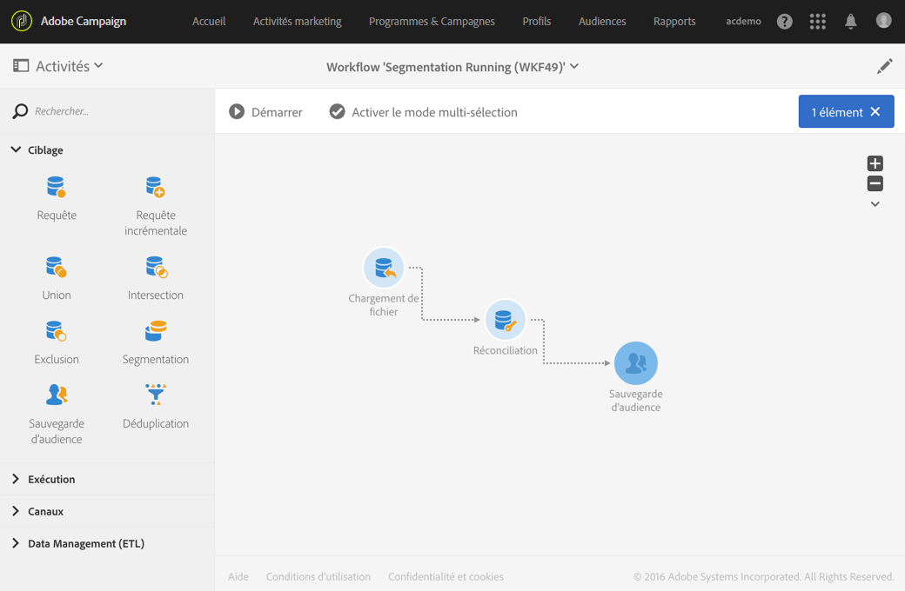
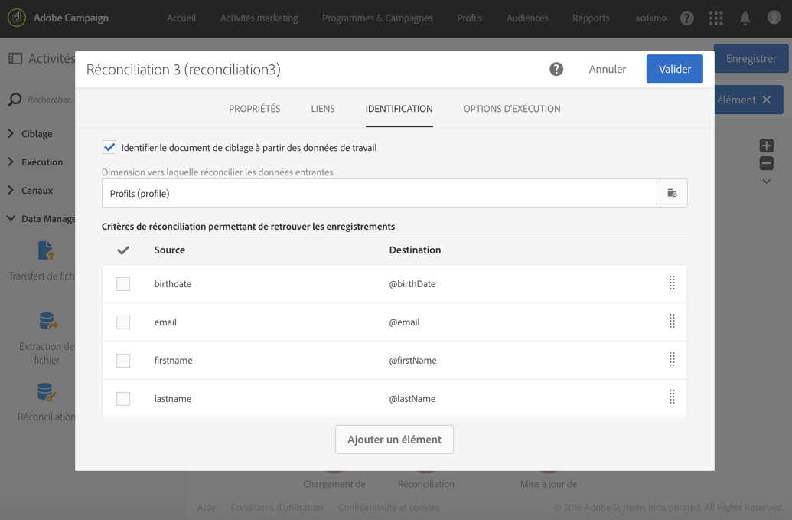
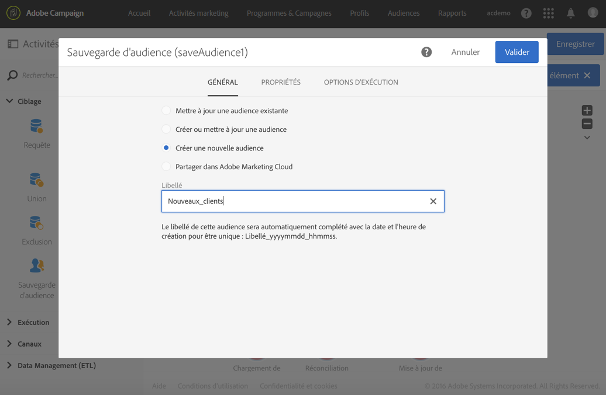

# Mise à jour des données à l’aide de la réconciliation {#data-update-reconciliation}

L&#39;exemple suivant illustre un workflow permettant de créer une audience de profils directement à partir d&#39;un fichier importé contenant des nouveaux clients. Il se compose des activités suivantes :



* Une activité [Chargement de fichier](../../automating/using/load-file.md) qui permet de charger et de détecter les données du fichier à importer. Le fichier importé contient les données suivantes :

   ```
   lastname;firstname;email;dateofbirth
   jackman;megan;megan.jackman@testmail.com;07/08/1975
   phillips;edward;phillips@testmail.com;09/03/1986
   weaver;justin;justin_w@testmail.com;11/15/1990
   martin;babeth;babeth_martin@testmail.net;11/25/1964
   reese;richard;rreese@testmail.com;02/08/1987
   cage;nathalie;cage.nathalie227@testmail.com;07/03/1989
   xiuxiu;andrea;andrea.xiuxiu@testmail.com;09/12/1992
   grimes;daryl;daryl_890@testmail.com;12/06/1979
   tycoon;tyreese;tyreese_t@testmail.net;10/08/1971
   ```

* une activité de [Réconciliation](../../automating/using/reconciliation.md) permettant d&#39;associer chaque colonne du fichier chargé à une colonne de la dimension des profils. Les enregistrements du fichier ne pouvant pas être identifiés (données manquantes, type de données incompatible, etc.) sont ignorés afin de préserver l&#39;intégrité des données de l&#39;audience finale.

   

* une activité de [Sauvegarde d&#39;audience](../../automating/using/save-audience.md) permettant d&#39;enregistrer l&#39;audience de profils.

   
