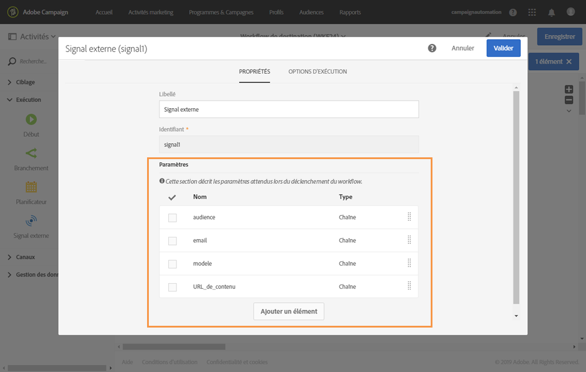

# Déclarer les paramètres dans l’activité Signal externe {#declaring-the-parameters-in-the-external-signal-activity}

Pour appeler un workflow avec des paramètres, la première étape consiste à les déclarer dans une activité **[!UICONTROL Signal externe]**.

1. Ouvrez l’activité **[!UICONTROL Signal externe]** et sélectionnez ensuite l’onglet **[!UICONTROL Paramètres]**.
1. Cliquez sur le bouton **[!UICONTROL Créer un élément]**, puis spécifiez le nom et le type de chaque paramètre.

   >[!CAUTION]
   >
   >Veillez à ce que le nom et le nombre de paramètres soient identiques à ce qui est défini lors de l&#39;appel du workflow (voir [cette page](../../automating/using/defining-parameters-calling-workflow.md)). De plus, les types des paramètres doivent être cohérents par rapport aux valeurs attendues.

   

1. Une fois les paramètres déclarés, terminez la configuration du workflow, puis exécutez-le.
