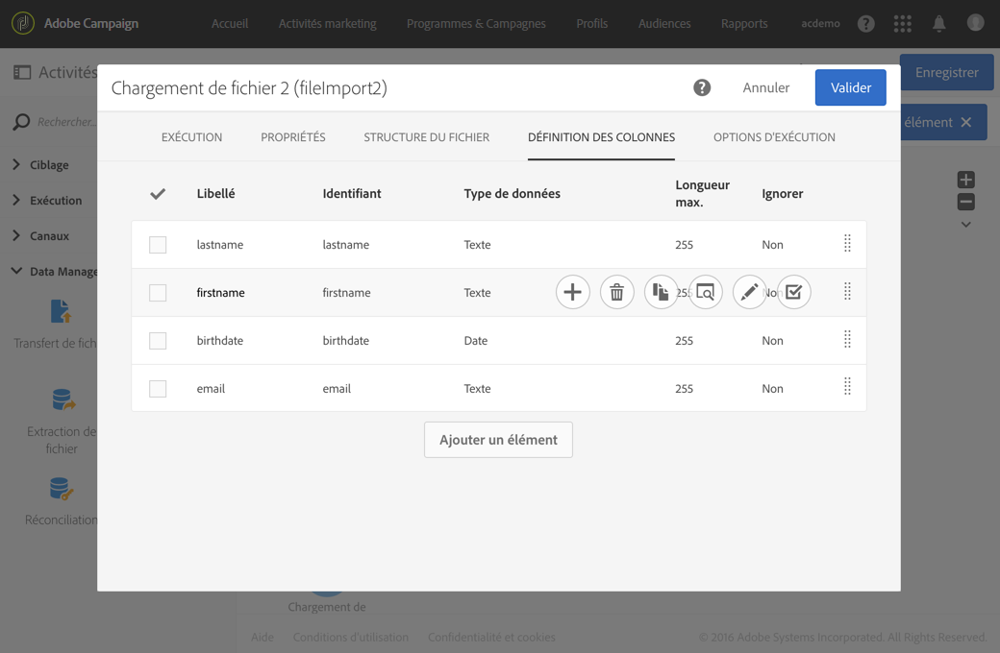
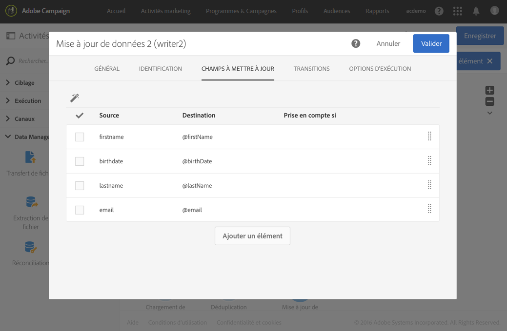

# Dédupliquer les données d’un fichier importé {#deduplicating-the-data-from-an-imported-file}

Cet exemple montre comment dédupliquer les données d&#39;un fichier importé avant de les charger dans la base de données. Ce procédé permet d&#39;améliorer la qualité des données chargées dans la base.

Le workflow est constitué comme suit :


* Un fichier contenant une liste profils est importé à l&#39;aide d&#39;un [Chargement de fichier](../../automating/using/load-file.md). Dans cet exemple, le fichier importé est au format .csv et contient 10 profils :

   ```
   lastname;firstname;dateofbirth;email
   Smith;Hayden;23/05/1989;hayden.smith@example.com
   Mars;Daniel;17/11/1987;dannymars@example.com
   Smith;Clara;08/02/1989;hayden.smith@example.com
   Durance;Allison;15/12/1978;allison.durance@example.com
   Lucassen;Jody;28/03/1988;jody.lucassen@example.com
   Binder;Tom;19/01/1982;tombinder@example.com
   Binder;Tommy;19/01/1915;tombinder@example.com
   Connor;Jade;10/10/1979;connor.jade@example.com
   Mack;Clarke;02/03/1985;clarke.mack@example.com
   Ross;Timothy;04/07/1986;timross@example.com
   ```

   Ce fichier peut également servir de fichier d&#39;exemple pour détecter et définir le format des colonnes. Depuis l&#39;onglet **[!UICONTROL Définition des colonnes]**, assurez-vous que chaque colonne du fichier importé est correctement paramétrée.

   

* Une activité de [Déduplication](../../automating/using/deduplication.md). La déduplication est réalisée directement après l&#39;import du fichier et avant que les données soient insérées dans la base. Il faut donc se baser sur la **[!UICONTROL Ressource temporaire]** issue de l&#39;activité de **[!UICONTROL Chargement de fichier]**.

   Pour cet exemple, nous souhaitons conserver une seule entrée par adresse email unique contenue dans le fichier. L&#39;identification des doublons est donc réalisée sur la colonne **email** de la ressource temporaire. Or, deux adresses email apparaissent deux fois dans le fichier. Deux lignes seront donc considérées comme des doublons.

   

* Une activité de [Mise à jour de données](../../automating/using/update-data.md), permettant d&#39;insérer dans la base de données les données conservées à l&#39;issue de la déduplication. Ce n&#39;est qu&#39;au moment de la mise à jour de données que les données importées sont identifiées comme appartenant à la dimension des profils.

   Nous souhaitons ici **[!UICONTROL Ajouter uniquement]** les profils qui n&#39;existent pas déjà dans la base, en utilisant la colonne email du fichier et le champ email de la dimension **Profil** comme clé de réconciliation.

   

   Indiquez les correspondances entre les colonnes du fichier dont vous souhaitez insérer les données et les champs de la base depuis l&#39;onglet **[!UICONTROL Champs à mettre à jour]**.

   

Lancez ensuite le workflow. Les enregistrements conservés à l&#39;issue de la déduplication sont alors ajoutés aux profils de votre base de données.
