# Déduplication{#deduplication}

## Description {#description}


L'activité **[!UICONTROL Déduplication]permet de supprimer les doublons dans le ou les résultats des activités entrantes.**

## Contexte d'utilisation {#context-of-use}

L'activité **[!UICONTROL Déduplication]est généralement utilisée à la suite des activités de ciblage ou d'un import de fichier et avant les activités permettant de consommer les données ciblées.**

Lors d'une déduplication, les transitions entrantes sont traitées séparément. Si par exemple, un profil « A » est présent dans le résultat de la requête 1 et également dans le résultat de la requête 2, il ne sera pas dédupliqué.

Il est ainsi conseillé de faire en sorte qu'une déduplication ne possède qu'une transition entrante. Pour cela, vous pouvez réunir vos différentes requêtes par des activités répondant aux besoins de votre ciblage telles qu'une union, une intersection, etc. Par exemple :

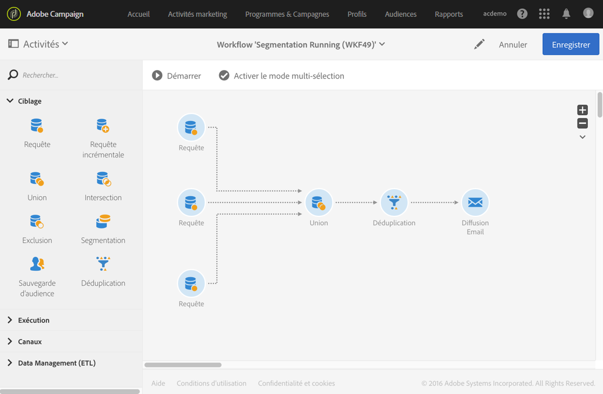

## Configuration {#configuration}

Pour paramétrer une déduplication, vous devez renseigner son libellé, la méthode et les critères de déduplication, ainsi que les options relatives au résultat.

1. Placez une activité **[!UICONTROL Déduplication]dans votre workflow.**
1. Sélectionnez l'activité puis ouvrez-la à l'aide du bouton 

   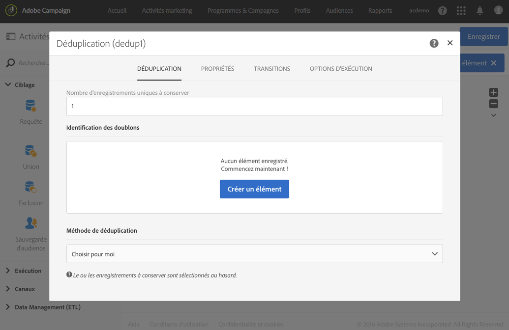

1. Sélectionnez le **[!UICONTROL Type de ressource]sur lequel doit être effectuée la déduplication :**

   * **[!UICONTROL Ressource de la base]** si la déduplication porte sur des données déjà existantes en base de données. Select the **[!UICONTROL Filtering dimension]** and the **[!UICONTROL Targeting dimension]**, depending on the data that you want to deduplicate. Par défaut, la déduplication porte sur les **profils**.
   * **[!UICONTROL Ressource temporaire]** si la déduplication porte sur des données temporaires du workflow : sélectionnez l'**[!UICONTROL Ensemble ciblé]contenant les données à dédupliquer.** Ce cas peut être rencontré à la suite d'un import de fichier ou si des données de la base ont été enrichies (par exemple avec un code segment).

1. Sélectionnez le **[!UICONTROL Nombre d'enregistrements uniques à conserver]**. La valeur par défaut de ce champs est 1. La valeur 0 permet de conserver tous les doublons.

   Par exemple, si des enregistrements A et B sont considérés comme des doublons d'un enregistrement Y, et un enregistrement C est considéré comme un doublon d'un enregistrement Z :

   * Si la valeur du champ est 1 : seuls les enregistrements Y et Z sont conservés.
   * Si la valeur du champ est 0 : tous les enregistrements sont conservés.
   * Si la valeur du champ est 2 : les enregistrements C et Z sont conservés et deux enregistrements parmi A, B et Y sont conservés, au hasard ou en fonction de la méthode de déduplication choisie par la suite.

1. Définissez les critères d'**[!UICONTROL Identification des doublons]en ajoutant des conditions dans la liste prévue à cet effet.** Indiquez les champs et/ou expressions pour lesquels des valeurs identiques permettent d'identifier les doublons : adresse email, nom, prénom etc. L'ordre des conditions permet d'indiquer lesquelles traiter en priorité.
1. Sélectionnez dans la liste déroulante la **[!UICONTROL Méthode de déduplication]à utiliser :**

   * **[!UICONTROL Choisir pour moi]** : sélectionne au hasard parmi les doublons l'enregistrement à conserver.
   * **[!UICONTROL Par ordonnancement de valeurs]** : permet de définir un ordre de priorité des valeurs pour un ou plusieurs champs. Pour définir les valeurs, sélectionnez un champ ou créez une expression puis ajoutez la ou les valeurs dans le tableau correspondant. Cliquez sur le bouton **[!UICONTROL Ajouter]situé au-dessus de la liste des valeurs pour définir un nouveau champ.**

      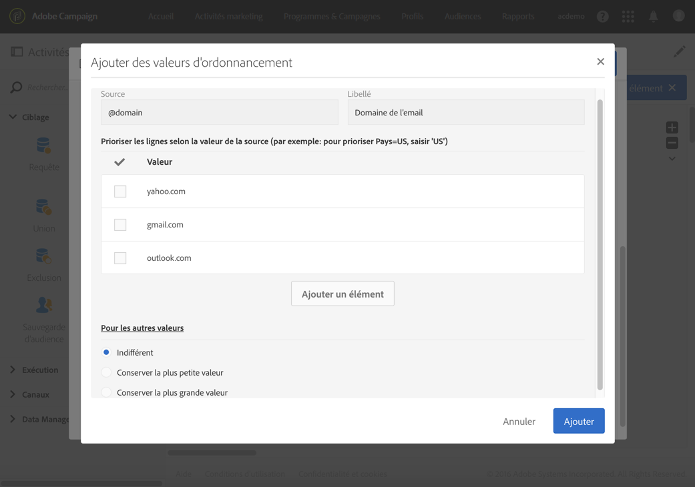

   * **[!UICONTROL Valeur non vide]** : permet de conserver en priorité les enregistrements pour lesquels la valeur de l'expression sélectionnée n'est pas vide.

      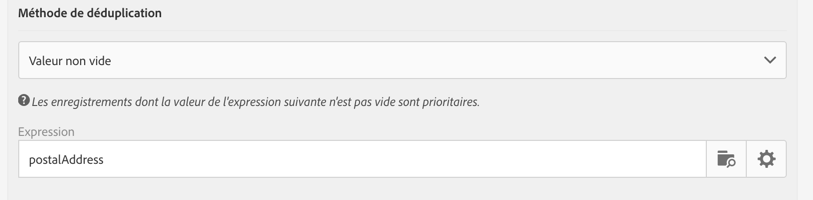

   * **[!UICONTROL A partir d'une expression]** : permet de conserver les enregistrements dont la valeur de l'expression renseignée est la plus petite ou la plus grande.

      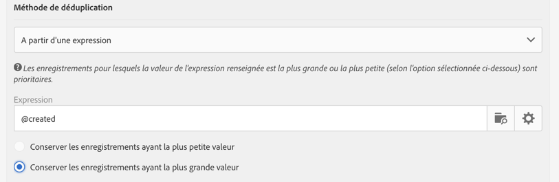

1. Si besoin, gérez les [Transitions](../../automating/using/executing-a-workflow.md#managing-an-activity-s-outbound-transitions) de l'activité afin d'accéder à des options avancées sur la population transmise en sortie.
1. Validez le paramétrage de l'activité et enregistrez le workflow.

## Exemple 1 : identifier des doublons avant une diffusion {#example-1--identifying-duplicates-before-a-delivery}

L'exemple suivant illustre une déduplication permettant d'exclure les doublons d'une cible avant l'envoi d'un email. Cela permet d’éviter d’envoyer une communication plusieurs fois à un même profil.

Le workflow est constitué comme suit :

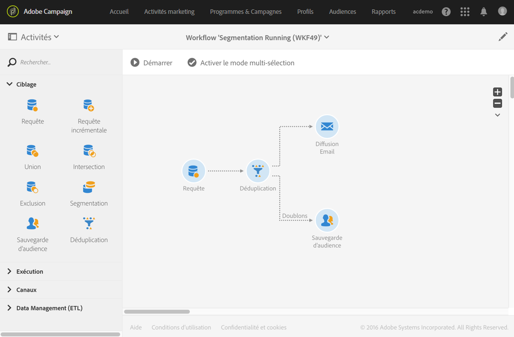

* Une **[!UICONTROL Requête]permettant de définir la cible de l'email.** Ici, le workflow cible tous les profils ayant entre 18 et 25 ans et faisant partie de la base clients depuis plus d'un an.

   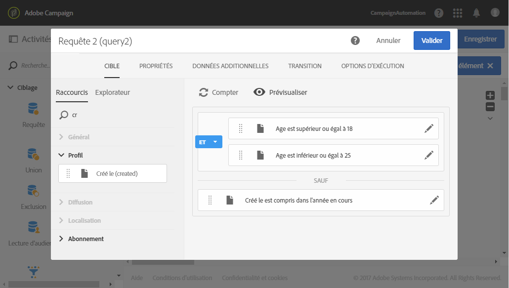

* Une **[!UICONTROL Déduplication]permettant d'identifier les doublons issus de la requête précédente.** Dans cet exemple, un seul enregistrement est conservé pour chaque doublon. Les doublons sont identifiés grâce à l'adresse email. Ainsi, la diffusion email ne pourra être envoyée qu'une fois pour chaque adresse email présente dans le ciblage.

   La méthode de déduplication sélectionnée est **[!UICONTROL Valeur non vide]**. Cela permet de s'assurer que les enregistrements conservés en cas de doublons soient prioritairement ceux dont le champ **Prénom** est renseigné. Cela permettra plus de cohérence si le prénom est utilisé dans les champs de personnalisation du contenu de l'email.

   De plus, une transition complémentaire est ajoutée afin de conserver les doublons et de pouvoir les lister.

   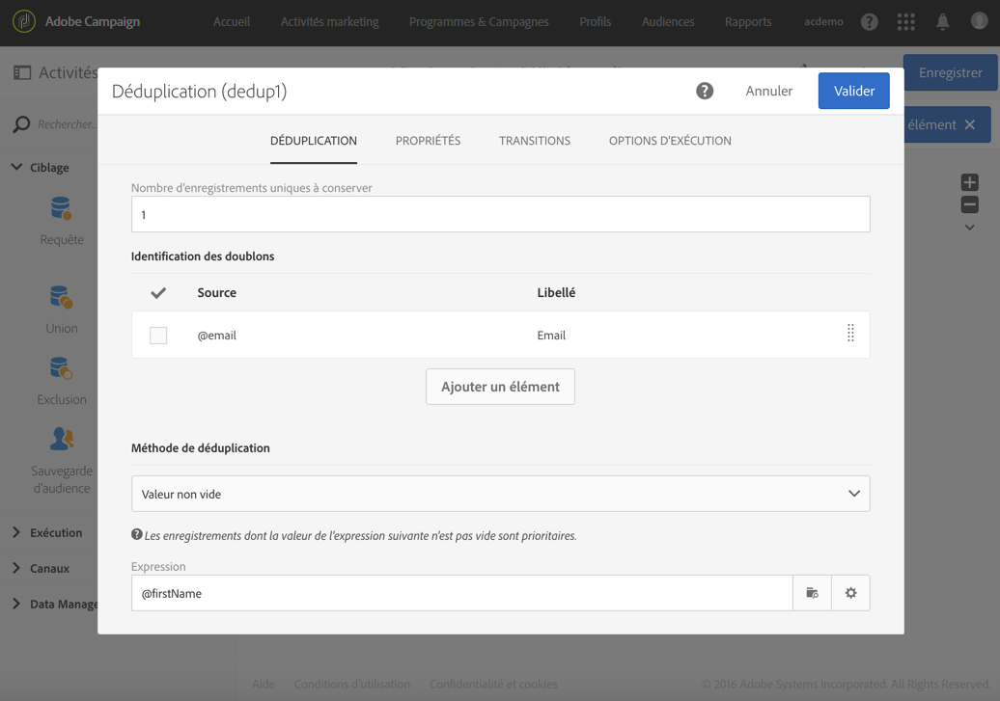

* Une **[!UICONTROL Diffusion email]placée à la suite de la transition sortante principale de la déduplication.** Le paramétrage des diffusions email est détaillé dans la section [Diffusion Email](../../automating/using/email-delivery.md).
* Une **[!UICONTROL Sauvegarde d'audience]** placée à la suite de la transition complémentaire de la déduplication afin de sauvegarder les doublons dans une audience **Doublons.** Cette audience pourra être réutilisée afin d'exclure directement ses membres de toute diffusion email.

## Exemple 2 : dédupliquer les données d'un fichier importé {#example-2--deduplicating-the-data-from-an-imported-file}

Cet exemple montre comment dédupliquer les données d'un fichier importé avant de les charger dans la base de données. Ce procédé permet d'améliorer la qualité des données chargées dans la base.

Le workflow est constitué comme suit :

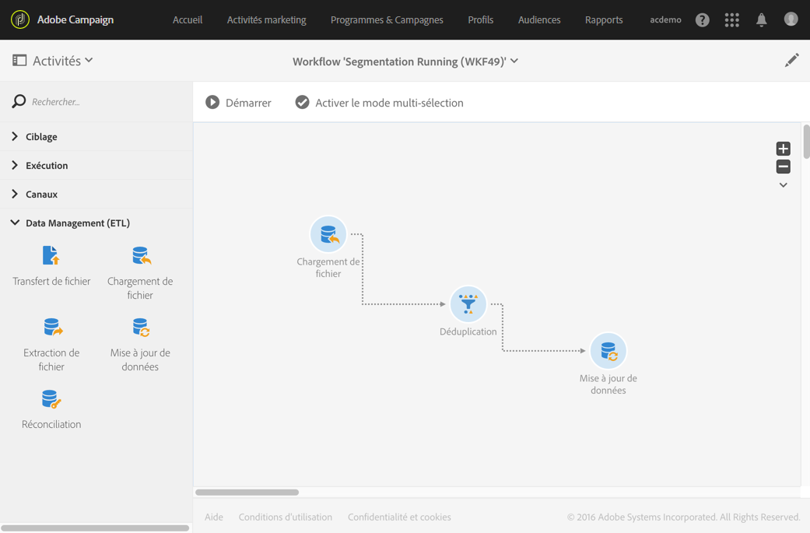

* Un fichier contenant une liste profils est importé à l'aide d'un **[!UICONTROL Chargement de fichier.]** Dans cet exemple, le fichier importé est au format .csv et contient 10 profils :

   ```
   lastname;firstname;dateofbirth;email
   Smith;Hayden;23/05/1989;hayden.smith@example.com
   Mars;Daniel;17/11/1987;dannymars@example.com
   Smith;Clara;08/02/1989;hayden.smith@example.com
   Durance;Allison;15/12/1978;allison.durance@example.com
   Lucassen;Jody;28/03/1988;jody.lucassen@example.com
   Binder;Tom;19/01/1982;tombinder@example.com
   Binder;Tommy;19/01/1915;tombinder@example.com
   Connor;Jade;10/10/1979;connor.jade@example.com
   Mack;Clarke;02/03/1985;clarke.mack@example.com
   Ross;Timothy;04/07/1986;timross@example.com
   ```

   Ce fichier peut également servir de fichier d'exemple pour détecter et définir le format des colonnes. Depuis l'onglet **[!UICONTROL Définition des colonnes], assurez-vous que chaque colonne du fichier importé est correctement paramétrée.**

   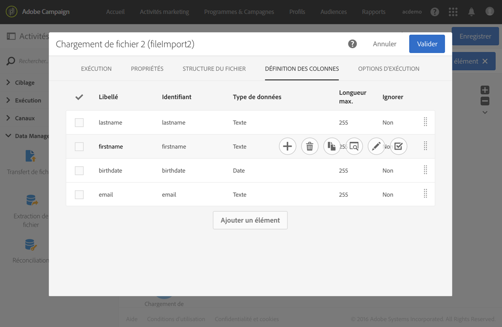

* Une activité de **[!UICONTROL Déduplication.]** La déduplication est réalisée directement après l'import du fichier et avant que les données soient insérées dans la base. Il faut donc se baser sur la **[!UICONTROL Ressource temporaire]** issue de l'activité de **Chargement de fichier[!UICONTROL .]**

   Pour cet exemple, nous souhaitons conserver une seule entrée par adresse email unique contenue dans le fichier. L'identification des doublons est donc réalisée sur la colonne **email** de la ressource temporaire. Or, deux adresses email apparaissent deux fois dans le fichier. Deux lignes seront donc considérées comme des doublons.

   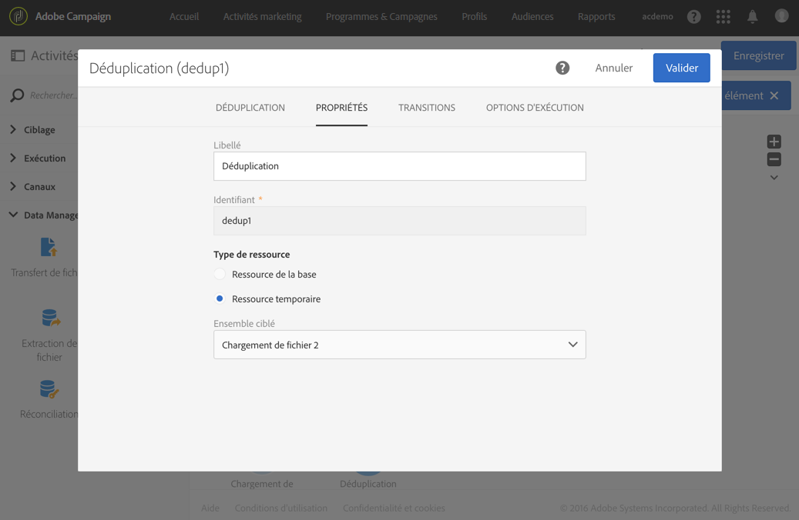

* Une activité de **[!UICONTROL Mise à jour de données], permettant d'insérer dans la base de données les données conservées à l'issue de la déduplication.** Ce n'est qu'au moment de la mise à jour de données que les données importées sont identifiées comme appartenant à la dimension des profils.

   Nous souhaitons ici **[!UICONTROL Ajouter uniquement]les profils qui n'existent pas déjà dans la base,** en utilisant la colonne email du fichier et le champ email de la dimension **Profil** comme clé de réconciliation.

   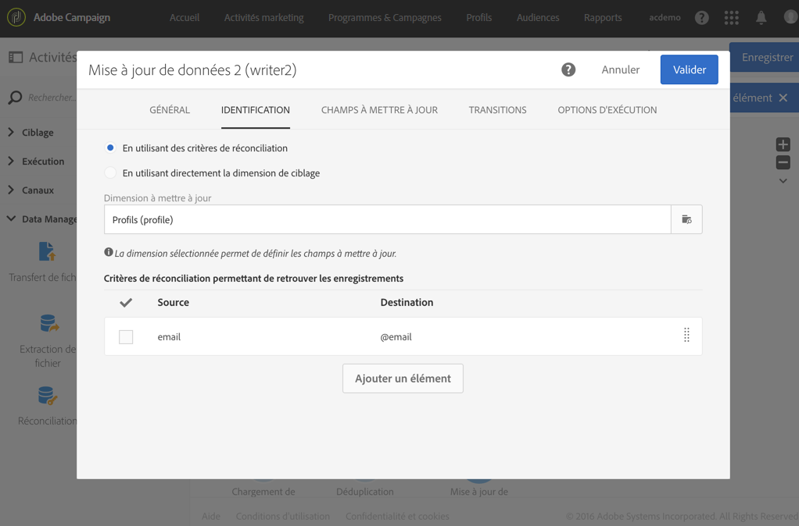

   Indiquez les correspondances entre les colonnes du fichier dont vous souhaitez insérer les données et les champs de la base depuis l'onglet **[!UICONTROL Champs à mettre à jour].**

   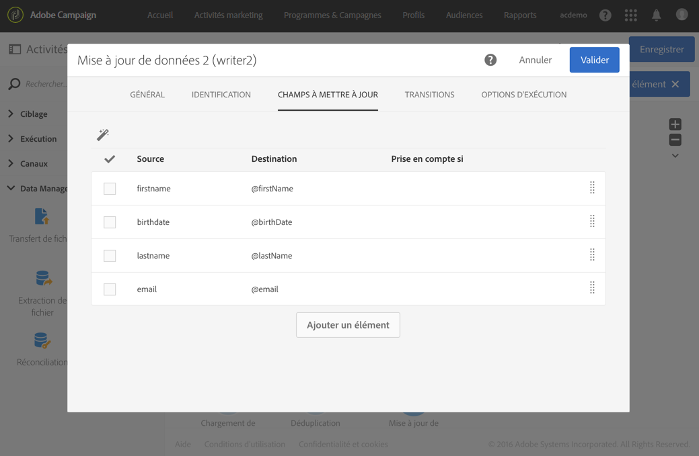

Lancez ensuite le workflow. Les enregistrements conservés à l'issue de la déduplication sont alors ajoutés aux profils de votre base de données.
