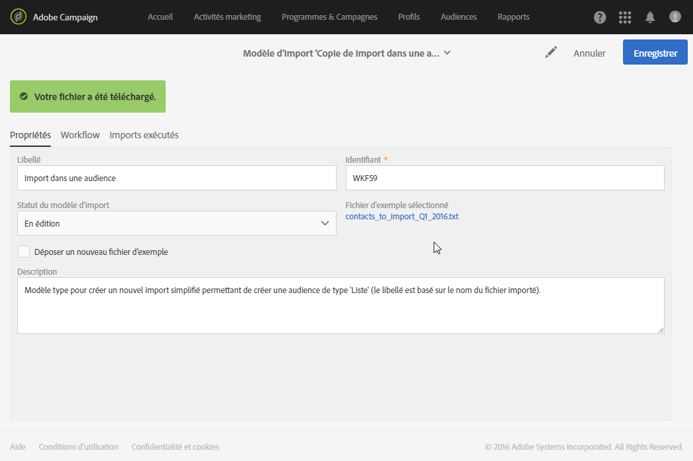

# Définir un modèle d'import{#defining-import-templates}

Les modèles d'import permettent à l'administrateur de prédéfinir un certain nombre de configurations d'import techniques. Ces modèles peuvent être ensuite mis à la disposition des utilisateurs standard pour gérer et charger les fichiers.

Un modèle d'import est défini par l'administrateur fonctionnel et peut être géré depuis le menu **[!UICONTROL Ressources]** &gt; **[!UICONTROL Modèles]** &gt; **[!UICONTROL Modèles d'import]**.

Trois modèles par défaut sont disponibles en lecture seule :

* **[!UICONTROL Mettre à jour les logs de diffusion et les mises en quarantaine Courrier]** : ce modèle peut servir de base pour de nouveaux imports permettant de mettre à jour les mises en quarantaine et les logs de diffusion du canal Courrier. Le workflow de ce modèle contient les activités suivantes :
* **[!UICONTROL Import de données]** : ce modèle peut servir de base pour de nouveaux imports permettant d'insérer les données d'un fichier dans la base de données. Le workflow de ce modèle contient les activités suivantes :

   * **[!UICONTROL Chargement de fichier]** : cette activité permet de télécharger un fichier de données sur le serveur Adobe Campaign.
   * **[!UICONTROL Mise à jour de données]** : cette activité permet d'insérer les données du fichier dans la base de données.

* **[!UICONTROL Import de liste]** : ce modèle peut servir de base pour de nouveaux imports permettant de créer une audience de type **Liste** à partir des données d'un fichier. Le workflow de ce modèle contient les activités suivantes :

   * **[!UICONTROL Chargement de fichier]** : cette activité permet de télécharger un fichier de données sur le serveur Adobe Campaign.
   * **[!UICONTROL Réconciliation]** : cette activité permet d'associer une dimension de ciblage aux données importées. Cela permet ensuite de créer une audience de type **Liste**. Si la dimension de ciblage des données importées n'est pas connue, l'audience est de type **Fichier**. Voir [Dimensions de ciblage et ressources](../../automating/using/query.md#targeting-dimensions-and-resources).
   * **[!UICONTROL Sauvegarde d'audience]** : cette activité permet d'enregistrer les données importées sous la forme d'audience de type **Liste**. Le nom de l'audience sauvegardée correspondra au nom du fichier importé par l'utilisateur, auquel sera ajouté un suffixe précisant la date et l'heure de l'import. Par exemple : 'profiles_20150406_151448'.

Ces modèles par défaut sont en lecture seule et ne sont pas visibles par les utilisateurs standards. Pour créer un modèle mis à la disposition des utilisateurs, procédez comme suit :

1. Dupliquez le modèle par défaut de votre choix. Le modèle dupliqué contient trois onglets :

   * **[!UICONTROL Propriétés]** : paramètres généraux du modèle d'import. Cet onglet permet notamment d'activer le modèle et de charger un fichier d'exemple.
   * **[!UICONTROL Workflow]** : workflow d'import. Cet onglet permet de définir les activités du workflow. Ces activités ne seront pas visibles lors des imports simplifiés réalisés par les utilisateurs.
   * **[!UICONTROL Imports exécutés]** : liste des imports réalisés à l'aide de ce modèle. Vous pouvez visualiser le statut, le détail et les résultats de chaque import réalisé à partir du modèle. Vous pouvez accéder directement au workflow (exécuté de manière transparente pour l'utilisateur) à partir de cette liste.

1. Depuis l'onglet **[!UICONTROL Propriétés]**, renommez le modèle et ajoutez une description. La description sera visible par les utilisateurs lorsque le modèle sera disponible.

   

1. Accédez à l'onglet **[!UICONTROL Workflow]**. Vous pouvez ici enrichir le workflow proposé par défaut en y ajoutant de nouvelles activités, selon vos besoins.

   Pour plus d'informations sur la configuration des activités de workflow, reportez-vous au cas d'utilisation de la section suivante : [Exemple : modèle de workflow d'import](../../automating/using/importing-data.md#example--import-workflow-template). Ce cas d'utilisation vous aidera à configurer un workflow réutilisable pour importer des profils provenant d'un CRM dans la base de données Adobe Campaign.

1. Enregistrez votre modèle pour que le paramétrage du workflow soit correctement pris en compte.
1. Chargez un fichier d'exemple depuis l'onglet **[!UICONTROL Propriétés]**. Le fichier chargé peut contenir uniquement les colonnes nécessaires aux futurs imports ou des données d'exemple. La présence de données dans le fichier d'exemple permet de tester l'import simplifié une fois le workflow défini.

   

   Ce fichier d'exemple sera par la suite disponible pour les utilisateurs utilisant le modèle pour réaliser un import. Ils pourront le télécharger sur leur poste afin par exemple de le remplir avec les données à importer. Prenez ce facteur en compte au moment d'ajouter le fichier d'exemple.

1. Enregistrez votre modèle. Le fichier d'exemple est désormais bien pris en compte. Vous pouvez à tout moment le télécharger sur votre poste afin d'en vérifier le contenu, ou le modifier en cochant l'option **[!UICONTROL Déposer un nouveau fichier d'exemple]**.

   

1. Revenez à l'onglet **[!UICONTROL Workflow]** et ouvrez l'activité de **[!UICONTROL Chargement de fichier]** afin de vérifier et ajuster le paramétrage des colonnes du fichier d'exemple chargé à l'étape précédente.
1. Testez l'import en lançant l'exécution du workflow. Le fichier d'exemple chargé à l'étape **5** doit contenir des données.

   Les données du fichier d'exemple sont alors réellement importées. Veillez à utiliser des données factices et peu nombreuses afin de ne pas compromettre votre base de données.

1. Accédez au journal d'exécution du workflow, disponible via la barre d'actions. En cas d'erreurs vérifiez le paramétrage des activités.

   

1. Depuis l'onglet **[!UICONTROL Propriétés]**, définissez le **[!UICONTROL Statut du modèle d'import]** sur **[!UICONTROL Disponible]**, puis enregistrez le modèle. Si vous souhaitez arrêter l'utilisation de ce modèle, vous pouvez définir le **[!UICONTROL Statut du modèle d'import]** sur **[!UICONTROL Archivé]**.

Le workflow du modèle peut être modifié en chargeant de nouveau le fichier d'exemple et en vérifiant la configuration de l'activité **[!UICONTROL Chargement de fichier]**.

Le modèle d'import est à présent disponible pour les utilisateurs et peut être utilisé pour charger les fichiers.

**Rubriques connexes :**

* [Workflows](../../automating/using/discovering-workflows.md)
* [Importer des données](../../automating/using/importing-data.md)
* [Exemple : modèle de workflow d'import ](../../automating/using/importing-data.md#example--import-workflow-template)

