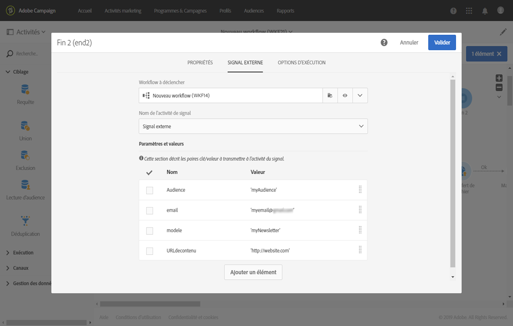

# Définir les paramètres lors de l&#39;appel du workflow {#defining-the-parameters-when-calling-the-workflow}

Cette section explique comment définir des paramètres lors de l’appel d’un workflow. Pour plus d’informations sur l’exécution de cette opération à partir d’un appel API, consultez la [documentation des API REST](../../api/using/triggering-a-signal-activity.md).

Avant de définir les paramètres, vérifiez les éléments suivants :

* Les paramètres ont été déclarés dans l’activité **[!UICONTROL Signal externe]**. Voir [cette page](../../automating/using/declaring-parameters-external-signal.md).
* Le workflow contenant l’activité Signal est en cours d’exécution.

Pour configurer l’activité **[!UICONTROL Fin]**, suivez les étapes ci-dessous :

1. Ouvrez l’activité **[!UICONTROL Fin]**, puis sélectionnez l’onglet **[!UICONTROL Signal externe]**.
1. Sélectionnez le workflow et l’activité Signal externe que vous voulez appeler.
1. Cliquez sur le bouton **[!UICONTROL Créer un élément]** pour ajouter un paramètre, puis indiquez son nom et sa valeur.

   * **[!UICONTROL Nom]** : nom déclaré dans l&#39;activité **[!UICONTROL Signal externe]** (voir [cette page](../../automating/using/declaring-parameters-external-signal.md)).
   * **[!UICONTROL Valeur]** : valeur que vous souhaitez assigner au paramètre. La valeur doit respecter la **syntaxe standard**, décrite dans [cette section](../../automating/using/advanced-expression-editing.md#standard-syntax).

   

   >[!CAUTION]
   >
   >Veillez à ce que tous les paramètres soient déclarés dans l’activité **[!UICONTROL Signal externe]**. Dans le cas contraire, une erreur se produira lors de l’exécution de l’activité.

1. Une fois les paramètres définis, confirmez l’activité, puis enregistrez votre workflow.
