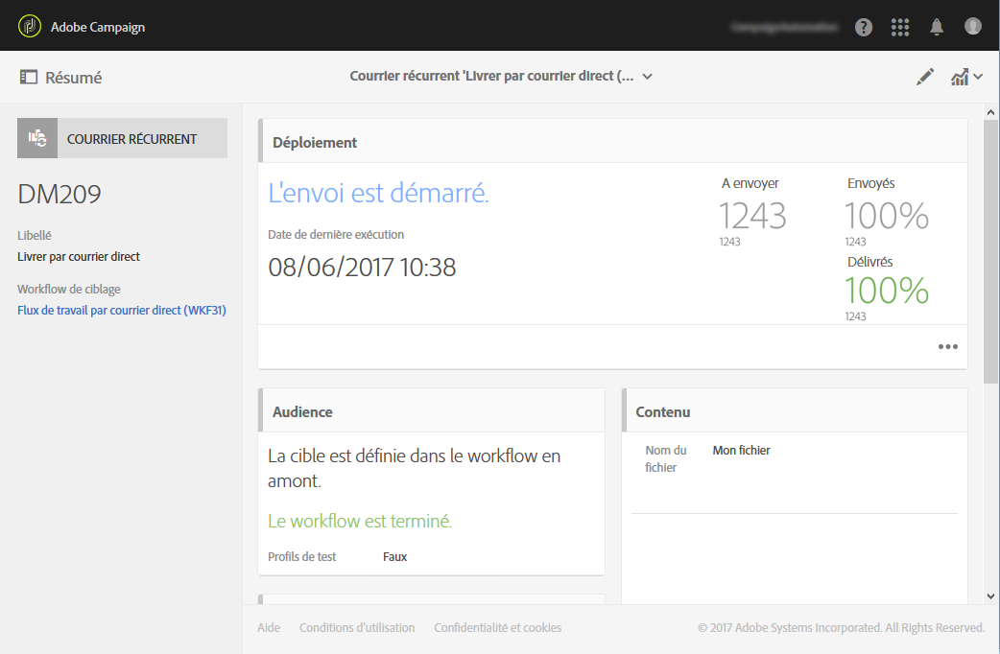
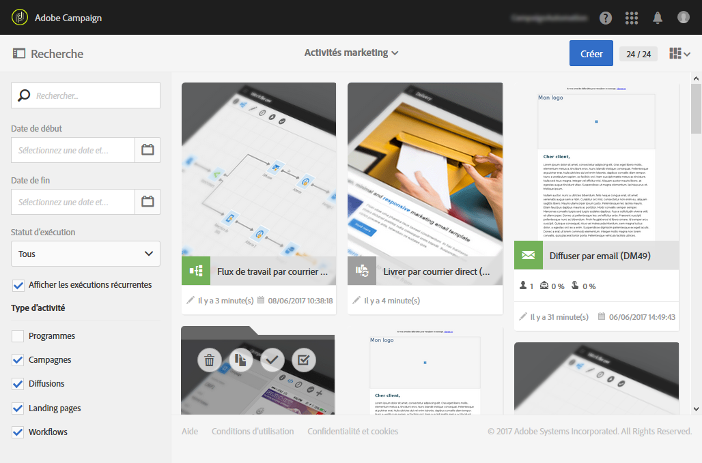
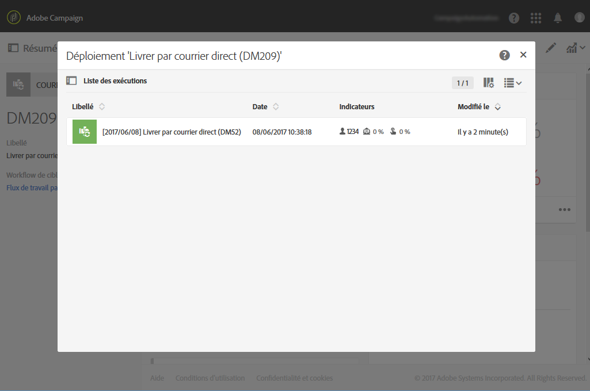

# Diffusion courrier{#direct-mail-delivery}

## Description {#description}

L'activité **[!UICONTROL Diffusion courrier]permet de configurer et de préparer un fichier contenant les données de profil que vous souhaitez utiliser pour une campagne courrier.** Il peut s'agir d'un courrier unique qui n'est envoyé qu'une seule fois ou d'un courrier **récurrent**.

Les courriers classiques ne sont envoyés qu'une seule fois

Les courriers récurrents permettent d'envoyer plusieurs fois sur une période définie un même courrier à des cibles différentes. Vous pouvez agréger les diffusions par période afin d'obtenir des rapports adaptés.

## Contexte d'utilisation {#context-of-use}

En règle générale, l'activité **[!UICONTROL Diffusion courrier]est utilisée pour automatiser la préparation d'un fichier contenant des données de profil.** Ce fichier peut ensuite être envoyé à un partenaire/prestataire en charge de l'envoi.

Lorsque la diffusion courrier est associée à un planificateur, il est possible de définir des courriers de type récurrent.

Les destinataires du courrier sont définis en amont de l'activité dans le même workflow, grâce à des activités de ciblage telles que requêtes, intersections, etc. Les profils dont l'adresse postale n'est pas renseignée sont automatiquement exclus lors de la préparation du courrier.

La préparation du message est déclenchée selon les paramètres d'exécution du workflow. Depuis le tableau de bord du message, vous pouvez choisir de demander ou non une confirmation manuelle pour envoyer le message (requise par défaut). Vous pouvez lancer manuellement le workflow ou bien placer une activité de planification afin d'en automatiser l'exécution.

## Configuration {#configuration}

1. Placez une activité **[!UICONTROL Diffusion courrier]dans votre workflow.**
1. Sélectionnez l'activité puis ouvrez-la à l'aide du bouton 

   >[!NOTE]
   >
   >Les propriétés générales et les options avancées de l'activité (et non de la diffusion elle-même) sont disponibles à l'aide du bouton  Ce bouton est spécifique aux activités de ce canal. Les propriétés du courrier sont disponibles via la barre d'actions du tableau de bord du courrier.

1. Sélectionnez le mode d'envoi du courrier :

   * **[!UICONTROL Courrier]** : le courrier est envoyé une seule fois. Vous pouvez définir à cet endroit si vous souhaitez ou non ajouter une transition en sortie de l'activité. Les différents types de transition sont détaillés à l'étape 7 de cette procédure.
   * **[!UICONTROL Courrier récurrent]** : le courrier est envoyé plusieurs fois, à une fréquence définie dans une activité **[!UICONTROL Planificateur.]** Choisissez la période d'agrégation des envois. Cela permet de regrouper tous les envois ayant eu lieu dans la période définie dans un seul courrier, aussi appelé **exécution récurrente** et accessible depuis la liste des activités marketing de l'application.

      Par exemple, pour un courrier récurrent d'anniversaire, traité chaque jour, vous pouvez choisir d'agréger les envois par mois. Vous obtiendrez ainsi des rapports sur votre diffusion mois par mois alors que le courrier est traité chaque jour.

      >[!NOTE]
      >
      >Pour les courriers récurrents, un nouveau fichier est généré à chaque exécution du workflow. La période d'agrégation sélectionnée n'a aucun impact sur ce comportement.

1. Sélectionnez un type de courrier. The direct mail types come from templates defined in the **[!UICONTROL Resources]** &gt; **[!UICONTROL Templates]** &gt; **[!UICONTROL Delivery templates]** menu.
1. Renseignez les propriétés générales du courrier. Vous pouvez également rattacher l'activité à une campagne existante. Le libellé de l'activité de diffusion dans le workflow est mis à jour avec le libellé du courrier.
1. Définissez le contenu du courrier. Consultez la section concernant l'[édition de contenu](../../designing/using/about-personalization.md).
1. Par défaut, l'activité **[!UICONTROL Diffusion courrier]ne possède aucune transition sortante.** Si vous souhaitez ajouter une transition sortante à votre activité de **[!UICONTROL Diffusion courrier]**, accédez à l'onglet **Général]des options avancées de l'activité (bouton

   * **[!UICONTROL Ajouter une transition sortante sans la population]** : permet de générer une transition sortante contenant la même population que la transition entrante. Cette transition contient le fichier généré par l'activité Diffusion courrier et la population initiale reçue par l'activité Diffusion courrier.
   * **[!UICONTROL Ajouter une transition sortante avec la population]** : permet de générer une transition sortante contenant la population à qui le courrier sera envoyé. Les membres de la cible exclus durant la préparation du publipostage (quarantaine, adresse non valide, etc.) sont exclus de cette transition. La transition contient également le fichier généré par le courrier.

1. Validez le paramétrage de l'activité et enregistrez le workflow.

Lorsque vous ouvrez à nouveau l'activité par la suite, vous accédez au tableau de bord du courrier. Seul son contenu reste modifiable.

Par défaut, le démarrage d'un workflow de diffusion déclenche uniquement la préparation des messages. L'envoi des messages créés depuis un workflow doit toujours être confirmé après le démarrage du workflow. Dans le tableau de bord des messages, vous pouvez toutefois désactiver l'option **[!UICONTROL Demander confirmation avant d'envoyer les messages]si les messages ont été créés depuis un workflow.** Lorsque cette option est décochée, les messages sont envoyés sans autre préavis une fois la préparation terminée.

## Remarques {#remarks}

Les diffusions créées à partir d'un workflow sont accessibles dans la liste des activités marketing de l'application. Vous pouvez visualiser l'état d'exécution du workflow depuis le tableau de bord. Des liens dans le volet de résumé du courrier vous permettent d'accéder directement aux éléments liés (workflow, campagne, diffusion parente dans le cas d'un courrier récurrent).

Les exécutions des diffusions récurrentes sont masquées par défaut. Pour les afficher, cochez l'option **[!UICONTROL Afficher les exécutions récurrentes]dans le volet de recherche des activités marketing.**

Depuis les diffusions parentes, accessibles depuis la liste des activités marketing ou directement via les exécutions récurrentes associées, vous pouvez visualiser l'ensemble des courriers ayant été traités (en fonction de la période d'agrégation définie lors du paramétrage de l'activité de **[!UICONTROL Diffusion courrier).]** Pour cela, accédez au détail du bloc **[!UICONTROL Déploiement]** de la diffusion parente en sélectionnant .

## Exemple {#example}

Un exemple de **[!UICONTROL Diffusion courrier]** est disponible dans le chapitre [Courrier](../../channels/using/example-of-direct-mail-in-a-workflow.md).
