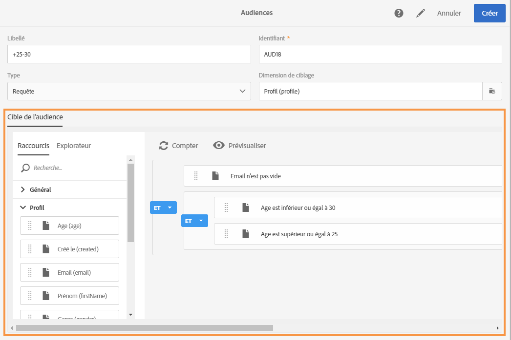
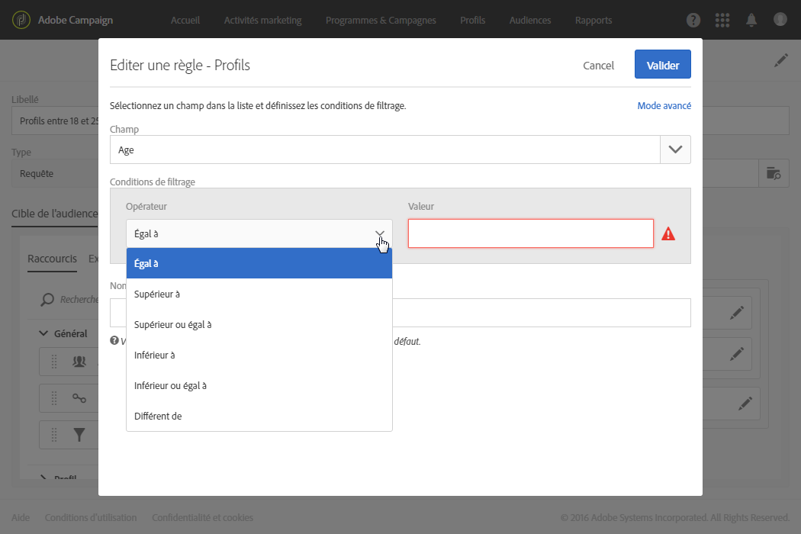
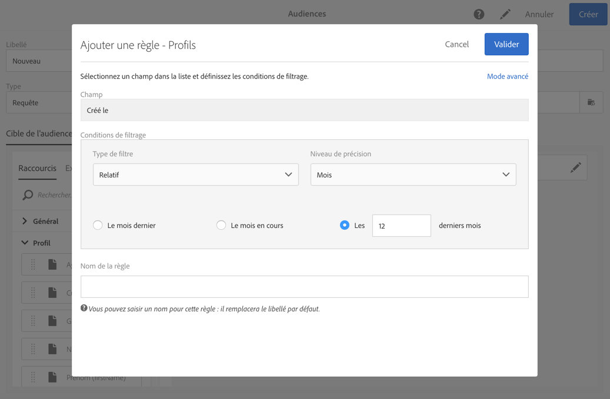
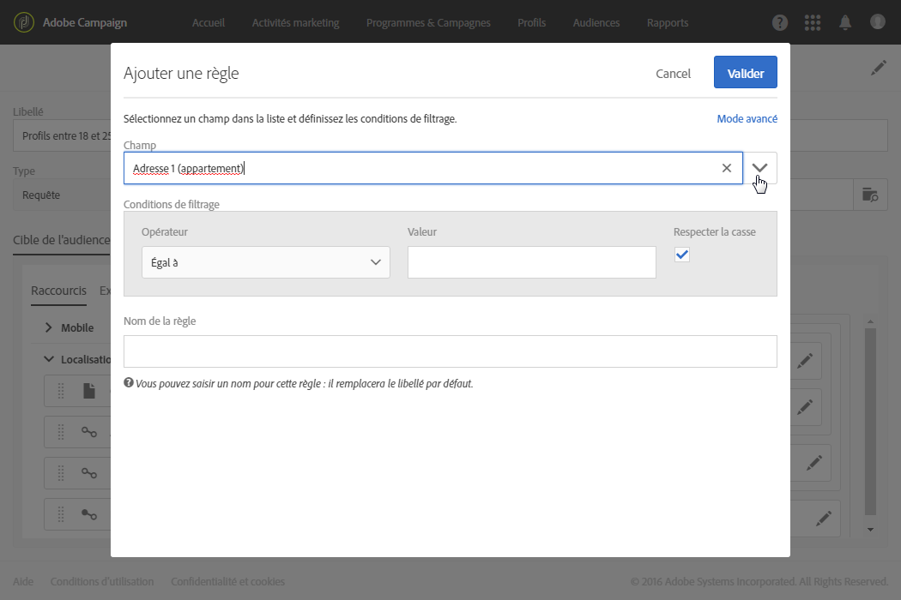
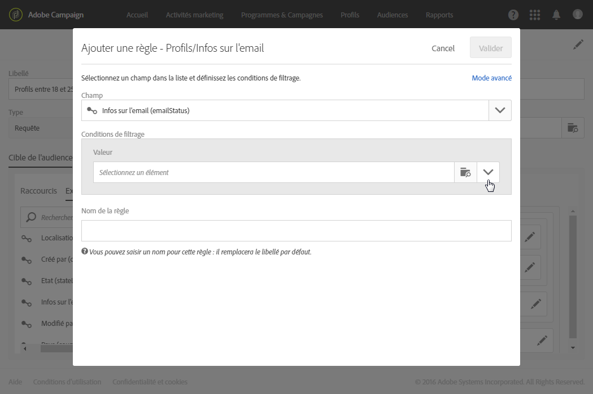
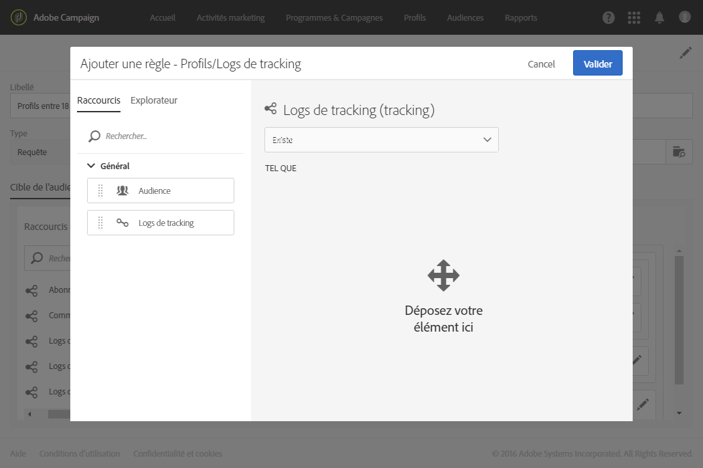
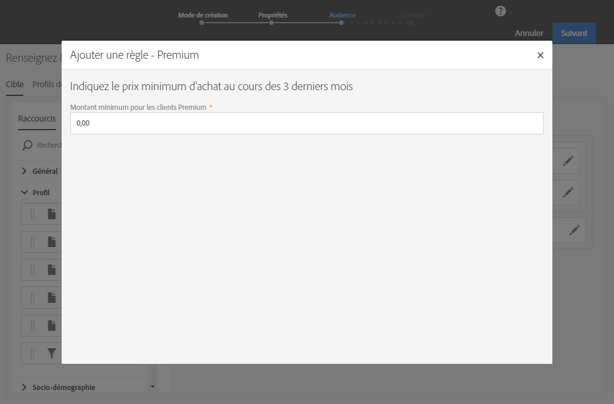
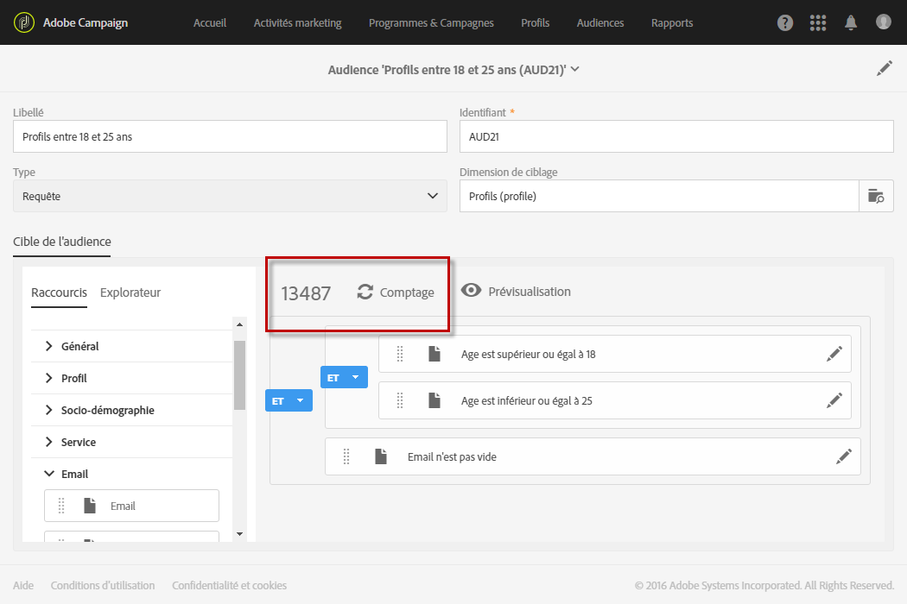

# Edition de requêtes{#editing-queries}

## A propos de l'éditeur de requêtes {#about-query-editor}

L'outil d'édition de requêtes est un assistant permettant de filtrer des données contenues dans la base de données Adobe Campaign.

Cette fonctionnalité vous permet de créer une population afin de mieux cibler les destinataires grâce aux règles et aux filtres prédéfinis.

Cet outil est partagé par plusieurs fonctionnalités de l'application :

* création d'une **audience** de type **Requête**
* définition de la cible d'un **email**
* définition d'une population dans des activités de **workflows**.

## Interface de l'éditeur de requêtes {#query-editor-interface}

L'éditeur de requêtes se compose d'une **Palette** et d'un **Espace de travail**.

### Palette {#palette}

La palette, située sur la gauche de l'éditeur, est divisée en deux onglets, composés d'éléments répartis dans des blocs thématiques. Ces onglets sont :

* les **raccourcis**, disponibles par défaut, ou créés par l'administrateur de l'instance. Vous y retrouvez des champs, des noeuds, des groupements, des liens 1-1, des liens 1-N et des filtres prédéfinis.
* l'**explorateur**, qui permet d'accéder à l'ensemble des champs disponibles dans la ressource cible : noeuds, élements de groupement, liens (1-1 et 1-N).

Les éléments contenus dans les onglets doivent être déplacés dans l'espace de travail afin d'être paramétrés et pris en compte pour la requête. En fonction de la dimension de ciblage sélectionnée (voir [Dimensions de ciblage et ressources](../../automating/using/query.md#targeting-dimensions-and-resources)), vous pouvez :

* sélectionner unitairement des audiences ou des profils
* utiliser des filtres prédéfinis
* définir des règles simples sur les champs de votre choix
* définir des règles avancées permettant d'appliquer des fonctions sur certains champs.

### Espace de travail {#workspace}

L'espace de travail est la zone centrale, dans laquelle vous pouvez paramétrer et combiner les règles, audiences et filtres prédéfinis ajoutés depuis la palette.

Lorsque vous déplacez un élément de la palette dans l'espace de travail, une nouvelle fenêtre s'ouvre et vous permet de [Créer une requête](../../automating/using/editing-queries.md#creating-queries).

## Créer une requête {#creating-queries}

L'éditeur de requêtes peut être utilisé pour définir une audience ou un profil de test dans un message, une population dans un workflow et pour créer une audience de type Requête.

Les requêtes peuvent être définies dans la fenêtre **[!UICONTROL Audience]** lors de la création d'une diffusion ou dans une activité de type **Requête** lors de la création d'un workflow.

1. Déplacez un élément depuis la palette vers l'espace de travail. La fenêtre d'édition de la règle s'ouvre.

   * pour un **champ** de type chaîne ou numérique, spécifiez l'opérateur de comparaison et la valeur.

      

   * pour un **champ** de type date ou date et heure, vous pouvez choisir de définir une date précise, une intervalle entre deux dates précises ou une date ou période relative à la date d'exécution de la requête.

      

   * pour un **champ** de type booléen, cochez les cases associées aux valeurs possibles pour le champ.
   * pour un **groupement**, sélectionnez le champ du groupement sur lequel vous souhaitez créer la règle, puis définissez la condition de la même manière que pour les autres champs.

      

   * pour un lien de type **1-1** avec une autre ressource de la base, sélectionnez directement une valeur de la table ciblée.

      

   * pour un lien de type **1-N** avec une autre ressource de la base, vous pouvez définir une sous-requête sur les champs de cette seconde ressource.

      Spécifier une sous-condition n'est pas obligatoire.

      Vous pouvez par exemple seulement sélectionner l'opérateur **[!UICONTROL Existe]sur le tracking des profils et valider la règle.** La règle renverra tous les profils pour lesquels le tracking existe.

      

   * pour un **filtre prédéfini**, saisissez ou sélectionnez les éléments de votre choix en fonction des critères proposés.

      Pour faciliter l'élaboration de requêtes complexes et répétitives, les administrateurs peuvent créer des filtres. Ceux-ci apparaissent dans l'éditeur de requêtes sous la forme de règles pré-paramétrées et permettent de limiter le nombre d'étapes à réaliser pour l'utilisateur.

      

1. Donnez éventuellement un nom à votre règle. Ce nom est affiché au niveau de la règle dans l'espace de travail. Si aucun nom n'est défini, un texte automatique décrivant les conditions est affiché.
1. Pour combiner les éléments de l'espace de travail, imbriquez-les afin de créer différents groupes et/ou niveaux de groupes. Vous pouvez alors sélectionner un opérateur logique afin de combiner les éléments de même niveau :

   * **[!UICONTROL ET]** : intersection de deux critères. Seuls les éléments répondant à chacun des critères sont comptabilisés.
   * **[!UICONTROL OU]** : union de deux critères. Les éléments répondant à au moins l'un des deux critères sont comptabilisés.
   * **[!UICONTROL SAUF]** : critère d'exclusion. Les éléments répondant au premier critère sont comptabilisés sauf s'ils répondent également au second critère.

1. Vous pouvez à tout moment compter et prévisualiser les éléments ciblés par votre requête à l'aide des boutons  et 

   

Si vous souhaitez modifier un élément de la requête, cliquez sur l'icône d'édition. La règle s'ouvre telle qu'elle a été paramétrée auparavant et vous pouvez alors effectuer les ajustements nécessaires.

Vos requêtes sont à présent créées et définies. Vous pouvez créer une population pour mieux personnaliser vos diffusions.

**Rubriques connexes :**

* [Fonctions avancées](../../automating/using/advanced-expression-editing.md)
* [Définir des filtres](../../developing/using/configuring-filter-definition.md)

