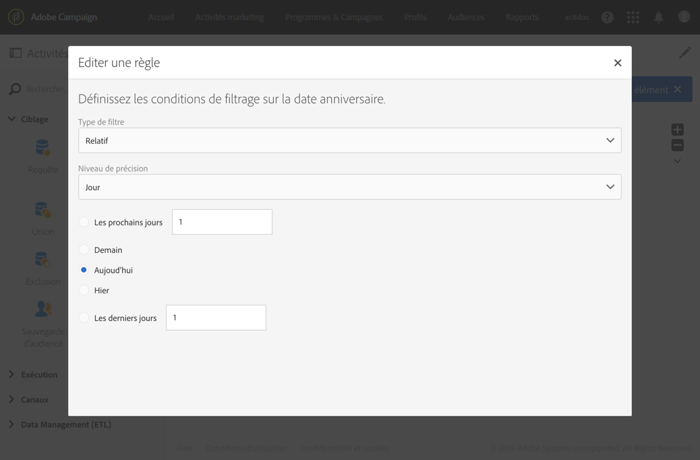

# Diffusion Email{#email-delivery}

## Description {#description}

L'activité **[!UICONTROL Diffusion Email]** permet de paramétrer l'envoi d'un email dans un workflow. Cet email peut être **unique** et n'être envoyé qu'une seule fois ou être **récurrent**.

Les emails uniques sont des emails standard, envoyés une seule fois.

Les emails récurrents permettent d'envoyer plusieurs fois sur une période définie un même email à des cibles différentes. Vous pouvez agréger les diffusions par période afin d'obtenir des rapports adaptés.

## Contexte d'utilisation {#context-of-use}

L'activité **[!UICONTROL Diffusion Email]** est généralement utilisée afin d'automatiser l'envoi d'un email à une cible calculée dans le même workflow.

Associée à un planificateur, il est possible de définir des emails de type récurrent.

Les destinataires de l'email sont définis en amont de l'activité dans le même workflow, grâce à des activités de ciblage telles que requêtes, intersections, etc.

La préparation du message est déclenchée selon les paramètres d'exécution du workflow. Depuis le tableau de bord du message, vous pouvez choisir de demander ou non une confirmation manuelle pour envoyer le message (requise par défaut). Vous pouvez lancer manuellement le workflow ou bien placer une activité de planification afin d'en automatiser l'exécution.

## Configuration {#configuration}

1. Placez une activité **[!UICONTROL Diffusion Email]** dans votre workflow.
1. Sélectionnez l'activité puis ouvrez-la à l'aide du bouton , disponible dans les actions rapides qui s'affichent.

   >[!NOTE]
   >
   >Les propriétés générales et les options avancées de l'activité (et non de la diffusion elle-même) sont disponibles à l'aide du bouton , disponible dans les actions rapides de l'activité. Ce bouton est spécifique à l'activité de **[!UICONTROL Diffusion Email]**. Les propriétés de l'email sont disponibles via la barre d'actions du tableau de bord de l'email.

1. Sélectionnez le mode d'envoi de l'email :

   * **[!UICONTROL Email]** : l'email est envoyé une seule fois. Vous pouvez définir à cet endroit si vous souhaitez ou non ajouter une transition en sortie de l'activité. Les différents types de transition sont détaillés à l'étape 7 de cette procédure.
   * **[!UICONTROL Email récurrent]** : l'email est envoyé plusieurs fois, à une fréquence définie dans une activité **[!UICONTROL Planificateur]**. Choisissez la période d'agrégation des envois. Cela permet de regrouper tous les envois ayant eu lieu dans la période définie dans un seul email, aussi appelé **exécution récurrente** et accessible depuis la liste des activités marketing de l'application.

      Par exemple, pour un email récurrent d'anniversaire, envoyé chaque jour, vous pouvez choisir d'agréger les envois par mois. Vous pourrez ainsi obtenir des rapports sur votre diffusion mois par mois alors que l'email est envoyé chaque jour.

1. Sélectionnez un type d'email. Les types d'emails sont issus des modèles d'emails définis dans **[!UICONTROL Ressources]** &gt; **[!UICONTROL Modèles]** &gt; **[!UICONTROL Modèles de diffusion]**.
1. Renseignez les propriétés générales de l'email. Vous pouvez également rattacher l'activité à une campagne existante. Le libellé de l'activité de la diffusion dans le workflow est mis à jour avec le libellé de l'email.
1. Définissez le contenu de l'email. Consultez la section concernant l'[édition de contenu](../../designing/using/about-email-content-design.md).
1. Par défaut, l'activité de **[!UICONTROL Diffusion Email]** ne possède aucune transition sortante. Si vous souhaitez ajouter une transition sortante à votre activité de **[!UICONTROL Diffusion Email]**, accédez à l'onglet **[!UICONTROL Général]** des options avancées de l'activité (bouton , disponible dans les actions rapides de l'activité) puis cochez l'une des options suivantes :

   * **[!UICONTROL Ajouter une transition sortante sans la population]** : permet de générer une transition sortante contenant la même population que la transition entrante.
   * **[!UICONTROL Ajouter une transition sortante avec la population]** : permet de générer une transition sortante contenant la population à qui l'email a été envoyé. La population ciblée exclue pendant la préparation de la diffusion (quarantaine, adresses email non valides, etc.) est exclue de cette transition.

1. Validez le paramétrage de l'activité et enregistrez le workflow.

Lorsque vous ouvrez à nouveau l'activité par la suite, vous accédez au tableau de bord de l'email. Seul son contenu reste modifiable.

Par défaut, le démarrage d'un workflow de diffusion déclenche uniquement la préparation des messages. L'envoi des messages créés depuis un workflow doit toujours être confirmé après le démarrage du workflow. Dans le tableau de bord des messages, vous pouvez toutefois désactiver l'option **[!UICONTROL Demander confirmation avant d'envoyer les messages]** si les messages ont été créés depuis un workflow. Lorsque cette option est décochée, les messages sont envoyés sans autre préavis une fois la préparation terminée.

## Remarques  {#remarks}

Les diffusions créées à partir d'un workflow sont accessibles dans la liste des activités marketing de l'application. Vous pouvez visualiser l'état d'exécution du workflow depuis le tableau de bord. Des liens dans le volet de résumé de l'email vous permettent d'accéder directement aux éléments liés (workflow, campagne, diffusion parente dans le cas d'un email récurrent).

Toutefois, les exécutions des diffusions récurrentes sont masquées par défaut. Pour les afficher, cochez l'option **[!UICONTROL Afficher les exécutions récurrentes]** dans le volet de recherche des activités marketing.

Depuis les diffusions parentes, accessibles depuis la liste des activités marketing ou directement via les exécutions récurrentes associées, vous pouvez visualiser l'ensemble des envois ayant été réalisés (en fonction de la période d'agrégation définie lors du paramétrage de l'activité de **[!UICONTROL Diffusion Email]**). Pour cela, accédez au détail du bloc **[!UICONTROL Déploiement]** de la diffusion parente en sélectionnant .

## Exemple {#example}

Cet exemple représente un workflow d'anniversaire. Un email est envoyé chaque jour aux profils dont l'anniversaire a lieu le jour même. Pour cela :

* Le **[!UICONTROL Planificateur]** permet de lancer le workflow chaque jour à 8h00.

   

* La **[!UICONTROL Requête]** permet de calculer à chaque exécution du workflow les profils dont c'est l'anniversaire et dont l'adresse email est renseignée. Le calcul de l'anniversaire est réalisé grâce à un filtre prédéfini disponible dans la palette de l'outil d'édition de requêtes.

   

* L'**[!UICONTROL Email]** est de type récurrent. Les envois sont agrégés par mois. Ainsi, tous les emails envoyés dans un mois sont agrégés dans une seule vue. En un an, 365 diffusions sont donc exécutées mais sont regroupées dans 12 vues (aussi appelés **exécutions récurrentes**) dans l'interface d'Adobe Campaign. Le détail des historiques et des rapports est ainsi affiché sur une base mensuelle et non pour chaque envoi.

   

**Rubriques connexes :**

* [Utilisation : Créer une fois par semaine un courrier électronique](../../automating/using/workflow-weekly-offer.md)
* [Utilisation : Création d'une livraison segmentée sur place](../../automating/using/workflow-segmentation-location.md)
* [Utilisation : Créer des livraisons avec un complément](../../automating/using/workflow-created-query-with-complement.md)
* [Utilisation : Retargeting workflow envoie une nouvelle livraison aux non-initiateurs](../../automating/using/workflow-cross-channel-retargeting.md)