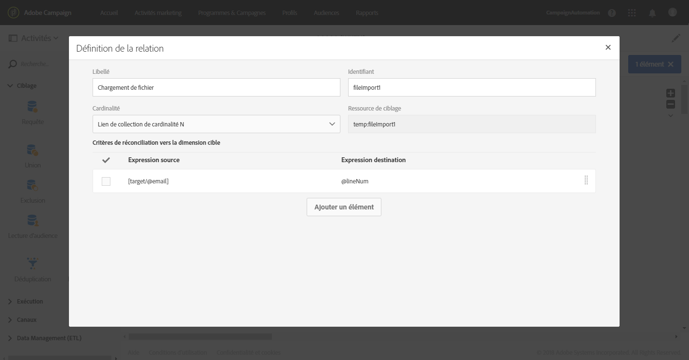
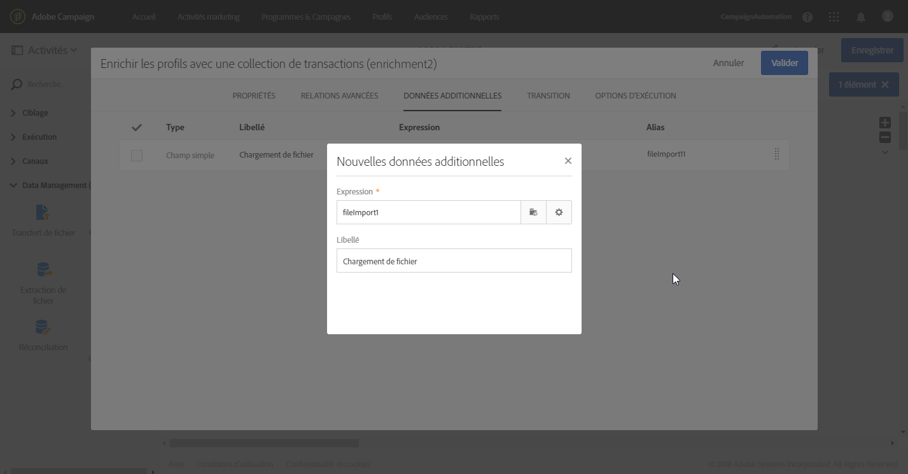
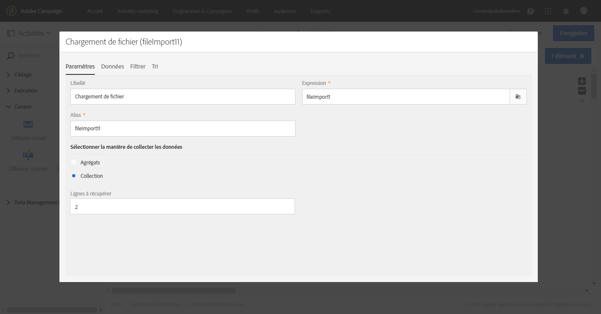
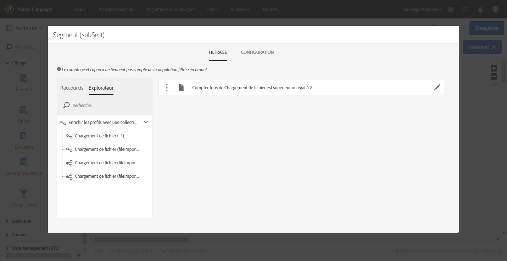

# Enrichissement des données de profil avec des données contenues dans un fichier {#enriching-profile-data-with-data-contained-in-a-file}

Cet exemple montre comment enrichir les données de profil avec les données d’achat contenues dans un fichier. Nous considérons ici que les données d’achat sont stockées dans un système tiers. Le fichier peut stocker plusieurs achats pour chaque profil. L&#39;objectif final du workflow est d&#39;envoyer un email aux profils ciblés ayant acheté au moins deux articles afin de les remercier pour leur fidélité.

Le workflow est configuré comme suit :


* Une activité [Requête](../../automating/using/query.md) cible les profils qui recevront le message.
* Une activité [Chargement de fichier](../../automating/using/load-file.md) charge les données d&#39;achat. Par exemple :

   ```
   tcode;tdate;customer;product;tamount
   aze123;21/05/2017;dannymars@example.com;TV;799
   aze124;28/05/2017;dannymars@example.com;Headphones;8
   aze125;31/07/2017;john.smith@example.com;Headphones;8
   aze126;14/12/2017;john.smith@example.com;Plastic Cover;4
   aze127;02/01/2018;dannymars@example.com;Case Cover;79
   aze128;04/03/2017;clara.smith@example.com;Phone;149
   ```

   Avec cet exemple de fichier, nous allons utiliser l&#39;adresse email pour réconcilier les données avec les profils de la base de données. Vous pouvez également activer des identifiants uniques, comme décrit dans [ce document](../../developing/using/configuring-the-resource-s-data-structure.md#generating-a-unique-id-for-profiles-and-custom-resources).

* Une activité [Enrichissement](../../automating/using/enrichment.md) crée un lien entre les données de transaction chargées depuis le fichier et les profils sélectionnés dans la **[!UICONTROL Requête]**. Le lien est défini dans l&#39;onglet **[!UICONTROL Relations avancées]** de l&#39;activité. Il repose sur la transition provenant de l&#39;activité **[!UICONTROL Chargement de fichier]**. Il utilise le champ &quot;email&quot; de la ressource de profil et la colonne &quot;client&quot; du fichier importé en tant que critères de réconciliation.

   

   Une fois le lien créé, deux ensembles de **[!UICONTROL Données additionnelles]** sont ajoutés :

   * Une collection de deux lignes qui correspond aux deux dernières transactions de chaque profil. Pour cette collection, le nom du produit, la date de transaction et le prix du produit sont ajoutés en tant que données additionnelles. Un tri descendant est appliqué aux données. Pour créer la collection, dans l&#39;onglet **[!UICONTROL Données additionnelles]**, procédez comme suit :

      Sélectionnez le lien défini auparavant dans l&#39;onglet **[!UICONTROL Relations avancées]** de l&#39;activité.

      

      Cochez **[!UICONTROL Collection]** et indiquez le nombre de lignes à récupérer (2 dans cet exemple). Dans cet écran, vous pouvez personnaliser l&#39;**[!UICONTROL Alias]** et le **[!UICONTROL Libellé]** de la collection. Ces valeurs seront visibles dans les activités suivantes du workflow lorsqu&#39;elles désigneront cette collection.

      

      Sélectionnez les colonnes qui seront utilisées dans la diffusion finale en tant que **[!UICONTROL Données]** à conserver pour la collection.

      

      Appliquez un tri descendant sur la date de transaction pour être sûr de récupérer les toutes dernières transactions.

      

   * Un agrégat qui comptabilise le nombre total de transactions pour chaque profil. Cet agrégat sera utilisé plus tard pour filtrer les profils pour lesquels deux transactions au moins sont enregistrées. Pour créer l&#39;agrégat, dans l&#39;onglet **[!UICONTROL Données additionnelles]**, procédez comme suit :

      Sélectionnez le lien défini auparavant dans l&#39;onglet **[!UICONTROL Relations avancées]** de l&#39;activité.

      

      Sélectionnez **[!UICONTROL Agrégat]**.

      

      Définissez un agrégat **[!UICONTROL Comptage intégral]** en tant que **Données** à conserver. Au besoin, indiquez un alias personnalisé afin de retrouver l&#39;agrégat plus rapidement dans les activités suivantes.

      

* Une activité [Segmentation](../../automating/using/segmentation.md), avec un seul segment, récupère les profils de la cible initiale pour lesquels au moins deux transactions sont enregistrées. Les profils ne comportant qu&#39;une seule transaction sont exclus. Pour cela, la requête de la segmentation est créée sur l&#39;agrégat défini auparavant.

   

* Une activité [Diffusion Email](../../automating/using/email-delivery.md) utilise les données additionnelles définies dans l&#39;**[!UICONTROL Enrichissement]** pour récupérer dynamiquement les deux derniers achats effectués par le profil. Les données additionnelles sont accessibles depuis le nœud **Données additionnelles (TargetData)** lors de l&#39;ajout d&#39;un champ personnalisé.

   

**Rubrique connexe :**

* [Enrichissement de profils client avec des données externes](https://helpx.adobe.com/fr/campaign/kb/simplify-campaign-management.html#Managedatatofuelengagingexperiences)
