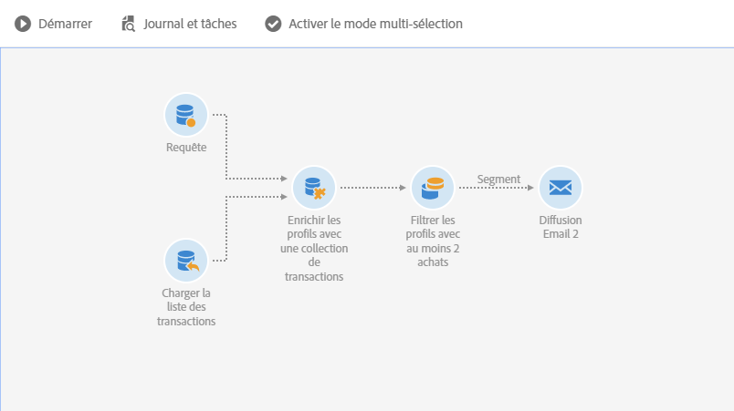
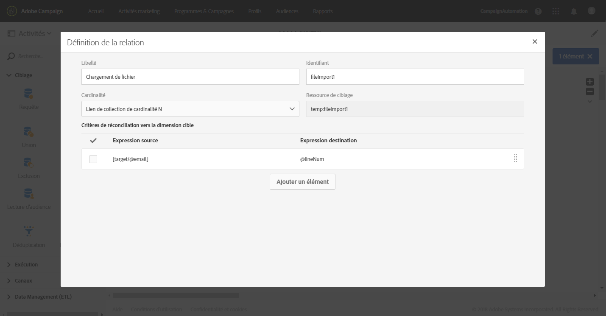
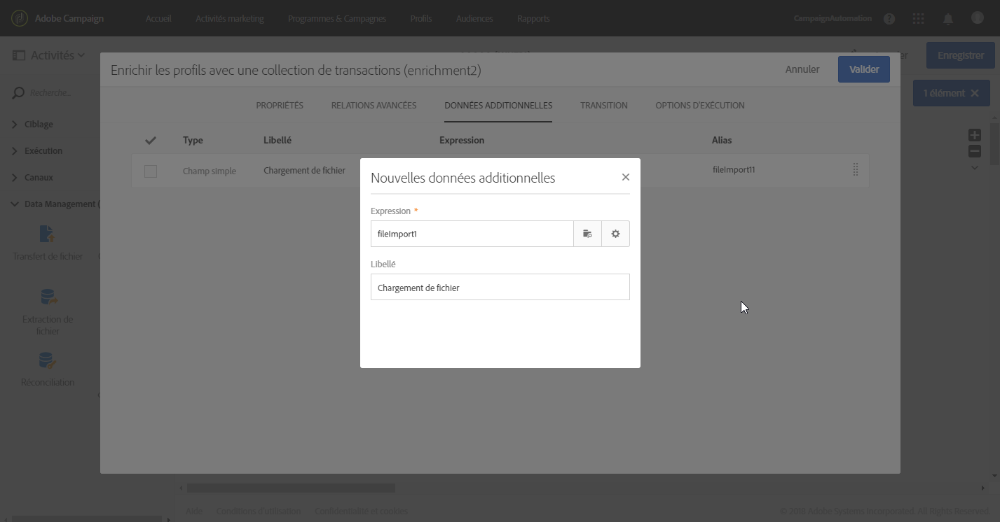
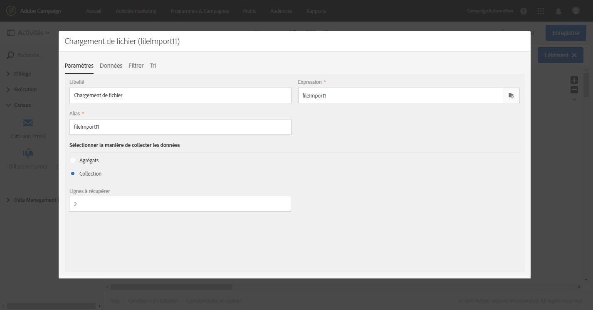
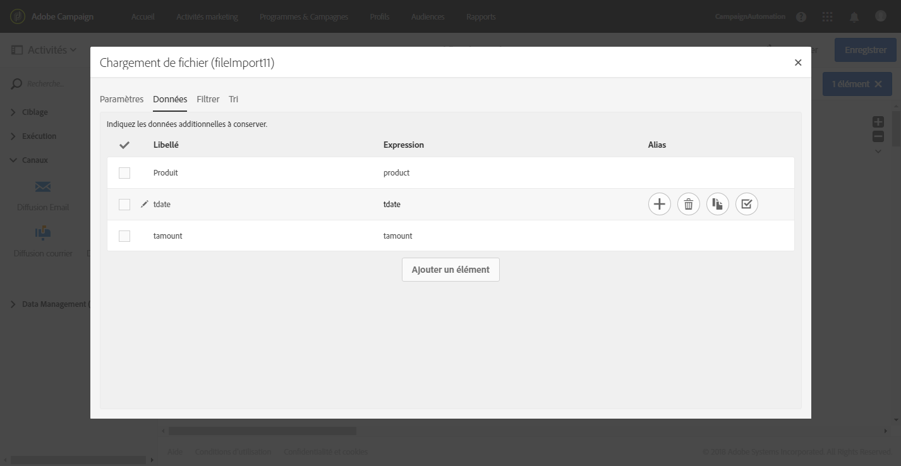
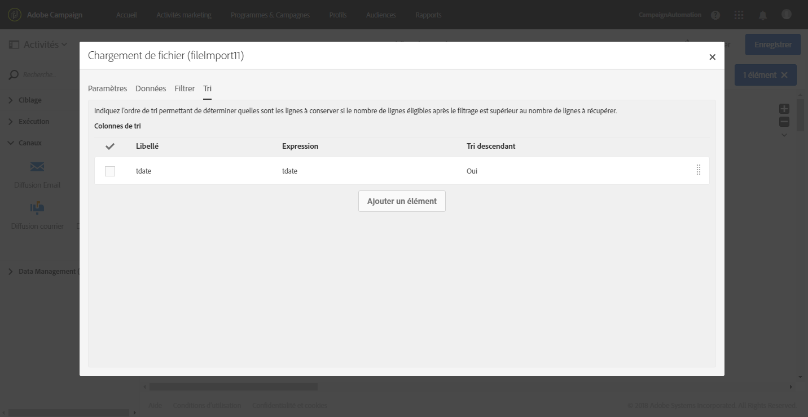
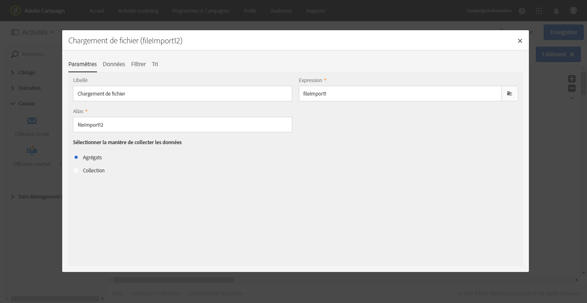
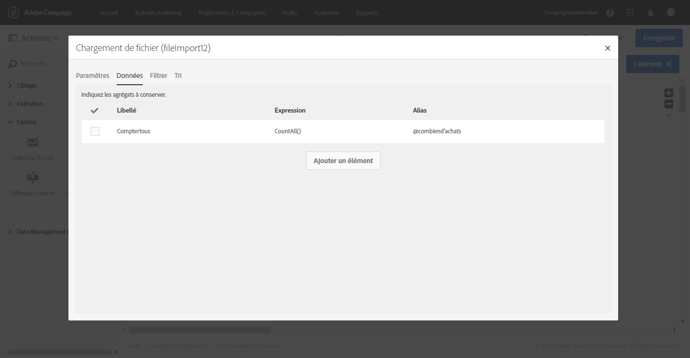
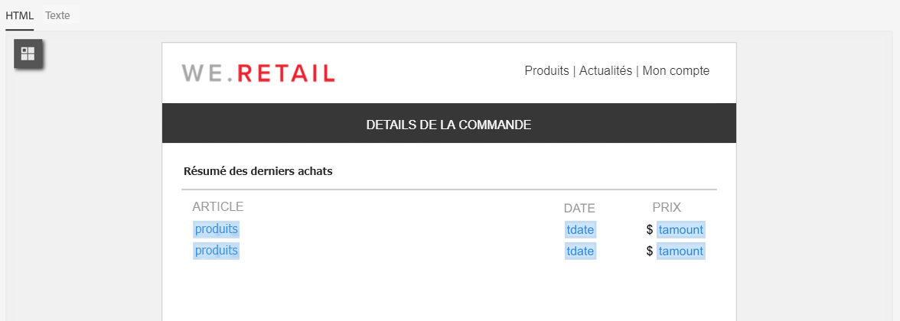

# Enrichissement{#enrichment}

## Description {#description}


L'activité **[!UICONTROL Enrichissement]** est une activité avancée qui permet de définir des données additionnelles à traiter dans un workflow.

## Contexte d'utilisation {#context-of-use}

L'activité **[!UICONTROL Enrichissement]** est généralement utilisée à la suite des activités de ciblage ou d'un import de fichier et avant les activités permettant de consommer les données ciblées.

Cette activité contient plus de fonctions avancées d'enrichissement que l'activité **[!UICONTROL Requête]**. Certains cas simples d'enrichissement peuvent être directement effectués dans l'[activité Requête](../../automating/using/query.md#enriching-data).

Avec l'activité **[!UICONTROL Enrichissement]**, vous pouvez utiliser la transition entrante et configurer l'activité pour ajouter des données additionnelles à la transition sortante. Elle permet de combiner des données provenant de plusieurs ensembles ou de créer des liens avec une ressource temporaire.

## Configuration {#configuration}

Pour configurer une activité **[!UICONTROL Enrichissement]** :

1. Placez une activité **[!UICONTROL Enrichissement]** dans votre workflow.
1. Sélectionnez l'activité puis ouvrez-la à l'aide du bouton , disponible dans les actions rapides qui s'affichent.
1. Si l'activité possède plusieurs transitions entrantes, sélectionnez l'**[!UICONTROL Ensemble principal]**. Les données additionnelles configurées dans cette activité seront ajoutées à cet ensemble principal dans la transition sortante.

   Si l'ensemble principal contient déjà des données additionnelles, vous pouvez choisir de les conserver ou de les supprimer. Si vous décochez l'option **[!UICONTROL Conserver toutes les données additionnelles de l'ensemble principal]**, seules les données additionnelles configurées dans l'**[!UICONTROL Enrichissement]** sont conservées dans la transition sortante.

1. S'il existe plusieurs transitions entrantes, définissez les relations entre l'ensemble principal et les autres données entrantes dans l'onglet **[!UICONTROL Relations avancées]** de l'activité. Vous pouvez ajouter plusieurs relations à l'aide du bouton **[!UICONTROL Ajouter un élément]**.

   Lorsque vous définissez une nouvelle relation, sélectionnez l'ensemble de données entrantes à associer à l'ensemble principal. Définissez ensuite le type de relation. Selon les données entrantes et le modèle de données, plusieurs types de relation sont proposées :

   * **[!UICONTROL Lien simple de cardinalité 1]** : chaque enregistrement des données entrantes est associé à un seul enregistrement de l'ensemble principal. Chaque enregistrement de l'ensemble principal est associé à un enregistrement des données liées.
   * **[!UICONTROL Lien de collection de cardinalité N]** : 0, 1 ou davantage (N) d'enregistrements des données liées peuvent être associés à 1 enregistrement de l'ensemble principal.
   * **[!UICONTROL Lien simple de cardinalité 0 ou 1]** : les enregistrements de l'ensemble principal peuvent être associés à 0 ou 1 enregistrement des données liées (et pas plus de un).
   Une fois la **[!UICONTROL Cardinalité]** définie, définissez un **[!UICONTROL Critère de réconciliation]**. L'**[!UICONTROL Expression source]** du critère de réconciliation peut être un champ de la ressource cible, une [expression](../../automating/using/advanced-expression-editing.md) ou une valeur indiquée entre guillemets.

   Définissez un **[!UICONTROL Libellé]** et un **[!UICONTROL Identifiant]** qui pourront être facilement identifiés plus tard dans le workflow.

   >[!NOTE]
   >
   >Vous ne pouvez définir des relations qu'entre l'ensemble principal et les autres transitions entrantes reliées à l'activité **[!UICONTROL Enrichissement]**. Pour des cas plus simples visant à définir des relations avec des ressources de la base de données, utilisez une activité [Réconciliation](../../automating/using/reconciliation.md).

1. Définissez les données additionnelles dans l'onglet **[!UICONTROL Données additionnelles]** de l'activité. Vous pouvez définir des données additionnelles (champs simples, agrégats et collections) liées à la dimension de ciblage de l'ensemble principal ou reposant sur les liens créés dans l'onglet **[!UICONTROL Relations avancées]** de l'activité **[!UICONTROL Enrichissement]**.

   Consultez la section [Enrichir des données](../../automating/using/query.md#enriching-data).

1. Validez le paramétrage de l'activité et enregistrez le workflow.

Les données peuvent maintenant être utilisées dans les activités reliées qui se trouvent à la suite de l'**[!UICONTROL Enrichissement]**. Par exemple, vous pouvez les retrouver via le lien **[!UICONTROL Données additionnelles (targetData)]** de l'explorateur des champs de personnalisation dans un contenu d'email.

## Exemple : enrichissement des données de profil avec des données contenues dans un fichier {#example--enriching-profile-data-with-data-contained-in-a-file}

Cet exemple illustre comment enrichir des données de profil avec des données d'achat contenues dans un fichier. Dans cet exemple, les données d'achat sont stockées dans un système tiers. Le fichier peut stocker plusieurs achats pour chaque profil. L'objectif final du workflow est d'envoyer un email aux profils ciblés ayant acheté au moins deux articles afin de les remercier pour leur fidélité.

Le workflow est configuré comme suit :



* Une activité **[!UICONTROL Requête]** cible les profils qui recevront le message.
* Une activité **[!UICONTROL Chargement de fichier]** charge les données d'achat. Par exemple :

   ```
   tcode;tdate;customer;product;tamount
   aze123;21/05/2017;dannymars@example.com;TV;799
   aze124;28/05/2017;dannymars@example.com;Headphones;8
   aze125;31/07/2017;john.smith@example.com;Headphones;8
   aze126;14/12/2017;john.smith@example.com;Plastic Cover;4
   aze127;02/01/2018;dannymars@example.com;Case Cover;79
   aze128;04/03/2017;clara.smith@example.com;Phone;149
   ```

   Avec cet exemple de fichier, nous allons utiliser l'adresse email pour réconcilier les données avec les profils de la base de données. Vous pouvez également activer des identifiants uniques, comme décrit dans [ce document](../../developing/using/configuring-the-resource-s-data-structure.md#generating-a-unique-id-for-profiles-and-custom-resources).

* Une activité **[!UICONTROL Enrichissement]** crée un lien entre les données de transaction chargées depuis le fichier et les profils sélectionnés dans la **[!UICONTROL Requête]**. Le lien est défini dans l'onglet **[!UICONTROL Relations avancées]** de l'activité. Il repose sur la transition provenant de l'activité **[!UICONTROL Chargement de fichier]**. Il utilise le champ "email" de la ressource de profil et la colonne "client" du fichier importé en tant que critères de réconciliation.

   

   Une fois le lien créé, deux ensembles de **[!UICONTROL Données additionnelles]** sont ajoutés :

   * Une collection de deux lignes qui correspond aux deux dernières transactions de chaque profil. Pour cette collection, le nom du produit, la date de transaction et le prix du produit sont ajoutés en tant que données additionnelles. Un tri descendant est appliqué aux données. Pour créer la collection, dans l'onglet **[!UICONTROL Données additionnelles]**, procédez comme suit :

      Sélectionnez le lien défini auparavant dans l'onglet **[!UICONTROL Relations avancées]** de l'activité.

      

      Cochez **[!UICONTROL Collection]** et indiquez le nombre de lignes à récupérer (2 dans cet exemple). Dans cet écran, vous pouvez personnaliser l'**[!UICONTROL Alias]** et le **[!UICONTROL Libellé]** de la collection. Ces valeurs seront visibles dans les activités suivantes du workflow lorsqu'elles désigneront cette collection.

      

      Sélectionnez les colonnes qui seront utilisées dans la diffusion finale en tant que **[!UICONTROL Données]** à conserver pour la collection.

      

      Appliquez un tri descendant sur la date de transaction pour être sûr de récupérer les toutes dernières transactions.

      

   * Un agrégat qui comptabilise le nombre total de transactions pour chaque profil. Cet agrégat sera utilisé plus tard pour filtrer les profils pour lesquels deux transactions au moins sont enregistrées. Pour créer l'agrégat, dans l'onglet **[!UICONTROL Données additionnelles]**, procédez comme suit :

      Sélectionnez le lien défini auparavant dans l'onglet **[!UICONTROL Relations avancées]** de l'activité.

      

      Sélectionnez **[!UICONTROL Agrégat]**.

      

      Définissez un agrégat **Comptage intégral** en tant que **[!UICONTROL Données]** à conserver. Au besoin, indiquez un alias personnalisé afin de retrouver l'agrégat plus rapidement dans les activités suivantes.

      

* Une activité **[!UICONTROL Segmentation]**, avec un seul segment, récupère les profils de la cible initiale pour lesquels au moins deux transactions sont enregistrées. Les profils ne comportant qu'une seule transaction sont exclus. Pour cela, la requête de la segmentation est créée sur l'agrégat défini auparavant.

   

* Une activité **[!UICONTROL Diffusion Email]** utilise les données additionnelles définies dans l'**[!UICONTROL Enrichissement]** pour récupérer dynamiquement les deux derniers achats effectués par le profil. Les données additionnelles sont accessibles depuis le nœud **Données additionnelles (TargetData)** lors de l'ajout d'un champ personnalisé.

   

**Rubrique connexe :**

* [Enrichir les profils client avec des données externes](https://helpx.adobe.com/campaign/kb/simplify-campaign-management.html#Managedatatofuelengagingexperiences)

