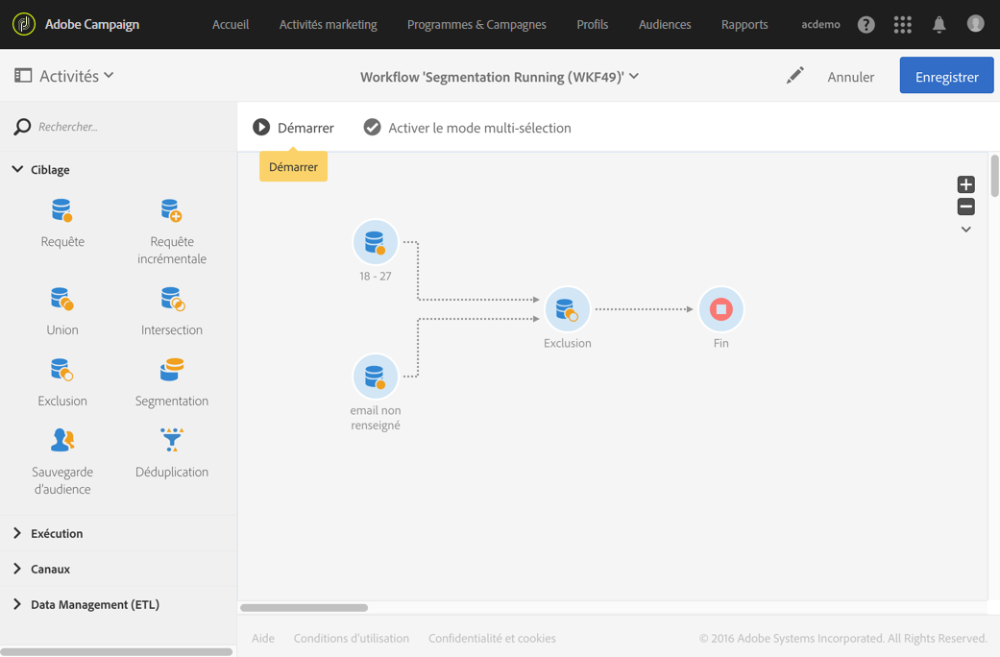

# Exclusion{#exclusion}

## Description {#description}

L'activité **[!UICONTROL Exclusion]permet d'exclure des éléments d'une population selon certains critères.**

## Contexte d'utilisation {#context-of-use}

L'activité **[!UICONTROL Exclusion]est essentiellement utilisée afin de réaliser un filtrage supplémentaire sur les populations des transitions entrantes.**

Un ensemble principal est défini parmi les transitions entrantes. Les membres des autres transitions entrantes sont exclus de l'ensemble principal. La transition sortante de l'activité d'exclusion contient uniquement les membres de l'ensemble principal non rencontrés dans les autres transitions entrantes.

## Configuration {#configuration}

1. Placez une activité **[!UICONTROL Exclusion]dans votre workflow.**
1. Sélectionnez l'activité puis ouvrez-la à l'aide du bouton 
1. Sélectionnez l'**[!UICONTROL Ensemble principal]parmi les transitions entrantes.** C'est l'ensemble à partir duquel des éléments sont exclus. Les autres ensembles correspondent aux éléments devant être exclus de l'ensemble principal.

   >[!NOTE]
   >
   >Les transitions entrantes doivent contenir le même type de population. Par exemple, si l'ensemble principal contient des profils de test, les autres transitions doivent aussi contenir des profils de test.

1. Si besoin, gérez les [Transitions](../../automating/using/executing-a-workflow.md#managing-an-activity-s-outbound-transitions) de l'activité afin d'accéder à des options avancées sur la population transmise en sortie.
1. Validez le paramétrage de l'activité et enregistrez le workflow.

## Exemple {#example}

L'exemple suivant montre le paramétrage de deux activités de requête visant à filtrer les profils de la base Adobe Campaign dont l'âge est compris entre 18 et 27 ans et dont l'adresse email n'est pas valide. Ceux dont l'email n'est pas valide sont ensuite exclus du premier ensemble. Cela permet par exemple d'envoyer un email par la suite.

