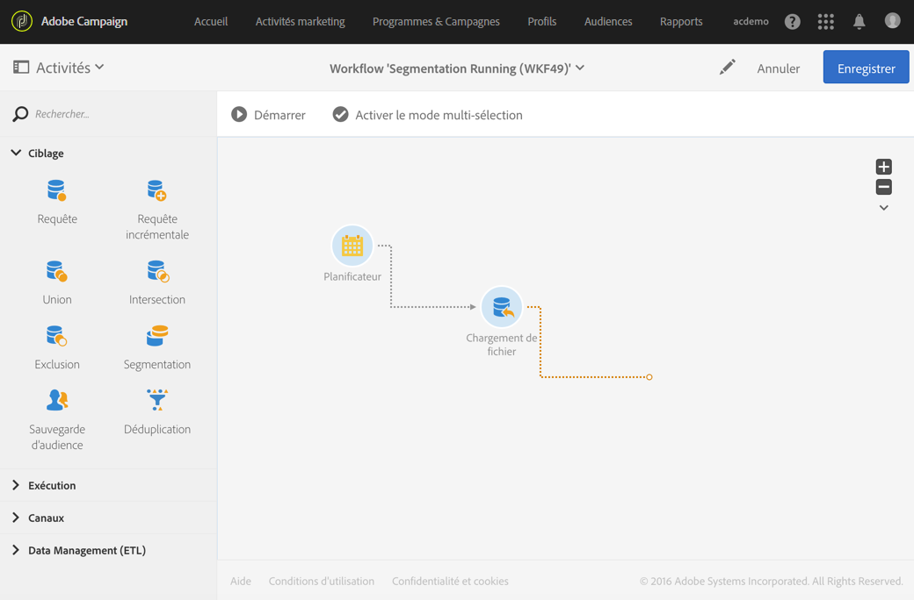
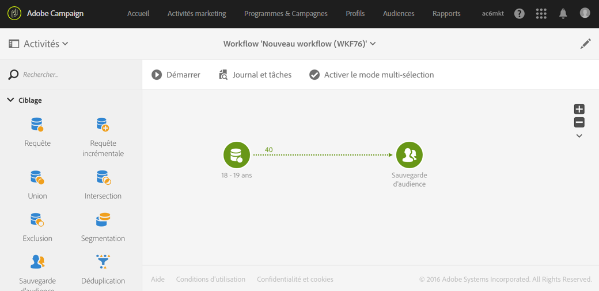
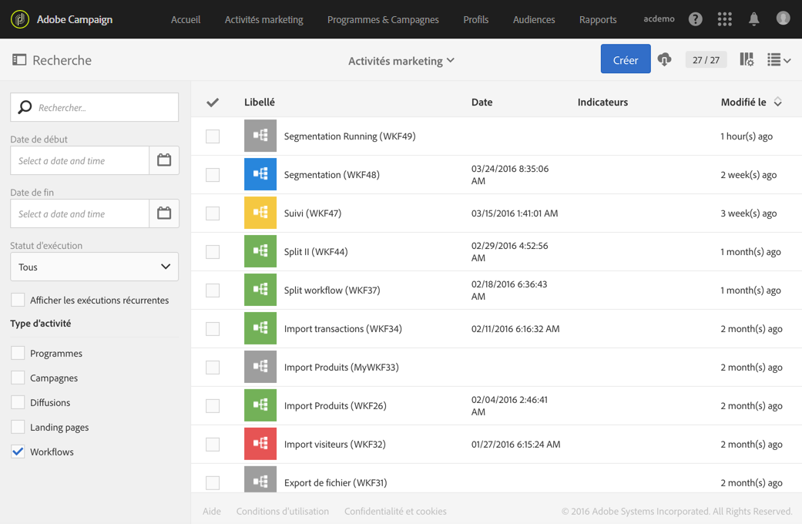
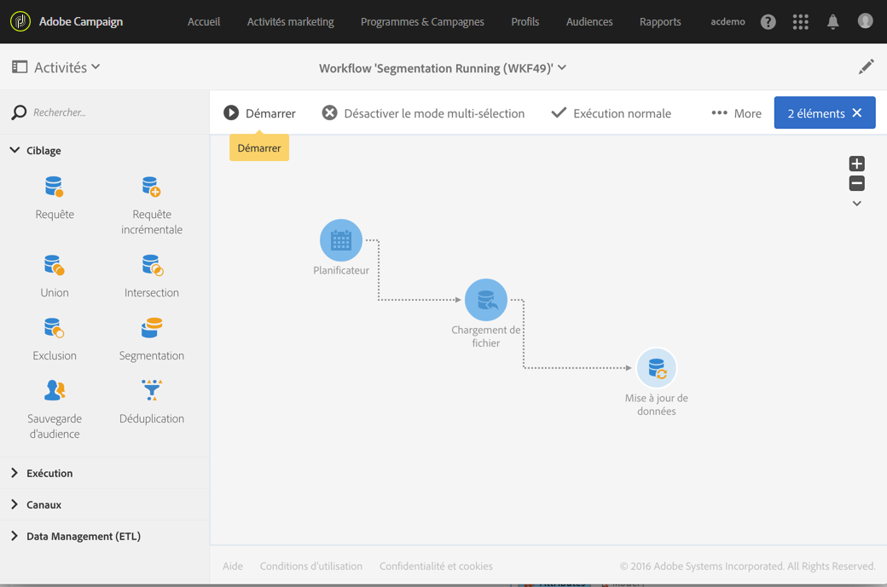
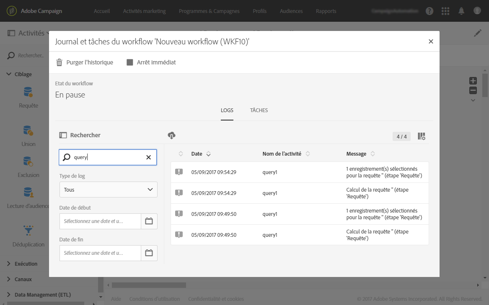
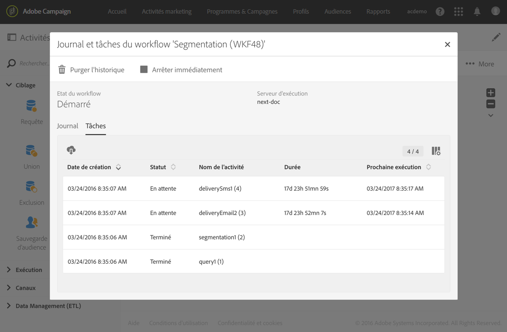
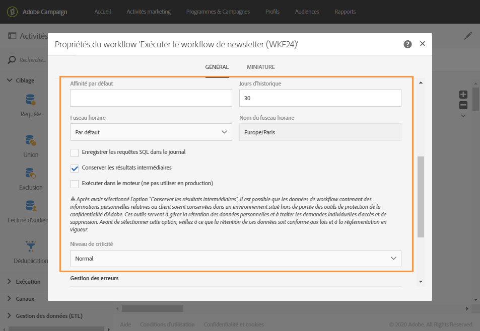

# Exécuter un workflow{#executing-a-workflow}

## A propos de l'exécution d'un workflow {#about-workflow-execution}

Un workflow est toujours démarré manuellement. Une fois lancé, il peut toutefois rester inactif selon les informations spécifiées via un [planificateur](../../automating/using/scheduler.md).

>[!CAUTION]
>
> Adobe recommande aux clients de hiérarchiser les exécutions de workflows et d'exécuter au maximum 20 workflows simultanément de façon à obtenir constamment des performances maximales sur leur instance. Il est possible de planifier plus de 20 exécutions de workflows simultanées ; elles s'exécuteront en séquence par défaut. Vous pouvez ajuster les paramètres par défaut pour le nombre maximum d'exécutions de flux de travaux simultanés en envoyant un ticket au service d'assistance clientèle.

Les actions relatives à l'exécution (lancement, arrêt, pause, etc.) sont des processus **asynchrones** : la commande est enregistrée et sera effective dès que le serveur est disponible pour l'appliquer.

En général, dans un workflow, le résultat de chaque activité est transmis à l'activité suivante via une transition, représentée par une flèche.

Une transition est flottante si elle n'est pas rattachée à une activité de destination.

>[!NOTE]
>
>Un workflow contenant des transitions flottantes peut être exécuté : lors de l'activation d'une telle transition, l'exécution génère un avertissement et se trouve suspendue, mais aucune erreur n'est entraînée. Il est ainsi possible de démarrer un workflow sans en avoir terminé la conception et de le compléter au fur et à mesure.

Lorsqu'une activité a été exécutée, le nombre d'enregistrements transmis dans la transition est affiché au-dessus de cette dernière.

Vous pouvez ouvrir les transitions afin de vérifier que les données transmises sont correctes pendant ou après l'exécution du workflow. Vous pouvez visualiser les données présentes ainsi que leur structure.

Pour pouvoir accéder au détail des transitions intermédiaires (autres que la dernière transition du workflow), vous devez cocher l'option **[!UICONTROL Conserver les résultats intermédiaires]** dans la section **Exécution]des propriétés du workflow avant de démarrer le workflow.[!UICONTROL **

>[!NOTE]
>
>Cette option consomme beaucoup de mémoire et a été conçue pour vous aider à construire un workflow et à vous assurer que sa configuration et son comportement sont corrects. Laissez-la décochée sur les instances de production.

Lorsqu'une transition est ouverte, vous pouvez modifier son **[!UICONTROL Libellé]** ou lui associer un **Code segment.** Pour cela, éditez les champs correspondants et validez vos modifications.

## Contrôle d'un workflow à partir de l'API REST {#controlling-a-workflow-from-the-rest-api}

L'API REST vous permet de **démarrer**, **mettre en pause**, **reprendre** et **arrêter** un workflow.

Vous trouverez plus d'informations et d'exemples d'appels REST dans la [documentation de l'API.](https://docs.campaign.adobe.com/doc/standard/en/api/ACS_API.html#controlling-a-workflow)

## Cycle de vie {#life-cycle}

Le cycle de vie d'un workflow comporte trois grandes étapes, chacune d'elle étant associée à un statut et à une couleur :

* **En édition** (gris)

   C'est la phase de conception initiale d'un nouveau workflow (voir [Créer un workflow](../../automating/using/building-a-workflow.md#creating-a-workflow)). Un tel workflow n'est pas encore pris en charge par le serveur, il peut donc être modifié sans risque.

* **En cours** (bleu)

   Une fois la phase de conception terminée, le workflow peut être démarré et il est pris en charge par le serveur.

* **Terminé** (vert)

   Un workflow est terminé lorsqu'il n'a plus de tâche en cours ou lorsque l'exécution a explicitement été arrêtée.

Une fois qu'il a été démarré, un workflow peut également se voir attribuer deux autres statuts :

* **Avertissement** (jaune)

   Le workflow n'a pas pu se terminer ou a été mis en pause à l'aide des boutons  ou 

* **En erreur** (rouge)

   Une erreur est survenue pendant l'exécution du workflow. Ce dernier est arrêté et une action est requise de la part de l'utilisateur. Pour connaître l'origine de l'erreur, utilisez le bouton  afin d'accéder au journal du workflow (voir [Contrôle](../../automating/using/executing-a-workflow.md#monitoring)).

La liste des activités marketing permet d'afficher tous les workflows ainsi que leur statut. Voir à ce sujet la section [Gérer les activités marketing](../../start/using/marketing-activities.md#about-marketing-activities).

## Commandes d'exécution {#execution-commands}

Les icônes de la barre d'actions permettent de lancer, de tracker et de modifier l'exécution d'un workflow. Voir [La barre d'actions](../../automating/using/workflow-interface.md#action-bar).

Les actions disponibles sont les suivantes :

**Démarrer**

Le bouton  permet de lancer l'exécution d'un workflow, qui prend alors le statut **En cours** (bleu). Si le workflow était en pause, il s'agit d'une reprise, sinon il s'agit d'un démarrage et les activités initiales sont alors activées.

>[!NOTE]
>
>Le démarrage est un processus asynchrone : la demande est enregistrée et sera traitée dès que possible par le moteur d'exécution de workflow.

**Pause**

Le bouton  Le workflow prend le statut **Avertissement** (jaune). Aucune nouvelle activité ne sera activée jusqu'à la prochaine reprise, mais les opérations en cours ne sont pas suspendues.

**Arrêter**

Le bouton  arrête un workflow en cours d'exécution, qui prend alors le statut **Terminé** (vert). Les opérations en cours sont interrompues, si possible, et les imports ou requêtes SQL en cours sont immédiatement annulées. Il n'est pas possible de reprendre à l'endroit où le workflow s'est arrêté.

**Redémarrer**

Le bouton  Dans la plupart des cas, cela permet de redémarrer plus vite. C'est également utile pour automatiser le redémarrage lorsque l'arrêt prend un certain temps, car le bouton 

Lorsqu'une ou plusieurs activités d'un workflow sont sélectionnées, d'autres actions sont possibles :

**Traitement anticipé**

Le bouton 

**Exécution normale**

Le bouton 

**Exécution suspendue**

Le bouton 

**Pas d'exécution**

Le bouton 

>[!NOTE]
>
>Les actions permettant d'agir sur une activité en particulier sont également disponibles depuis les actions rapides, qui s'affichent lors de la sélection d'une activité.

## Contrôle {#monitoring}

L'icône 

L'historique d'un workflow est conservé pendant la durée que vous indiquez dans les options d'exécution du workflow (voir [Propriétés des workflows](../../automating/using/executing-a-workflow.md#workflow-properties)). Pendant cette durée, tous les messages sont donc conservés, même après un redémarrage. Si vous ne voulez pas conserver les messages d'une exécution précédente, vous devez purger l'historique en cliquant sur le bouton 

L'onglet **[!UICONTROL Journal]contient l'historique de l'exécution de toutes les activités ou des activités sélectionnées.** Il répertorie par ordre chronologique les opérations réalisées et les erreurs d'exécution.

L'onglet **[!UICONTROL Tâches]permet de voir le séquencement de l'exécution des activités.** Cliquez sur une tâche pour obtenir plus d'informations.

Dans ces deux listes :

* Cliquez sur le compteur pour obtenir le nombre total des activités selon le filtrage appliqué. Le comptage est affiché par défaut si le nombre d'éléments dans la liste est inférieur à 30.
* Le bouton **[!UICONTROL Configurer la liste]permet de choisir les informations affichées, de définir l'ordre des colonnes et d'appliquer un tri.**
* Vous pouvez utiliser des filtres pour trouver plus rapidement les informations dont vous avez besoin. Utilisez le champ de recherche pour rechercher du texte spécifique dans les noms des activités de workflow (par exemple "requête") et les logs.

## Gestion des erreurs {#error-management}

Lorsqu'une erreur se produit, le workflow se met en pause et l'activité qui était en cours d'exécution lorsque l'erreur s'est produite clignote alors en rouge.

Le statut du workflow passe au rouge et l'erreur est consignée dans le journal.

Vous pouvez paramétrer le workflow pour qu'il ne se mette pas en pause et continue son exécution en cas d'erreur. Pour cela, accédez aux propriétés du workflow à l'aide du bouton  et, dans la section **[!UICONTROL Exécution]**, sélectionnez l'option **Ignorer** dans le champ **En cas d'erreur**.

Dans ce cas, la tâche en erreur est abandonnée. Ce mode est particulièrement adapté aux workflows conçus pour permettre de retenter l'opération ultérieurement (actions périodiques).

>[!NOTE]
>
>Vous pouvez appliquer ce paramétrage au niveau de chaque activité. To do this, select an activity and open it using the quick action . et sélectionnez le mode de gestion des erreurs dans l'onglet **Options d'exécution.** Voir [Options d'exécution d'une activité](../../automating/using/executing-a-workflow.md#activity-execution-options).

La section **[!UICONTROL Exécution]** des propriétés du workflow permet également de définir un nombre d'**erreurs consécutives]autorisées avant que l'exécution du workflow ne soit automatiquement suspendue.[!UICONTROL ** Tant que ce nombre n'est pas atteint, les éléments en erreur sont ignorés et les autres branches du workflow sont exécutées normalement. Si ce nombre est atteint, le workflow est suspendu et les superviseurs du workflow sont informés automatiquement (email et notification dans l'application). Voir [Propriétés des workflows](../../automating/using/executing-a-workflow.md#workflow-properties) et [Notifications Adobe Campaign](../../administration/using/sending-internal-notifications.md).

Les superviseurs peuvent également être définis dans les propriétés d'exécution du workflow.

## Propriétés d'exécution {#workflow-properties}

Pour modifier les propriétés d'exécution de l'ensemble d'un workflow, utilisez le bouton  pour accéder aux propriétés du workflow et sélectionnez la section **Exécution[!UICONTROL .]**

Le champ **[!UICONTROL Affinité par défaut]vous permet de forcer l'exécution d'un workflow ou d'une activité de workflow sur une machine en particulier.**

Dans le champ **[!UICONTROL Jours d'historique], indiquez la durée au bout de laquelle l'historique doit être purgé.**

Vous pouvez choisir de cocher les cases **[!UICONTROL Enregistrer les requêtes SQL dans le journal]** et **[!UICONTROL Exécuter dans le moteur (ne pas utiliser en production)]** le cas échéant.

Cochez la case **[!UICONTROL Conserver les résultats intermédiaires]si vous souhaitez pouvoir visualiser le détail des transitions.** Attention, en cochant cette option, l'exécution du workflow peut être fortement ralentie.

Le champ **[!UICONTROL Niveau de criticité]permet de définir un niveau de priorité pour l'exécution des workflows de votre instance Adobe Campaign.** Les workflows critiques seront exécutés en priorité.

Le champ **[!UICONTROL Superviseurs]permet de définir le groupe de personnes à avertir (email et notification dans l'application) si le workflow est en erreur.** Si aucun groupe n'est défini, personne ne sera notifié. Pour plus d'informations sur les notifications d'Adobe Campaign, voir [Notifications Adobe Campaign](../../administration/using/sending-internal-notifications.md).

Le champ **[!UICONTROL En cas d'erreur]vous permet de définir l'action à effectuer lorsque l'activité a rencontré une erreur.** Deux options sont disponibles :

* **Suspendre le processus** : le workflow est automatiquement suspendu. Le statut du workflow est alors **En erreur** et la couleur qui lui est associée passe au rouge. Lorsque le problème est résolu, relancez le workflow.
* **Ignorer** : l'activité n'est pas exécutée, de même que, par voie de conséquence, toutes celles qui lui succèdent (dans la même branche). Cela peut s'avérer utile dans le cas de tâches récurrentes. Si la branche comporte un planificateur placé en amont, celui-ci se déclenchera normalement à sa prochaine date d'exécution.

   En sélectionnant cette option, vous pouvez également définir un nombre d'**[!UICONTROL Erreurs consécutives]autorisées :**

   * If the number specified is **[!UICONTROL 0]**, or as long as the number specified is not reached, activities that encounter errors are ignored. Les autres branches du workflow sont exécutées normalement.
   * Si le nombre indiqué est atteint, l'ensemble du workflow est suspendu et passe **[!UICONTROL En erreur]**. Si des superviseurs ont été définis, ils sont automatiquement notifié par un email.

## Propriétés d'une activité {#activity-properties}

### Propriétés générales d'une activité {#general-properties-of-an-activity}

Chaque activité possède un onglet **[!UICONTROL Propriétés.]** Cet onglet permet de modifier les paramètres généraux de l'activité, notamment le libellé et l'identifiant. La configuration de cet onglet est facultative.

### Gestion des transitions sortantes d'une activité {#managing-an-activity-s-outbound-transitions}

Par défaut, certaines activités ne possèdent pas de transition sortante. Vous pouvez en ajouter à partir de l'onglet **[!UICONTROL Transitions]** ou de l'onglet **Propriétés]de l'activité afin d'appliquer d'autres traitements à votre population dans un même workflow.[!UICONTROL **

En fonction des activités, vous pouvez ajouter plusieurs types de transitions sortantes :

* transition standard : population calculée par l'activité
* Transition sans population : ce type de transition sortante peut être ajouté pour continuer le workflow et ne contient pas de population afin de ne pas occuper d'espace inutilement sur le système.
* rejets : population rejetée. Par exemple, si des données en entrée d'une activité n'ont pas pu être traitées car incorrectes ou non complètes.
* complémentaire : population restante après exécution de l'activité. Par exemple, si une activité de segmentation est paramétrée pour ne conserver qu'un pourcentage de la population entrante.

Vous pouvez indiquer un **[!UICONTROL Code segment]pour la transition sortante d'une l'activité.** Ce code segment permet d'identifier d'où viennent les sous-ensembles de la population cible finale, et peut par la suite servir à des fins de personnalisation dans un message.

### Options d'exécution d'une activité {#activity-execution-options}

L'écran des propriétés d'une activité comporte un onglet **[!UICONTROL Options d'exécution]vous permettant notamment de définir son mode d'exécution et le comportement en cas d'erreur.**

Pour y accéder, sélectionnez l'activité de votre choix dans un workflow, puis ouvrez-la à l'aide du bouton 

Le champ **[!UICONTROL Exécution]vous permet de définir l'action à effectuer au moment du déclenchement de la tâche.** Trois options sont disponibles :

* **Normale** : l'activité est exécutée normalement.
* **Activer mais ne pas exécuter** : l'activité est mise en pause, de même que, par voie de conséquence, les futurs traitements qui en découlent. Cela peut s'avérer utile si vous souhaitez assister au déclenchement de la tâche.
* **Ne pas activer** : l'activité n'est pas exécutée, de même que, par voie de conséquence, toutes celles qui lui succèdent (dans la même branche).

Le champ **[!UICONTROL En cas d'erreur]vous permet de définir l'action à effectuer lorsque l'activité a rencontré une erreur.** Deux options sont disponibles :

* **Suspendre le processus** : le workflow est automatiquement suspendu. Le statut du workflow est alors **En erreur** et la couleur qui lui est associée passe au rouge. Lorsque le problème est résolu, relancez le workflow.
* **Ignorer** : l'activité n'est pas exécutée, de même que, par voie de conséquence, toutes celles qui lui succèdent (dans la même branche). Cela peut s'avérer utile dans le cas de tâches récurrentes. Si la branche comporte un planificateur placé en amont, celui-ci se déclenchera normalement à sa prochaine date d'exécution.

Le champ **[!UICONTROL Comportement]vous permet de définir la marche à suivre en cas de tâches asynchrones.** Deux options sont disponibles :

* **Plusieurs tâches autorisées** : plusieurs tâches peuvent être exécutées en même temps, même si la première n'est pas terminée.
* **La tâche en cours est prioritaire** : lorsqu'une tâche est en cours, celle-ci est prioritaire. Tant qu'une tâche est toujours en cours, aucune autre tâche ne sera exécutée.

The **[!UICONTROL Max. execution duration]** field allows you to specify a duration such as "30s" or "1h". Si l'activité n'est pas terminée une fois cette durée écoulée, une alerte est déclenchée, ce qui n'a par ailleurs aucun impact sur le fonctionnement du workflow.

Le champ **[!UICONTROL Affinité]vous permet de forcer l'exécution d'un workflow ou d'une activité de workflow sur une machine en particulier.** Vous devez pour cela définir une ou plusieurs affinités au niveau du workflow ou de l'activité concernée.

Le champ **[!UICONTROL Fuseau horaire]vous permet de sélectionner le fuseau horaire de l'activité.** Adobe Campaign permet de gérer les décalages horaires entre plusieurs pays concernés par la même instance. La configuration appliquée est paramétrée lors de la création de l'instance.

Le champ **Commentaire** est un champ libre vous permettant d'ajouter une note.
