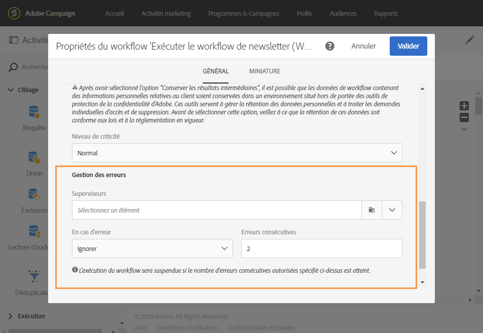
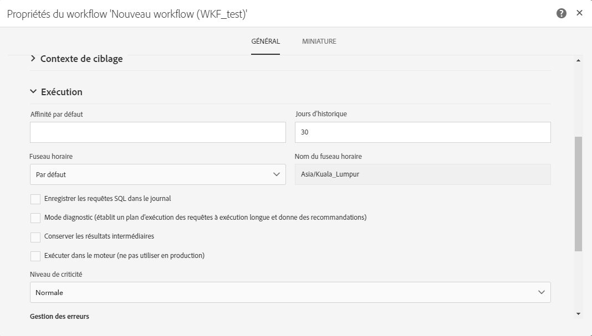

# Exécuter un workflow{#executing-a-workflow}

## A propos de l’exécution d’un workflow {#about-workflow-execution}

Un workflow est toujours démarré manuellement. Une fois lancé, il peut toutefois rester inactif selon les informations spécifiées via un [planificateur](../../automating/using/scheduler.md).

>[!CAUTION]
>
> Adobe recommande aux clients de hiérarchiser les exécutions de workflows et d’exécuter au maximum 20 workflows simultanément de façon à obtenir constamment des performances maximales sur leur instance. Il est possible de planifier plus de 20 exécutions de workflows simultanées ; elles s’exécuteront en séquence par défaut. Vous pouvez ajuster les paramètres par défaut pour le nombre maximal d’exécutions de workflows simultanées en envoyant un ticket à l’assistance client.

Les actions relatives à l’exécution (lancement, arrêt, pause, etc.) sont des processus **asynchrones** : la commande est enregistrée et sera effective dès que le serveur est disponible pour l’appliquer.

En général, dans un workflow, le résultat de chaque activité est transmis à l’activité suivante via une transition, représentée par une flèche.

Une transition est flottante si elle n’est pas rattachée à une activité de destination.

>[!NOTE]
>
>Un workflow contenant des transitions flottantes peut être exécuté : lors de l’activation d’une telle transition, l’exécution génère un avertissement et se trouve suspendue, mais aucune erreur n’est entraînée. Il est ainsi possible de démarrer un workflow sans en avoir terminé la conception et de le compléter au fur et à mesure.

Lorsqu’une activité a été exécutée, le nombre d’enregistrements transmis dans la transition est affiché au-dessus de cette dernière.

Vous pouvez ouvrir les transitions afin de vérifier que les données transmises sont correctes pendant ou après l’exécution du workflow. Vous pouvez visualiser les données présentes ainsi que leur structure.

Pour pouvoir accéder au détail des transitions intermédiaires (autres que la dernière transition du workflow), To be able to access the results of the preceding activities, you need to check the **[!UICONTROL Keep interim results]** option in the **[!UICONTROL Execution]** section of the workflow properties, before starting the workflow.

>[!NOTE]
>
>Cette option consomme beaucoup de mémoire et a été conçue pour vous aider à construire un workflow et à vous assurer que sa configuration et son comportement sont corrects. Laissez-la décochée sur les instances de production.

When a transition is open, you can edit its **[!UICONTROL Label]** or link a **[!UICONTROL Segment code]** to it. Pour cela, éditez les champs correspondants et validez vos modifications.

Les API REST Campaign Standard vous permettent de **démarrer**, **mettre en pause**, **reprendre** et **arrêter** un workflow. Vous trouverez plus d’informations et d’exemples d’appels REST dans la [documentation de l’API.](../../api/using/controlling-a-workflow.md)

## Cycle de vie {#life-cycle}

Le cycle de vie d’un workflow comporte trois grandes étapes, chacune d’elle étant associée à un statut et à une couleur :

* **En édition** (gris)

   C’est la phase de conception initiale d’un nouveau workflow (voir [Créer un workflow](../../automating/using/building-a-workflow.md#creating-a-workflow)). Un tel workflow n’est pas encore pris en charge par le serveur, il peut donc être modifié sans risque.

* **En cours** (bleu)

   Une fois la phase de conception terminée, le workflow peut être démarré et il est pris en charge par le serveur.

* **Terminé** (vert)

   Un workflow est terminé lorsqu’il n’a plus de tâche en cours ou lorsque l’exécution a explicitement été arrêtée.

Une fois qu’il a été démarré, un workflow peut également se voir attribuer deux autres statuts :

* **Avertissement** (jaune)

   Le workflow n’a pas pu se terminer ou a été mis en pause à l’aide des boutons  ou .

* **En erreur** (rouge)

   Une erreur est survenue pendant l’exécution du workflow. Ce dernier est arrêté et une action est requise de la part de l’utilisateur. Pour connaître l’origine de l’erreur, utilisez le bouton  afin d’accéder au journal du workflow (voir [Contrôle](#monitoring)).

La liste des activités marketing permet d’afficher tous les workflows ainsi que leur statut. Voir à ce sujet la section [Gérer les activités marketing](../../start/using/marketing-activities.md#about-marketing-activities).

## Commandes d’exécution    {#execution-commands}

Les icônes de la barre d’actions permettent de lancer, de tracker et de modifier l’exécution d’un workflow. Voir [La barre d’actions](../../automating/using/workflow-interface.md#action-bar).

Les actions disponibles sont les suivantes :

**Début**

Le bouton  permet de lancer l’exécution d’un workflow, qui prend alors le statut **En cours** (bleu). Si le workflow était en pause, il s’agit d’une reprise, sinon il s’agit d’un démarrage et les activités initiales sont alors activées.

>[!NOTE]
>
>Le démarrage est un processus asynchrone : la demande est enregistrée et sera traitée dès que possible par le moteur d’exécution de workflow.

**Pause**

Le bouton  a pour effet de mettre l’exécution en pause. Le workflow prend le statut **Avertissement** (jaune). Aucune nouvelle activité ne sera activée jusqu’à la prochaine reprise, mais les opérations en cours ne sont pas suspendues.

**Stopper**

Le bouton  arrête un workflow en cours d’exécution, qui prend alors le statut **Terminé** (vert). Les opérations en cours sont interrompues, si possible, et les imports ou requêtes SQL en cours sont immédiatement annulées. Il n’est pas possible de reprendre à l’endroit où le workflow s’est arrêté.

**Redémarrer**

Le bouton  consiste à arrêter, puis démarrer un workflow. Dans la plupart des cas, cela permet de redémarrer plus vite. C’est également utile pour automatiser le redémarrage lorsque l’arrêt prend un certain temps, car le bouton  n’est disponible que lorsque l’arrêt est effectif.

Lorsqu’une ou plusieurs activités d’un workflow sont sélectionnées, d’autres actions sont possibles :

**Traitement anticipé**

Le bouton  permet de lancer dès que possible la ou les activités sélectionnées en attente.

**Exécution normale**

Le bouton  réactive la ou les activités mises en pause ou désactivées.

**Exécution suspendue**

Le bouton  met le workflow en pause à l’activité sélectionnée : cette tâche ainsi que toutes celles qui lui succèdent (dans la même branche) ne sont pas exécutées.

**Pas d’exécution**

Le bouton  désactive la ou les activités sélectionnées.

>[!NOTE]
>
>Les actions permettant d’agir sur une activité en particulier sont également disponibles depuis les actions rapides, qui s’affichent lors de la sélection d’une activité.

## Contrôle    {#monitoring}

L’icône  permet d’accéder au menu Journal et tâches du workflow.

L’historique d’un workflow est conservé pendant la durée que vous indiquez dans les options d’exécution du workflow (voir [Propriétés des workflows](#workflow-properties)). Pendant cette durée, tous les messages sont donc conservés, même après un redémarrage. Si vous ne voulez pas conserver les messages d’une exécution précédente, vous devez purger l’historique en cliquant sur le bouton .

The **[!UICONTROL Log]** tab contains the execution history of all the activities or any selected activities. Il répertorie par ordre chronologique les opérations réalisées et les erreurs d’exécution.

The **[!UICONTROL Tasks]** tab details the execution sequencing of the activities. Cliquez sur une tâche pour obtenir plus d’informations.

Dans ces deux listes :

* Cliquez sur le compteur pour obtenir le nombre total des activités selon le filtrage appliqué. Le comptage est affiché par défaut si le nombre d’éléments dans la liste est inférieur à 30.
* The **[!UICONTROL Configure list]** button allows you to choose the information displayed, define the column order, and sort the list.
* Vous pouvez utiliser des filtres pour trouver plus rapidement les informations dont vous avez besoin. Utilisez le champ de recherche pour rechercher du texte spécifique dans les noms des activités de workflow (par exemple &quot;requête&quot;) et les logs.

## Gestion des erreurs    {#error-management}

Lorsqu’une erreur se produit, le workflow se met en pause et l’activité qui était en cours d’exécution lorsque l’erreur s’est produite clignote alors en rouge.

Le statut du workflow passe au rouge et l’erreur est consignée dans le journal.

Vous pouvez paramétrer le workflow pour qu’il ne se mette pas en pause et continue son exécution en cas d’erreur. To do this, go to the workflow properties via the  button and, in the **[!UICONTROL Execution]** section, select the **Ignore** option in the **In case of error** field.

Dans ce cas, la tâche en erreur est abandonnée. Ce mode est particulièrement adapté aux workflows conçus pour permettre de retenter l’opération ultérieurement (actions périodiques).

>[!NOTE]
>
>Vous pouvez appliquer ce paramétrage au niveau de chaque activité. Pour cela, sélectionnez l’activité de votre choix puis ouvrez-là à l’aide de l’action rapide  et sélectionnez le mode de gestion des erreurs dans l’onglet **Options d’exécution.** Voir [Options d’exécution d’une activité](#activity-execution-options).

Dans les [propriétés du workflow](#workflow-properties), des options supplémentaires liées à la gestion des erreurs sont disponibles.

Les options possibles sont les suivantes :

* **[!UICONTROL Supervisors]**: vous permet de définir le groupe de personnes à notifier (courrier électronique et notification in-app) si le flux de travaux rencontre une erreur. Si aucun groupe n’est défini, personne ne sera notifié. Pour plus d’informations sur les notifications d’Adobe Campaign, voir [Notifications Adobe Campaign](../../administration/using/sending-internal-notifications.md).

* **[!UICONTROL In case of error]**: vous permet de spécifier l’action à exécuter en cas d’erreur du  . Deux options sont disponibles :

   * **Suspendre le processus** : le workflow est automatiquement suspendu. Le statut du workflow est alors **En erreur** et la couleur qui lui est associée passe au rouge. Lorsque le problème est résolu, relancez le workflow.
   * **Ignorer** : l’activité n’est pas exécutée, de même que, par voie de conséquence, toutes celles qui lui succèdent (dans la même branche). Cela peut s’avérer utile dans le cas de tâches récurrentes. Si la branche comporte un planificateur placé en amont, celui-ci se déclenchera normalement à sa prochaine date d’exécution.

* **[!UICONTROL Consecutive errors]** : vous permet de définir un certain nombre d’erreurs consécutives autorisées avant que l’exécution du flux de travaux ne soit automatiquement suspendue.

   * Si le nombre indiqué est **[!UICONTROL 0]** ou tant que ce nombre n’est pas atteint, les activités qui rencontrent des erreurs sont ignorées. Les autres branches du workflow sont exécutées normalement.

   * If the number specified is reached, the whole of the workflow is suspended and becomes **[!UICONTROL Erroneous]**. Si des superviseurs ont été définis, ils sont automatiquement notifiés par un email. Voir [Notifications d’Adobe Campaign](../../administration/using/sending-internal-notifications.md).

## Propriétés d’exécution    {#workflow-properties}

To modify a workflow&#39;s execution options, use the  button to access the workflow properties and select the **[!UICONTROL Execution]** section.

Les options possibles sont les suivantes :

* **[!UICONTROL Default affinity]**: ce champ vous permet de forcer un workflow ou un workflow  à s&#39;exécuter sur une machine particulière.

* **[!UICONTROL History in days]**: indique le nombre de jours après lesquels l’historique doit être purgé. L’historique contient des éléments liés au processus : journaux, ,  (objets techniques liés à l’opération de flux de travail), ainsi que les fichiers téléchargés par le **[!UICONTROL Transfer file]** . La valeur par défaut est de 30 jours pour les modèles de workflow d’usine.

   La purge de l’historique est effectuée par le workflow technique Nettoyage de la base, qui est exécuté par défaut tous les jours (voir [Liste des workflows techniques](../../administration/using/technical-workflows.md)).

   >[!IMPORTANT]
   >
   >If the **[!UICONTROL History in days]** field is left blank, its value will be considered as &quot;1&quot;, meaning that the history will purged after 1 day.

* **[!UICONTROL Save SQL queries in the log]**: vous permet d&#39;enregistrer les  SQL du flux de travail dans les journaux.

* **[!UICONTROL Keep interim results]**: cochez cette option si vous souhaitez être en mesure de  les détails de la  de. Attention, en cochant cette option, l’exécution du workflow peut être fortement ralentie.

* **[!UICONTROL Execute in the engine (do not use in production)]**: vous permet d’exécuter le flux de travaux localement, à des fins de développement  de  tests de.

* **[!UICONTROL Severity]**: vous permet de spécifier un niveau de priorité pour l’exécution des  de dans votre instance . Les workflows critiques seront exécutés en priorité.

The **[!UICONTROL Error management]** section provides additional options that allow you to manage how workflows behave in case of errors. Ces options sont présentées dans la section [Gestion des erreurs](#error-management).

## Propriétés d’une activité    {#activity-properties}

### Propriétés générales d’une activité {#general-properties-of-an-activity}

Each activity has a **[!UICONTROL Properties]** tab. Cet onglet permet de modifier les paramètres généraux de l’activité, notamment le libellé et l’identifiant. La configuration de cet onglet est facultative.

### Gestion des transitions sortantes d’une activité    {#managing-an-activity-s-outbound-transitions}

Par défaut, certaines activités ne possèdent pas de transition sortante. You can add one from the **[!UICONTROL Transitions]** tab or from the activity&#39;s **[!UICONTROL Properties]** tab to apply other processes to your population in the same workflow.

En fonction des activités, vous pouvez ajouter plusieurs types de transitions sortantes :

* Transition standard : population calculée par l’activité.
* Transition sans population : ce type de transition sortante peut être ajouté pour continuer le workflow et ne contient pas de population afin de ne pas occuper d’espace inutilement sur le système.
* Rejets : population rejetée. Par exemple, si des données en entrée d’une activité n’ont pas pu être traitées car incorrectes ou non complètes.
* Complémentaire : population restante après exécution de l’activité. Par exemple, si une activité de segmentation est paramétrée pour ne conserver qu’un pourcentage de la population entrante.

If applicable, specify a **[!UICONTROL Segment code]** for the activity&#39;s outbound transition. Ce code segment permet d’identifier d’où viennent les sous-ensembles de la population cible finale, et peut par la suite servir à des fins de personnalisation dans un message.

### Options d’exécution d’une activité    {#activity-execution-options}

In the activity&#39;s properties screen, there is an **[!UICONTROL Advanced options]** tab that lets you define the activity&#39;s execution mode and behavior in case of errors.

Pour y accéder, sélectionnez l’activité de votre choix dans un workflow, puis ouvrez-la à l’aide du bouton  de la barre d’actions.

The **[!UICONTROL Execution]** field allows you to define the action to be carried out when the task is started. Trois options sont disponibles :

* **Normale** : l’activité est exécutée normalement.
* **Activer mais ne pas exécuter** : l’activité est mise en pause, de même que, par voie de conséquence, les futurs traitements qui en découlent. Cela peut s’avérer utile si vous souhaitez assister au déclenchement de la tâche.
* **Ne pas activer** : l’activité n’est pas exécutée, de même que, par voie de conséquence, toutes celles qui lui succèdent (dans la même branche).

The **[!UICONTROL In case of error]** field allows you to specify the action to be carried out should the activity encounter an error. Deux options sont disponibles :

* **Suspendre le processus** : le workflow est automatiquement suspendu. Le statut du workflow est alors **En erreur** et la couleur qui lui est associée passe au rouge. Lorsque le problème est résolu, relancez le workflow.
* **Ignorer** : l’activité n’est pas exécutée, de même que, par voie de conséquence, toutes celles qui lui succèdent (dans la même branche). Cela peut s’avérer utile dans le cas de tâches récurrentes. Si la branche comporte un planificateur placé en amont, celui-ci se déclenchera normalement à sa prochaine date d’exécution.

The **[!UICONTROL Behavior]** field allows you to define the procedure to follow if asynchronous tasks are used. Deux options sont disponibles :

* **Plusieurs tâches autorisées** : plusieurs tâches peuvent être exécutées en même temps, même si la première n’est pas terminée.
* **La tâche en cours est prioritaire** : lorsqu’une tâche est en cours, celle-ci est prioritaire. Tant qu’une tâche est toujours en cours, aucune autre tâche ne sera exécutée.

The **[!UICONTROL Max. execution duration]** field allows you to specify a duration such as &quot;30s&quot; or &quot;1h&quot;. Si l’activité n’est pas terminée une fois cette durée écoulée, une alerte est déclenchée, ce qui n’a par ailleurs aucun impact sur le fonctionnement du workflow.

The **[!UICONTROL Affinity]** field allows you to force a workflow or a workflow activity to execute on a particular machine. Vous devez pour cela définir une ou plusieurs affinités au niveau du workflow ou de l’activité concernée.

The **[!UICONTROL Time zone]** field allows you to select the time zone of the activity. Adobe Campaign permet de gérer les décalages horaires entre plusieurs pays concernés par la même instance. La configuration appliquée est paramétrée lors de la création de l’instance.

>[!NOTE]
>
>Par défaut, si aucun fuseau horaire n’est sélectionné, l’activité utilise le fuseau horaire défini dans les propriétés du workflow.

Le champ **Commentaire** est un champ libre vous permettant d’ajouter une note.
