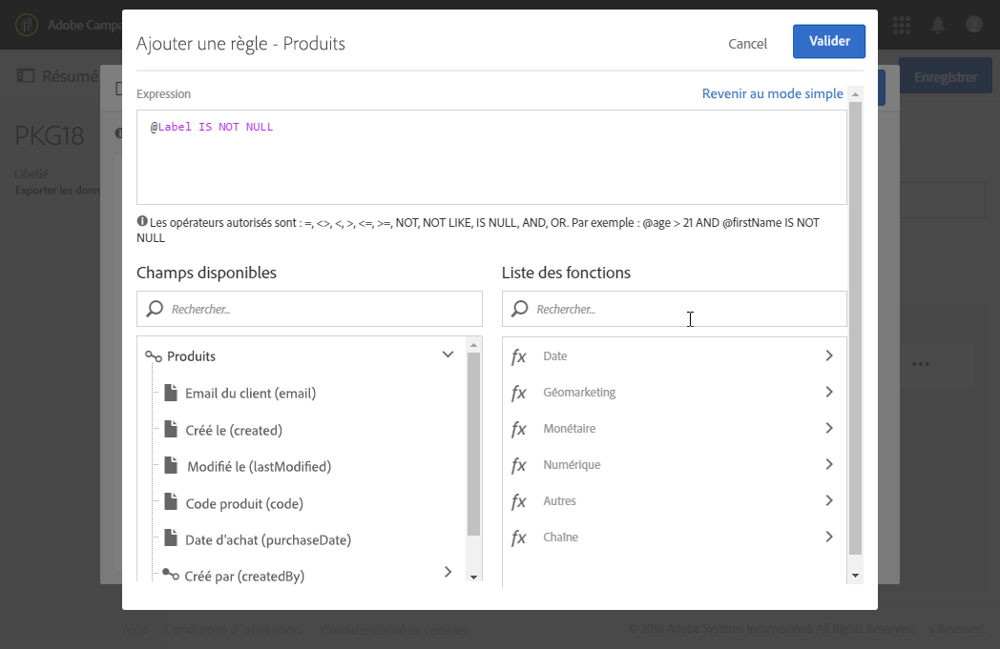

# Export/import de ressources personnalisées {#exporting-importing-custom-resources}

Ce tutoriel a pour objectif d&#39;exporter et d&#39;importer un package de ressources personnalisées d&#39;un environnement de développement vers un environnement de production.

Cet exemple est destiné aux administrateurs fonctionnels liés à Adobe Campaign.

Les prérequis sont :

* **Une ou plusieurs ressources personnalisées** disponibles et publiées.

   En outre, vous devez avoir défini une clé unique pour ces ressources, car les clés primaires automatiques ne sont pas exportées dans les packages. La ressource peut donc avoir une clé primaire et une clé unique supplémentaire pour garantir l&#39;unicité des données.
* **Avoir les droits nécessaires** pour créer et exporter un package.

Ressources supplémentaires :

* [Gestion des packages](../../automating/using/managing-packages.md)
* [Déploiement des packages : Principe de fonctionnement](../../developing/using/data-model-concepts.md)
* [Ajouter ou étendre une ressource](../../developing/using/key-steps-to-add-a-resource.md)

## Exporter la structure {#exporting-the-structure}

Dans cette partie, nous allons faire un premier export de package qui décrit la structure physique des données de la ressource personnalisée.

Cet exemple comporte deux ressources personnalisées **Produits** et **Commandes**.

1. Accédez au menu **[!UICONTROL Administration]** / **[!UICONTROL Déploiement]** / **[!UICONTROL Exports de package]**.

   Nous allons créer un package afin d&#39;exporter la **[!UICONTROL Ressource personnalisée (cusResource)]** filtrée avec les deux ressources personnalisées, « Produits » et « Commandes ».

1. Dans la page **[!UICONTROL Exports de package]**, cliquez sur **[!UICONTROL Créer]** pour créer un nouveau package.
1. Renseignez le libellé, puis cliquez sur **[!UICONTROL Créer un élément]**.

   

1. Recherchez et sélectionnez la ressource **[!UICONTROL Ressource personnalisée (cusResource)]**.

   

1. Paramétrez le détail de la ressource **[!UICONTROL Ressource personnalisée]** en sélectionnant les deux ressources, **Produits** et **Commandes**, dans les conditions de filtrage.

   N&#39;oubliez pas de modifier l&#39;opérateur logique. La valeur doit être **OU** pour que la structure de la ressource produits et la structure de la ressource commandes soient intégrées dans le package.

   

1. Validez et enregistrez la définition du package.

Vous pouvez maintenant cliquer sur **[!UICONTROL Démarrer l&#39;export]**.

Le package généré est disponible dans le dossier Téléchargements. Le nom du fichier zip est généré aléatoirement. Vous pouvez le renommer.

## Exporter les données {#exporting-the-data}

Ce second export va permettre d&#39;exporter les données des ressources personnalisées **Produits** et **Commandes**.

En se basant sur le même type d&#39;export que l&#39;export de la structure, vous allez créer un deuxième package contenant les données.

1. Dans la page **[!UICONTROL Exports de package]**, cliquez sur **[!UICONTROL Créer]** pour créer un nouveau package.
1. Complétez le libellé avec le label **[!UICONTROL Export données de mes ressources]** puis cliquez sur **[!UICONTROL Créer un élément]** dans l&#39;onglet **[!UICONTROL Définition de l&#39;export]**.
1. Recherchez et sélectionnez la ressource **Produits**.

   

1. Configurez une **condition de filtrage** avancée avec **@Label IS NOT NULL**.

   

1. Vérifiez le décompte.

   

1. Répétez la même opération pour la ressource personnalisée **Commandes**.

   

1. Validez et enregistrez la définition du package.

Vous pouvez maintenant cliquer sur **[!UICONTROL Démarrer l&#39;export]**.

Le package généré est disponible dans le dossier Téléchargements. Le nom du fichier zip est généré aléatoirement. Vous pouvez le renommer.

## Importer la structure {#importing-the-structure}

### Importer le package {#importing-the-structure-package}

1. Connectez-vous à l&#39;**instance cible** sur laquelle vous voulez importer les packages qui viennent d&#39;être créés.
1. Accédez au menu **[!UICONTROL Administration]** / **[!UICONTROL Déploiement]** / **[!UICONTROL Imports de package]** pour créer un nouveau package afin d&#39;importer le fichier résultant du premier export.
1. Glissez / déposez le **fichier structure** dans la zone prévue. Les formats acceptés sont ZIP ou XML.

   

1. Modifiez le libellé, par exemple **Import structure** puis cliquez sur **[!UICONTROL Enregistrer]**.
1. Cliquez sur **[!UICONTROL Démarrer l&#39;import]**.

   

### Publier {#publish-structure}

1. Accédez au menu **[!UICONTROL Administration]** / **[!UICONTROL Développement]** / **[!UICONTROL Publication]**.
1. Cliquez sur **[!UICONTROL Préparer la publication]** puis sur **[!UICONTROL Publier]** afin de mettre à jour l&#39;instance avec les nouvelles ressources personnalisées.
1. Les entrées de menu correspondant au package installé vont s&#39;insérer dans le menu **[!UICONTROL Données client]**.

   

## Importer les données {#importing-the-data}

Dans cette partie, nous allons **importer les données** liées au package installé sur l&#39;instance dans l&#39;étape précédente.

De la même manière, l&#39;étape se découpe en deux parties: l&#39;import du package et une publication.

### Importer le package {#importing-the-data-package}

1. Accédez au menu **[!UICONTROL Administration]** / **[!UICONTROL Déploiement]** / **[!UICONTROL Imports de package]** pour créer un nouveau package afin d&#39;importer le fichier contenant les données.
1. Glissez / déposez le fichier des données dans la zone prévue. Les formats acceptés sont ZIP ou XML.
1. Modifiez le libellé, par exemple « Import de données », puis cliquez sur **[!UICONTROL Enregistrer]**.
1. Cliquez sur **[!UICONTROL Démarrer l&#39;import]**.

   

### Publier {#publish-data}

1. Accédez au menu **[!UICONTROL Administration]** / **[!UICONTROL Développement]** / **[!UICONTROL Publication]**.
1. Cliquez sur **[!UICONTROL Préparer la publication]** puis sur **[!UICONTROL Publier]** afin de mettre à jour l&#39;instance avec les données des ressources personnalisées.
