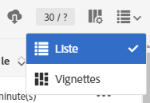
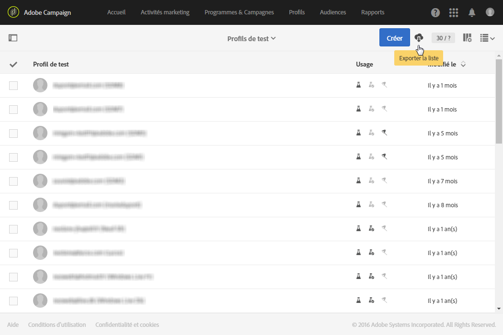

# Export de listes{#exporting-lists}

Adobe Campaign vous permet d'exporter le contenu de vos listes directement dans un fichier en vue d'une utilisation ultérieure. L'export d'une liste dans un fichier génère une entrée de journal dans le menu **[!UICONTROL Audits des exports.]** Pour plus d'informations sur les audits des exports, consultez la section [Audits des exports](../../administration/using/auditing-export-logs.md).

L'option d'export de liste permet d'exporter un maximum de 100 000 lignes par défaut et est définie par l'option **Nms_ExportListLimit.** This option can be managed by the functional administrator, under the **[!UICONTROL Administration]** &gt; **[!UICONTROL Application settings]** &gt; **[!UICONTROL Options]** menu.

Elle est présente dans tous les écrans disposant d'une vue en mode **Liste**, pour les utilisateurs disposant du rôle **[!UICONTROL EXPORT (export)].**

1. Accédez à l'écran de type **Liste** de votre choix. For example, the test profile overview screen ( **[!UICONTROL Profiles &amp; audiences]** &gt; **[!UICONTROL Test profiles]** ).
1. Assurez-vous que l'écran se trouve en mode **Liste**.

   

1. Organisez les colonnes de la liste tel que vous souhaitez les exporter à l'aide du bouton **[!UICONTROL Configurer la liste], en haut à droite.** Outre les colonnes configurées, la clé primaire de la ressource sera également exportée.
1. Si vous le souhaitez, appliquez un filtre. Pour cela, cliquez sur le bouton en haut à gauche pour afficher le volet de recherche.

   Si vous effectuez un export à partir d'une liste contenant différentes ressources, vous devez appliquer vos filtres de manière à ce qu'un seul type de ressource soit affiché dans la liste.

1. Si vous le souhaitez, triez la ou les colonnes de votre choix.
1. Sélectionnez le bouton d'export .

   Une popup de confirmation s'affiche. Une fois que vous avez confirmé l'export, le fichier est automatiquement téléchargé sur votre poste.

Le fichier est généré au format CSV, sauf si l'export est réalisé sous iOS, auquel cas le fichier généré est au format TXT. Il est nommé selon la ressource exportée et la date de l'export. Par exemple : profileBase_20150426_120253.csv pour un export de profils réalisé le 26 avril 2015 à 12h02 et 53 secondes. Il est encodé au format UTF-8.

Les valeurs numériques et les dates tiennent compte de la locale de l'utilisateur qui exécute l'export. Par exemple : JJ-MM-YYYY ou MM-JJ-YYYY.

Si vous souhaitez réaliser un export plus volumineux, vous devez créer un workflow dédié. Consultez la section [Extraction de fichier](../../automating/using/extract-file.md).

**Exemple**

L'exemple suivant est un export réalisé à partir de la liste des profils définie ci-dessous :

* Colonnes affichées (dans l'ordre) : Nom, Prénom, Date de naissance, Adresse email.
* Tri des noms par ordre alphabétique.



Le fichier généré se présente comme suit (pour les dix premiers enregistrements) :

```
Last name;First name;Birth date;Email;Zip code
Abalo;Patrick;11/11/1941 02:00:00;patrick.a@testmail.com;29200
Abasq;Joel;21/08/1977 02:00:00;abasq.joel@testmail.com;92160
Abernot;John;12/07/1963 01:00:00;john.abernot@testmail.com;78510
Abiven;Christian;16/03/1975 01:00:00;chris.a@mailtest.com;35000
Abouvier;Peter;02/07/1975 01:00:00;pabouvier@mailtest.com;94560
Accardi;Mike;22/06/1948 01:00:00;mike.accardi@mail.com;76400
Accremont;Frank;27/04/1947 01:00:00;accr.frank@mailtest.com;13500
Adam;Daniel;17/09/1953 01:00:00;danieladam@mail.com;17000
Adama;Pascal;22/01/1990 01:00:00;adapascal@mailtest.com;75012
Adama;Henry;22/09/1992 02:00:00;henry.adama@mail.com;64120
```

**Rubriques connexes :**

* [Rôles](../../administration/using/list-of-roles.md)
* [Personnalisation des listes](../../start/using/customizing-lists.md)
* Vidéo [Configurer une liste](https://helpx.adobe.com/campaign/kt/acs/using/acs-configuring-a-list-feature-video-setup.html)

