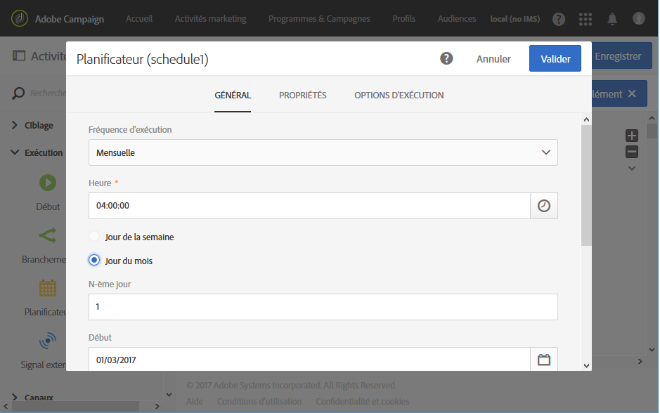
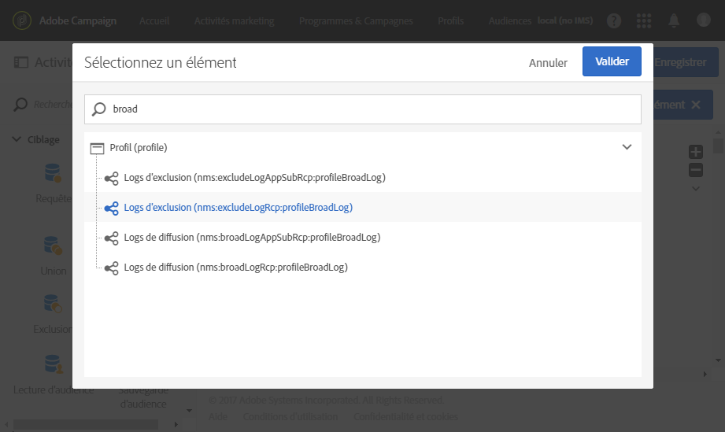
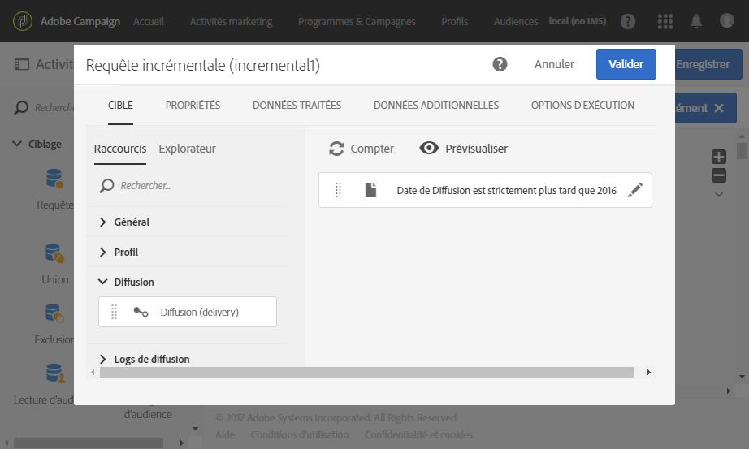
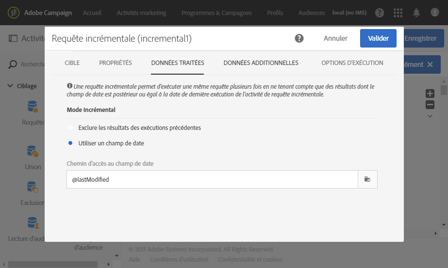
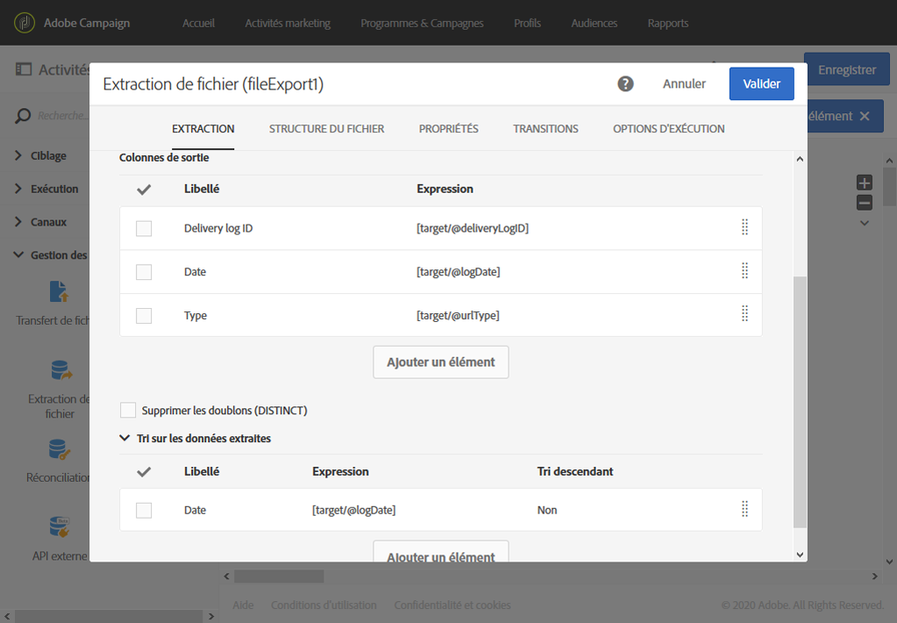
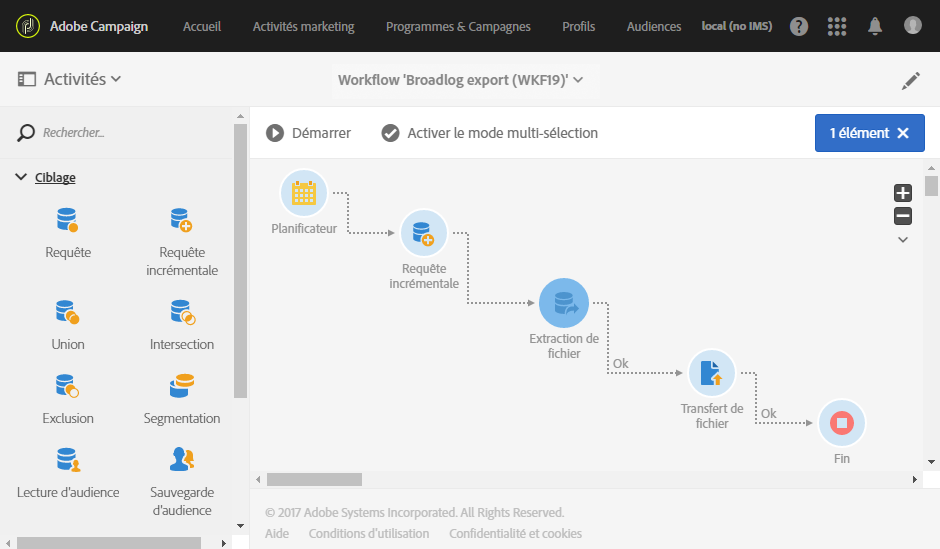

# Export des logs{#exporting-logs}

Qu'elles concernent les diffusions ou les abonnements, les données de log peuvent être exportées par le biais d'un workflow simple. Vous pouvez ainsi analyser les résultats de vos campagnes dans vos outils de reporting ou de Business Intelligence.

Grâce à une **[!UICONTROL Requête incrémentale]** qui récupère uniquement les nouveaux logs à chaque exécution du workflow et une activité **[!UICONTROL Extraction de fichier]** simple qui permet de définir les colonnes de sortie, vous pouvez obtenir un fichier au format et avec les données désirés. Utilisez ensuite une activité **[!UICONTROL Transfert de fichier]** pour récupérer le fichier final. Chaque exécution du workflow est planifiée par un **[!UICONTROL Planificateur]**.

L'opération d'export des logs peut être effectuée par les utilisateurs standard. En revanche, seul l'administrateur fonctionnel peut gérer les ressources privées suivantes : broadlogs, tracking, exclus, logs d'abonnement et logs d'historique des abonnements dans l'onglet **Profils**.

1. Créez un workflow, comme expliqué dans [cette section](../../automating/using/building-a-workflow.md#creating-a-workflow).
1. Ajoutez une activité **[!UICONTROL Planificateur]** et définissez-la selon vos besoins. Vous trouverez ci-dessous un exemple d'exécution mensuelle.

   

1. Ajoutez une activité **[!UICONTROL Requête incrémentale]** et configurez-la afin de sélectionner les logs dont vous avez besoin. Pour sélectionner par exemple tous les broadlogs (logs de diffusion des profils) mis à jour ou nouveaux, procédez comme suit :

   * Dans l'onglet **[!UICONTROL Propriétés]**, remplacez la ressource cible par **Logs de diffusion** (broadLogRcp).

      

   * Dans l'onglet **[!UICONTROL Cible]**, définissez une condition afin de récupérer tous les logs de diffusion qui correspondent aux diffusions envoyées en 2016 ou après. Pour plus d'informations à ce sujet, voir la section [Edition de requêtes](../../automating/using/editing-queries.md#creating-queries).

      

   * Dans l'onglet **[!UICONTROL Données traitées]**, sélectionnez **[!UICONTROL Utiliser un champ de date]** et le champ **lastModified**. Pendant les prochaines exécutions du workflow, seuls les logs qui auront été modifiés ou créés après la dernière exécution seront récupérés.

      

      Après la première exécution du workflow, vous pouvez voir dans cet onglet la date de dernière exécution qui sera utilisée pour la prochaine exécution. Cette date est automatiquement mise à jour à chaque exécution du workflow. Vous avez toujours la possibilité de remplacer cette valeur en en saisissant une autre qui répond à vos besoins.

1. Ajoutez une activité **[!UICONTROL Extraction de fichier]** qui permettra d'exporter les données interrogées vers un fichier :

   * Dans l'onglet **[!UICONTROL Extraction]**, indiquez le nom du fichier. Ce nom sera renseigné automatiquement avec la date de l'export afin de s'assurer que tous les fichiers extraits sont uniques.

      Sélectionnez les colonnes que vous souhaitez exporter dans votre fichier. Ici, vous pouvez sélectionner des données de ressources associées, telles que des informations de diffusion ou de profil. Pour organiser le fichier final, vous pouvez appliquer un tri, selon la date du log, par exemple, comme l'illustre l'exemple ci-après.

      

      >[!NOTE]
      >
      >Il n'est pas possible d'exporter les identifiants uniques (clés primaires) des ressources des logs.

   * Dans l'onglet **[!UICONTROL Structure du fichier]**, définissez le format du fichier de sortie selon vos besoins.

      Cochez l'option **[!UICONTROL Exporter les libellés plutôt que les valeurs internes des énumérations]** si vous exportez des valeurs d'énumération. Cette option permet de récupérer des libellés plus courts qui sont compréhensibles à la place d'identifiants.

1. Ajoutez une activité **[!UICONTROL Transfert de fichier]** et configurez-la pour transférer le fichier nouvellement créé du serveur Adobe Campaign vers un autre emplacement où vous pourrez accéder au fichier (un serveur SFTP, par exemple).

   * Dans l'onglet **[!UICONTROL Général]**, sélectionnez **[!UICONTROL Envoi de fichier]** puisque l'objectif est d'envoyer le fichier d'Adobe Campaign vers un autre serveur.
   * Dans l'onglet **[!UICONTROL Protocole]**, indiquez les paramètres de transfert et sélectionnez le [compte externe](../../administration/using/external-accounts.md#creating-an-external-account) à utiliser.

1. Ajoutez une activité **[!UICONTROL Fin]** pour vous assurer que le workflow se termine correctement et enregistrez ce dernier.

   

Vous pouvez exécuter à présent le workflow et récupérer le fichier de sortie sur le serveur externe.

**Rubrique connexe :**

[Workflows](../../automating/using/discovering-workflows.md)
