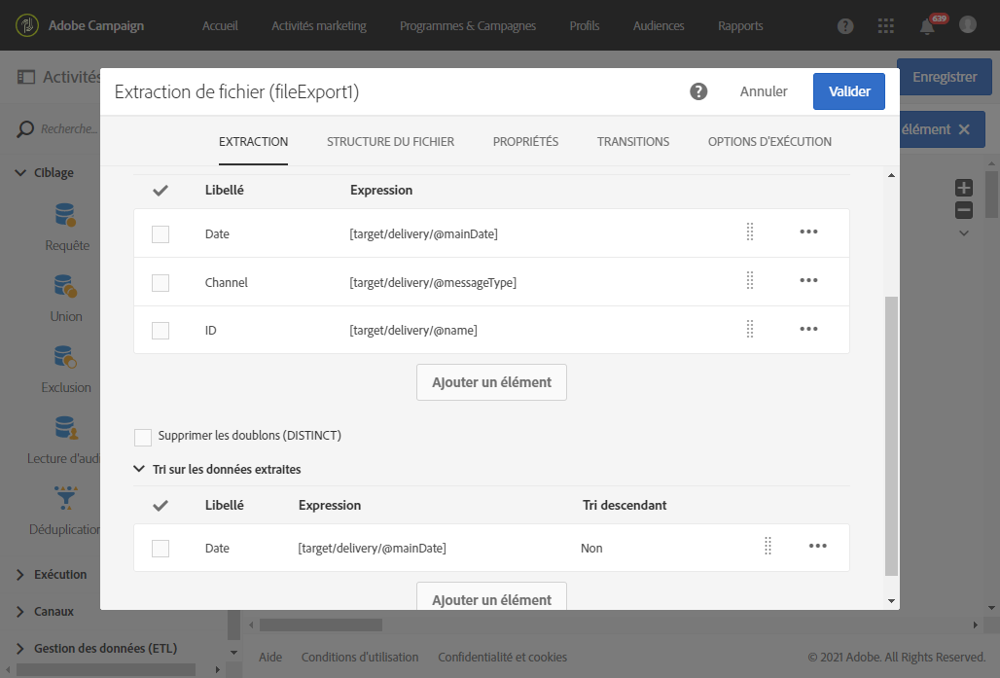

# Export des logs{#exporting-logs}

Qu&#39;elles concernent les diffusions ou les abonnements, les données de log peuvent être exportées par le biais d&#39;un workflow simple. Vous pouvez ainsi analyser les résultats de vos campagnes dans vos outils de reporting ou de Business Intelligence.

By using an **[!UICONTROL Incremental query]** that only retrieves new logs every time the workflow is executed and a simple **[!UICONTROL Extract file]** activity to define the output columns, you can get a file with the format and all the data you need. Then use a **[!UICONTROL Transfer file]** activity to retrieve the final file. Each workflow execution is planned by a **[!UICONTROL Scheduler]**.

L&#39;opération d&#39;export des logs peut être effectuée par les utilisateurs standard. En revanche, seul l&#39;administrateur fonctionnel peut gérer les ressources privées suivantes : broadlogs, tracking, exclus, logs d&#39;abonnement et logs d&#39;historique des abonnements dans l&#39;onglet **Profils**.

1. Créez un workflow, comme expliqué dans [cette section](../../automating/using/building-a-workflow.md#creating-a-workflow).
1. Add a **[!UICONTROL Scheduler]** activity and set it according to your needs. Vous trouverez ci-dessous un exemple d&#39;exécution mensuelle.

   

1. Add an **[!UICONTROL Incremental query]** activity and configure it so that it selects the logs you need. Pour sélectionner par exemple tous les broadlogs (logs de diffusion des profils) mis à jour ou nouveaux, procédez comme suit :

   * In the **[!UICONTROL Properties]** tab, change the target resource to **Delivery logs** (broadLogRcp).

      

   * In the **[!UICONTROL Target]** tab, set a condition to retrieve all delivery logs that correspond to deliveries sent in 2016 or after. Pour plus d&#39;informations à ce sujet, voir la section [Edition de requêtes](../../automating/using/editing-queries.md#creating-queries).

      

   * Dans l’ **[!UICONTROL Processed data]** onglet, sélectionnez **[!UICONTROL Use a date field]** et choisissez le **dernier champ Modifié** . Pendant les prochaines exécutions du workflow, seuls les logs qui auront été modifiés ou créés après la dernière exécution seront récupérés.

      

      Après la première exécution du workflow, vous pouvez voir dans cet onglet la date de dernière exécution qui sera utilisée pour la prochaine exécution. Cette date est automatiquement mise à jour à chaque exécution du workflow. Vous avez toujours la possibilité de remplacer cette valeur en en saisissant une autre qui répond à vos besoins.

1. Add an **[!UICONTROL Extract file]** activity that will export the queried data in a file:

   * Dans l&#39;onglet **[!UICONTROL Extraction]**, indiquez le nom du fichier.

      If you select the **[!UICONTROL Add date and time to the file name]** option, this name will be automatically completed with the date of the export to ensure all extracted files are unique. Sélectionnez les colonnes que vous souhaitez exporter dans votre fichier. Ici, vous pouvez sélectionner des données de ressources associées, telles que des informations de diffusion ou de profil.

      >[!NOTE]
      >
      >To export a unique identifier for each log, select the **[!UICONTROL Delivery log ID]** element.

      Pour organiser le fichier final, vous pouvez appliquer un tri, selon la date du log, par exemple, comme l&#39;illustre l&#39;exemple ci-après.

      

   * In the **[!UICONTROL File structure]** tab, define the format of the output file to match your needs.

      Cochez l’ **[!UICONTROL Export labels instead of internal values of enumerations]** option au cas où vous exporteriez des valeurs de énumération. Cette option permet de récupérer des libellés plus courts qui sont compréhensibles à la place d&#39;identifiants.

1. Add a **[!UICONTROL Transfer file]** activity and configure it to transfer the newly created file from the Adobe Campaign server to another location where you can access it, such as a SFTP server.

   * In the **[!UICONTROL General]** tab, select **[!UICONTROL File upload]** as the purpose is to send the file from Adobe Campaign to another server.
   * In the **[!UICONTROL Protocol]** tab, specify the transfer parameters and select the [external account](../../administration/using/external-accounts.md#creating-an-external-account) to use.

1. Add an **[!UICONTROL End]** activity to make sure it properly ends and save your workflow.

   

Vous pouvez exécuter à présent le workflow et récupérer le fichier de sortie sur le serveur externe.

**Rubrique connexe :**

[Workflows](../../automating/using/get-started-workflows.md)
