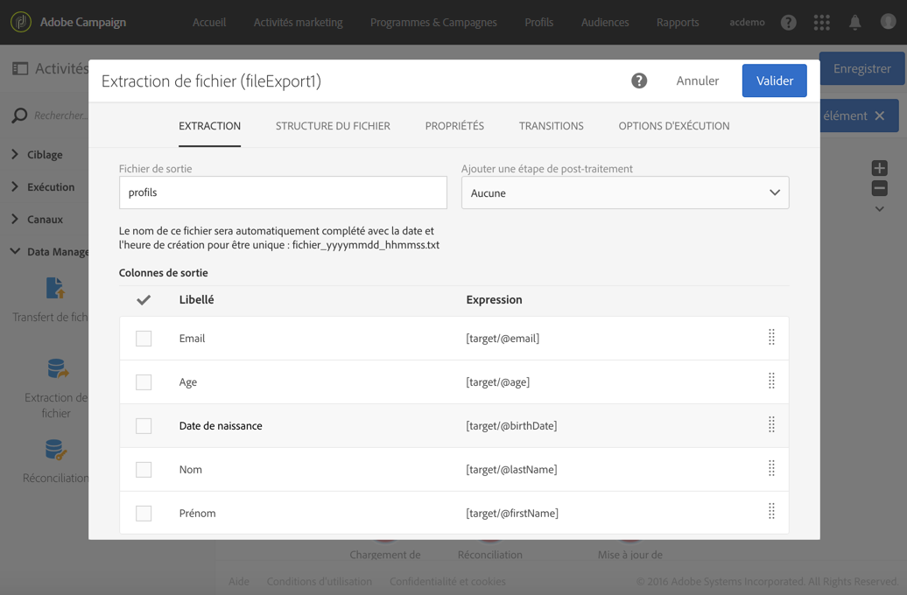
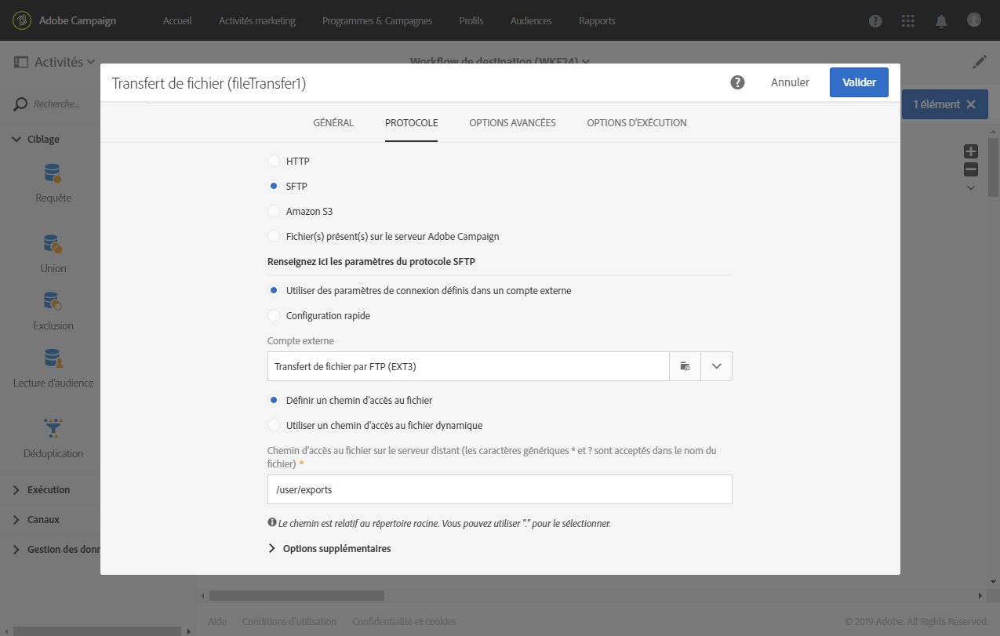

# Export de profils dans un fichier externe {#exporting-profiles-external-file}

L&#39;exemple suivant illustre le paramétrage d&#39;une activité de type **[!UICONTROL Extraction de fichier]** suivant une activité de type **[!UICONTROL Requête]**.

Le but de ce workflow est d&#39;exporter une liste de profils sous la forme d&#39;un fichier externe afin d&#39;en utiliser les données hors d&#39;Adobe Campaign.

1. Placez une activité de type [Extraction de fichier](../../automating/using/extract-file.md) à la suite d&#39;une activité de type [Requête](../../automating/using/query.md).

   Dans cet exemple, la requête porte sur tous les profils dont l&#39;âge se situe entre 18 et 30 ans inclus.

1. Ouvrez l’activité **[!UICONTROL Extraction de fichier]** pour l’éditer.
1. Nommez le fichier de sortie.
1. Ajoutez les colonnes de sortie.

   Dans cet exemple, l&#39;email, l&#39;âge, la date de naissance, le nom et le prénom des profils ciblés sont ajoutés comme colonnes de sortie.

   

1. Cliquez sur l&#39;onglet **[!UICONTROL Structure du fichier]** pour définir :

   * Format de sortie CSV

      

   * Format de date

      

1. Validez votre activité.
1. Placez une activité de type [Transfert de fichier](../../automating/using/transfer-file.md) à la suite de l&#39;activité **[!UICONTROL Extraction de fichier]** pour récupérer le fichier extrait sur un compte externe.
1. Ouvrez l&#39;activité et choisissez l&#39;action **[!UICONTROL Envoi de fichier]**.

   

1. Sélectionnez le compte externe et spécifiez le chemin du dossier sur le serveur.

   

1. Validez votre activité et sauvegardez votre workflow.
1. Démarrez le workflow.

   Lorsque le workflow s&#39;est correctement exécuté, le fichier extrait est disponible sur le compte externe.
