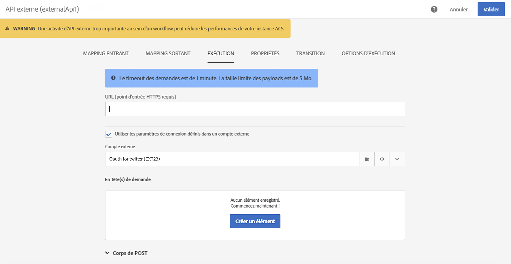
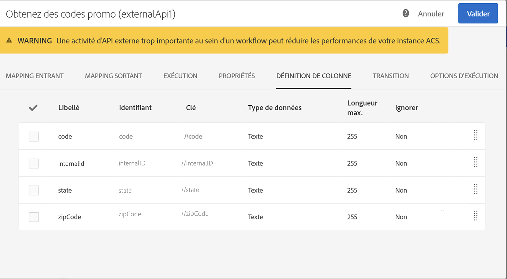

# API externe {#external-api}

## Description {#description}

The **[!UICONTROL External API]** activity brings data into the workflow from an **external system** via a **REST API** call.

The REST endpoints can be a customer management system, an [Adobe I/O Runtime](https://www.adobe.io/apis/experienceplatform/runtime.html) instance or an Experience Cloud REST endpoints (Data Platform, Target, Analytics, Campaign, etc).

>[!CAUTION]
>
>Cette fonctionnalité est actuellement en version bêta publique. Vous devez accepter l'accord d'utilisation avant de commencer à utiliser l'activité API externe. Notez que cette fonctionnalité bêta publique n'a pas encore été commercialisée par Adobe, qu'elle n'est pas prise en charge par le service à la clientèle Adobe, qu'elle peut contenir des erreurs et qu'elle peut ne pas fonctionner ainsi que d'autres fonctionnalités publiées.

Les principales caractéristiques de cette activité sont les suivantes :

* Capacité de transmettre des données au format JSON à un endpoint de terminaison d'API REST tiers
* Capacité à recevoir une réponse JSON, à la mapper pour générer des tableaux de sortie et transmettre en aval à d'autres activités de processus.
* Gestion des échecs avec une transition spécifique sortante

Les avertissements suivants ont été mis en place pour cette activité :

* Taille limite de taille des données de réponse http 5 Mo
* Délai d'attente de la demande de 60 secondes
* Les redirections HTTP ne sont pas autorisées
* Les URL non HTTPS sont rejetées
* « Accepter : application/json » request header and « Content-Type : l'en-tête de réponse application/json est autorisé

>[!CAUTION]
>
>Notez que l'activité est destinée à récupérer les données à l'échelle de la campagne (dernière série d'offres, derniers scores, etc.) pas pour récupérer des informations spécifiques pour chaque profil, car cela peut entraîner le transfert de grandes quantités de données. If the use case requires this, the recommendation is to use the [Transfer File](../../automating/using/transfer-file.md) activity.

## Configuration {#configuration}

Drag and drop an **[!UICONTROL External API]** activity into your workflow and open the activity to start the configuration.

### Mappage entrant

Le mappage entrant est un tableau temporaire généré par une activité inbound précédente qui sera affichée et envoyée sous forme de JSON dans l'interface utilisateur.
Selon ce tableau temporaire, l'utilisateur peut apporter des modifications aux données entrantes.

The **Inbound resource** dropdown lets you select the query activity that will create the temporary table.

The **Add count parameter** checkbox will a count value for each row coming from the temporary table. Notez que cette case à cocher est disponible uniquement si l'activité entrante génère un tableau temporaire.

**La section Colonnes** entrantes permet à l'utilisateur d'ajouter n'importe quel champ du tableau de transition entrant. Les colonnes sélectionnées sont les clés de l'objet de données. L'objet data du fichier JSON est une liste de tableaux contenant les données des colonnes sélectionnées de chaque ligne du tableau de transition entrant.

The **customize parameter** text box lets you add a valid JSON with additional data needed by the external API. Ces données supplémentaires seront ajoutées à l'objet params dans le fichier JSON généré.

### Mapping sortant

This tab lets you define the sample **JSON structure** returned by the API Call.

The JSON structure pattern is: `{“data”:[{“key”:“value”}, {“key”:“value”},...]}`

The sample JSON definition must have the **following characteristics**:

* **data** est un nom de propriété obligatoire dans le fichier JSON, le contenu des « données » est un tableau JSON.
* **Les éléments de tableau** doivent contenir des propriétés de premier niveau (les niveaux plus profonds ne sont pas pris en charge).
   **Les noms** de propriété deviennent des noms de colonnes pour le schéma de sortie du tableau temporaire de sortie.
* **La définition du nom** de colonne est basée sur le premier élément du tableau « data ».
Columns definition (add/remove) and the type value of the property can be edited in the **Column definition** tab.

If the **parsing is validated** a message appears and invite you to customize the data mapping in the "Column definition" tab. Dans d'autres cas, un message d'erreur s'affiche.

### Exécution

This tab lets you define the **HTTPS Endpoint** that will send data to ACS. If needed, you can enter authentication information in the fields below.

### Propriétés

This tab lets you control **general properties** on the external API activity like the displayed label in the UI. L'ID interne n'est pas personnalisable.

### Définition de colonne

>[!NOTE]
>
>This tab appears when the **response data format** is completed and validated in Outbound Mapping tab.

The **Column definition** tab allows you to precisely specify the data structure of each column in order to import data that does not contain any errors and make it match the types that are already present in the Adobe Campaign database for future operations.

Vous pouvez par exemple modifier le libellé d'une colonne, sélectionner son type (chaîne, nombre entier, date, etc.) ou encore définir le traitement des erreurs.

For more information, refer to the [Load File](../../automating/using/load-file.md) section.

### Transition

This tab lets you activate the **outbound transition** and its label. This specific transition is useful in case of **timeout** or if the payload exceed the **data size limit**.

### Options d'exécution

Cet onglet est disponible dans la plupart des activités de flux de travail. For more information, consult the [Activity properties](../../automating/using/executing-a-workflow.md#activity-properties) section.

## Résolution des problèmes

Deux types de messages de journal ont été ajoutés à cette nouvelle activité de flux de travaux : informations et erreurs. Ils peuvent vous aider à résoudre les problèmes potentiels.

### Information

Ces messages de journal sont utilisés pour consigner des informations sur les points de contrôle utiles lors de l'exécution de l'activité de flux de travail. En particulier, les messages de journal suivants sont utilisés pour enregistrer la première tentative également une tentative de nouvelle tentative (et pour raison d'échec de la première tentative) pour accéder à l'API.

<table> 
 <thead> 
  <tr> 
   <th> Message format  </th> 
   <th> Exemple  </th> 
  </tr> 
 </thead> 
 <tbody> 
  <tr> 
   <td> Appel de l'URL de l'API '% s '.</td> 
   <td> 
Appel de l'URL de l'API « https://example.com/api/v1/web-coupon?count=2' ».
</td> 
  </tr> 
  <tr> 
   <td> Nouvelle tentative de l'URL de l'API '% s ', échec de la tentative précédente ('% s ').</td> 
   <td> 
Nouvelle tentative de l'URL de l'API : https://example.com/api/v1/web-coupon?count=2', échec de la tentative précédente ('HTTP - 401 ').
</td>
  </tr> 
  <tr> 
   <td> Transfert du contenu à partir de '% s '(% s/% s).</td> 
   <td> 
Transfert de contenu depuis 'https://example.com/api/v1/web-coupon?count=2' (1234/1234).
</td> 
  </tr>
 </tbody> 
</table>

### Erreurs

Ces messages de journal sont utilisés pour consigner des informations sur des conditions d'erreur inattendues, ce qui peut entraîner l'échec de l'activité de flux de travail.

<table> 
 <thead> 
  <tr> 
   <th> Code - Message format  </th> 
   <th> Exemple  </th> 
  </tr> 
 </thead> 
 <tbody> 
  <tr> 
   <td> WKF -560250 - Le corps de la demande d'API est dépassé (limite : ' % d ').</td> 
   <td> 
Limite du corps de la demande d'API dépassée (limite : ' 5242880 ').
</td> 
  </tr> 
  <tr> 
   <td> WKF -560239 - Limite de réponse de l'API dépassée (limite : ' % d ').</td> 
   <td> 
Limite dépassée de la réponse API (limite : 5242880).
</td> 
  </tr> 
  <tr> 
   <td> WKF -560245 - Impossible d'analyser l'URL de l'API (erreur : ' % d ').</td> 
   <td> 
Impossible d'analyser l'URL de l'API (erreur : ' -2010 ').

   
 Remarque : Cette erreur est consignée lorsque l'URL de l'API échoue aux règles de validation.
</td>
  </tr> 
  <tr>
   <td> WKF -560244 - L'hôte URL de l'API ne doit pas être « localhost » ou littéral d'adresse IP (hôte URL : ' % s ').</td> 
   <td> 
L'hôte d'URL de l'API ne doit pas être « localhost » ou littéral d'adresse IP (hôte URL : ' localhost ').

    
L'hôte d'URL de l'API ne doit pas être « localhost » ou littéral d'adresse IP (hôte URL : ' 192.168.0.5 ').

    
L'hôte d'URL de l'API ne doit pas être « localhost » ou littéral d'adresse IP (hôte URL : ' [2001]').
</td>
  </tr> 
  <tr> 
   <td> WKF -560238 - L'URL de l'API doit être une URL sécurisée (https) (URL demandée : ' % s ').</td> 
   <td> 
URL de l'API doit être une URL sécurisée (https) (URL demandée : ' https://example.com/api/v1/web-coupon?count=2').
</td> 
  </tr> 
  <tr> 
   <td> WKF -560249 - Échec de création du corps de la demande JSON. Erreur lors de l'ajout de '% s '.</td> 
   <td> 
Échec de création du corps de la demande JSON. Erreur lors de l'ajout de « params ».

    
Échec de création du corps de la demande JSON. Erreur lors de l'ajout de données.
</td>
  </tr> 
  <tr> 
   <td> WKF -560246 - La clé d'en-tête HTTP est incorrecte (clé d'en-tête : ' % s ').</td> 
   <td> 
La clé d'en-tête HTTP est incorrecte (clé d'en-tête : ' % s ').

   
 Note: This error is logged when the custom header key fails validation according to <a href="https://tools.ietf.org/html/rfc7230#section-3.2.html">RFC</a>
</td> 
  </tr>
 <tr> 
   <td> WKF -560248 - La clé d'en-tête HTTP n'est pas autorisée (clé d'en-tête : ' % s ').</td> 
   <td> 
La clé d'en-tête HTTP n'est pas autorisée (clé d'en-tête : ' Accept ').
</td> 
  </tr> 
  <tr> 
   <td> WKF -560247 - La valeur d'en-tête AHTTP est mauvais (valeur d'en-tête : ' % s ').</td> 
   <td> 
Bad header value is bad (header value : ' % s '). 

    
Note: This error is logged when the custom header value fails validation according to <a href="https://tools.ietf.org/html/rfc7230#section-3.2.html">RFC</a>
</td> 
  </tr> 
  <tr> 
   <td> WKF -560240 - La charge JSON présente une propriété erronée '% s '.</td> 
   <td> 
La charge JSON possède une propriété bad'blah '.
</td>
  </tr> 
  <tr>
   <td> WKF -560241 - JSON mal formé ou format inacceptable.</td> 
   <td> 
Elément JSON incorrect ou format inacceptable.

   
Remarque : Ce message s'applique uniquement au corps de la réponse d'analyse de l'API externe et est consigné lors de la tentative de validation du corps de réponse au format JSON mandaté par cette activité.
</td>
  </tr>
  <tr> 
   <td> WKF -560246 - Échec de l'activité (raison : ' % s ').</td> 
   <td> 
Lorsque l'activité échoue en raison de la réponse d'erreur HTTP 401 - Échec de l'activité (raison : ' HTTP - 401 ')

        
Lorsque l'activité échoue en raison d'un appel interne échoué - échec de l'activité (raison : ' Irc - -nn ').

        
Lorsque l'activité échoue en raison d'un en-tête Content-Type non valide. - L'activité a échoué (raison : ' Content-Type - application/html ').
</td> 
  </tr>
 </tbody> 
</table>

<!--
## Example: Managing coupons with External API Activity

This example illustrates how to **add coupon value** retrieving by a REST call to profiles and then sending an email containing these coupon values.

The workflow is presented as follows:

1. Drag and drop an **External API** activity
    1. Parse the JSON sample responsa as {"data":[{"code":"value"}]}.
    1. Add the **Rest endpoint URL** and define authentication setting if needed
    
    1. In the **column definition** tab, add a new column called **code** that will store the code value.
        
    1. Enabled an **outbound transition** to manage request failures.
1. Drag and drop a **Query** activity
    1. Configure the **Target** tab to query all the **@adobe.com** email. For different Query samples, refer to the [Query](../../automating/using/query.md) section.
    1. In the **additional data** tab, add a new column based on **rowId()** function. This additional column allows you to reconciliate coupon code with the profile ID..
        

        >[!NOTE]
        >
        >This reconciliation approach means that the profile query number is equal to the number of coupon values returned by the REST call.
1. Once this two activities are configured, drag and drop an **Enrichment** activity to associate coupon values with profiles.
    1. Select the previous Query activity in the **primarySet** field.
        
    1. Create a new relation in the **Advanced relations** tab, and add the following reconciliation criteria:
    1. **@expr1** coming grom the Query activity in the source expression field.
    1. **@lineNum** as an expression that returns the line number for each coupon value in the destination field.
        
        More information on the enrichment activity are available [here](../../automating/using/enrichment.md)

    1. The transition **Data Structure** will contain:
        
1. Finally drag and drop a **Send via Email** activity.
    You can modify your email template by adding the **code** personnalized field.

-->
