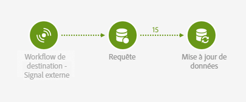

# Signal externe et import de données {#external-signal-data-import}

L&#39;exemple suivant illustre l&#39;activité **[!UICONTROL Signal externe]** dans un cas typique. Un import de données est effectué sur un workflow source. Une fois l&#39;import terminé et la base de données mise à jour, un deuxième workflow est déclenché. Ce deuxième workflow permet de mettre à jour et d&#39;agréger les données importées.

Le workflow source se présente comme suit :

* Une activité [Chargement de fichier](../../automating/using/load-file.md) télécharge un fichier contenant des nouvelles données d&#39;achat. Notez que la [base de données a été étendue](../../developing/using/data-model-concepts.md) en conséquence, comme les données d&#39;achat ne sont pas présentes par défaut dans le datamart.

   Par exemple :

   ```
   tcode;tdate;customer;product;tamount
   aze123;21/05/2015;dannymars@example.com;A2;799
   aze124;28/05/2015;dannymars@example.com;A7;8
   aze125;31/07/2015;john.smith@example.com;A7;8
   aze126;14/12/2015;john.smith@example.com;A10;4
   aze127;02/01/2016;dannymars@example.com;A3;79
   aze128;04/03/2016;clara.smith@example.com;A8;149
   ```

* Une activité [Réconciliation](../../automating/using/reconciliation.md) créé les liens entre les données importées et la base de données pour que les données de transactions soient bien connectées aux profils et produits.
* Une activité [Mise à jour de données](../../automating/using/update-data.md) insère et met à jour la ressource Transactions de la base de données avec les données entrantes.
* Une activité [Fin](../../automating/using/start-and-end.md) déclenche le workflow de destination, qui sert à mettre à jour les agrégats.


Le workflow de destination se présente comme suit :

* Une activité [Signal externe](../../automating/using/external-signal.md) attend que le workflow source se termine avec succès.
* Une activité [Requête](../../automating/using/query.md#enriching-data) cible les profils et les enrichit d&#39;une collection paramétrée pour récupérer la date du dernier achat.
* Une activité [Mise à jour de données](../../automating/using/update-data.md) stocke les données additionnelles dans un champ personnalisé dédié. Notez que la ressource profil a été étendue pour permettre l&#39;ajout du champ **Date du dernier achat**.


