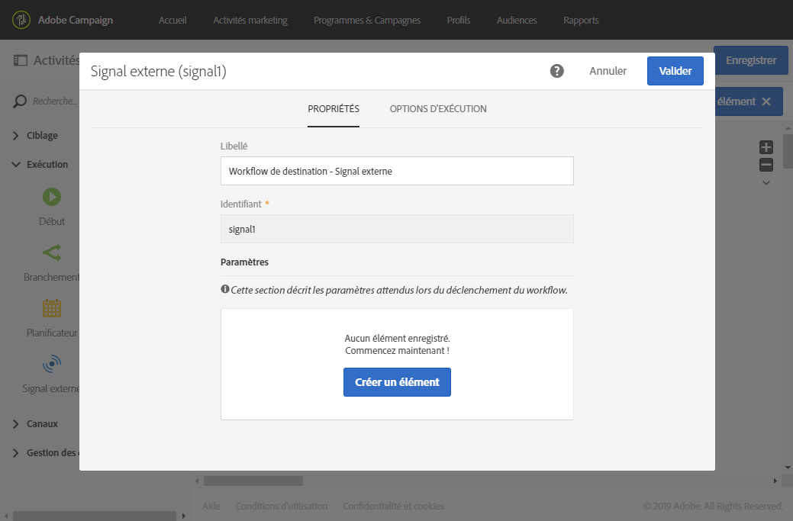
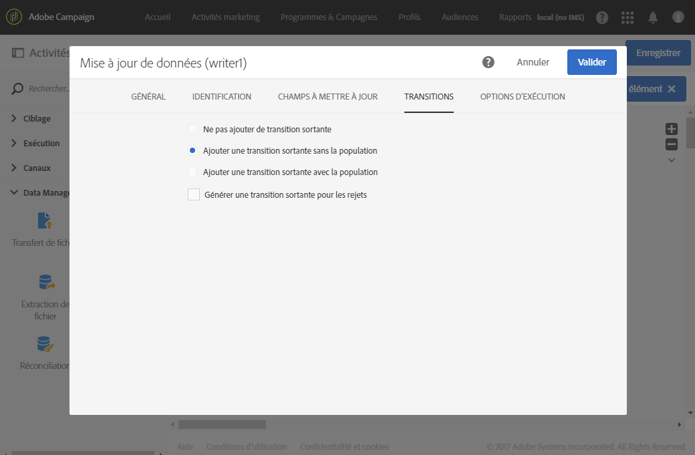
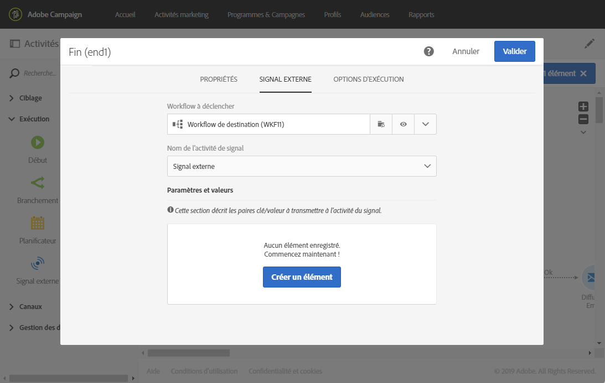
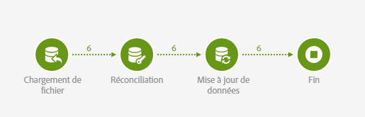
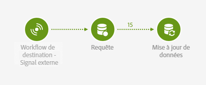

# Signal externe{#external-signal}

## Description {#description}


L'activité **[!UICONTROL Signal externe]** déclenche un workflow lorsque certaines conditions sont remplies dans un autre workflow ou un appel de l'API REST.

## Contexte d'utilisation {#context-of-use}

L'activité **[!UICONTROL Signal externe]** permet d'organiser et d'orchestrer différents processus qui composent un même parcours client dans différents workflows. Elle permet de démarrer un workflow à partir d'un autre, supportant ainsi des parcours client plus complexes tout en améliorant le contrôle et la réactivité en cas de problèmes.

L'activité **[!UICONTROL Signal externe]** est conçue pour être utilisée comme première activité de workflow. Elle peut être déclenchée à partir de l'activité **[!UICONTROL Fin]** d'un autre workflow ou d'un appel API REST (voir à ce propos la [documentation de l'API](https://docs.campaign.adobe.com/doc/standard/en/api/ACS_API.html#triggering-a-signal-activity)).

Quand elle est déclenchée, des paramètres externes peuvent être définis et disponibles dans les variables d'événements du workflow. Le processus d'appel d'un workflow avec des paramètres externes est détaillé dans [cette section](../../automating/using/calling-a-workflow-with-external-parameters.md).

>[!NOTE]
>
>L'activité ne peut pas être déclenchée plus souvent que toutes les 10 minutes.

Notez qu'une activité **[!UICONTROL Signal externe]** peut être déclenchée via plusieurs événements différents. Dans ce cas, le **[!UICONTROL Signal externe]** est déclenché dès que l'un des workflows source ou l'appel de l'API est exécuté. Il n'est pas nécessaire que tous les workflows source aient terminé leur exécution.

## Configuration  {#configuration}

Lors de la configuration d'un signal externe, il est important de commencer par configurer l'activité **[!UICONTROL Signal externe]** dans le workflow de destination. Une fois cette configuration terminée, l'activité **[!UICONTROL Signal externe]** de ce workflow devient disponible et vous pouvez configurer l'activité **[!UICONTROL Fin]** du workflow source.

1. Placez une activité **[!UICONTROL Signal externe]** dans votre workflow de destination.
1. Sélectionnez l'activité puis ouvrez-la à l'aide du bouton , disponible dans les actions rapides qui s'affichent.
1. Editez le libellé de l'activité. Le libellé est requis lors de la configuration du workflow source qui déclenche le **[!UICONTROL Signal externe]**.

   Si vous voulez appeler le workflow avec des paramètres, utilisez la zone **[!UICONTROL Paramètres]** pour les déclarer. Voir à ce propos [cette section](../../automating/using/calling-a-workflow-with-external-parameters.md#declaring-the-parameters-in-the-external-signal-activity).

   

1. Confirmez la configuration de votre activité, ajoutez les éventuelles autres activités souhaitées et sauvegardez votre workflow.

   >[!NOTE]
   >
   >Si vous souhaitez déclencher le workflow de destination à partir d'un autre workflow, effectuez la procédure suivante. Si vous souhaitez déclencher le workflow de destination depuis un appel de l'API REST, consultez la [documentation de l'API](https://docs.campaign.adobe.com/doc/standard/en/api/ACS_API.html#triggering-a-signal-activity) pour plus d'informations.

1. Ouvrez le workflow source et sélectionnez une activité **[!UICONTROL Fin]**. Si aucune activité **[!UICONTROL Fin]** n’est disponible, ajoutez-en une après la dernière activité d'une branche du workflow.

   Certaines activités ne sont pas dotées d'une transition sortante par défaut. L'onglet **[!UICONTROL Propriétés]** de cet onglet vous permet d'ajouter une transition sortante.

   Par exemple, dans une activité **[!UICONTROL Mise à jour de données]**, allez dans l'onglet **[!UICONTROL Transitions]** et cochez l'option **[!UICONTROL Ajouter une transition sortante sans la population]**. Cette option vous permet d'ajouter une transition qui ne contient pas de données et n'occupe pas d'espace inutilement sur votre système. Elle sert uniquement à relier l'activité **[!UICONTROL Fin]** supplémentaire qui déclenche le workflow de destination.

   

1. Dans l'onglet **[!UICONTROL Signal externe]** de l'activité **[!UICONTROL Fin]**, sélectionnez le workflow de destination et l’activité **[!UICONTROL Signal externe]** à déclencher dans ce workflow.

   Lorsque vous configurez une activité **[!UICONTROL Fin]** pour qu'elle déclenche un autre workflow, un symbole signal supplémentaire vient s'ajouter à son icône.

   Si vous voulez appeler le workflow avec des paramètres, utilisez la zone **[!UICONTROL Paramètres et valeurs]**. Voir à ce propos [cette section](../../automating/using/calling-a-workflow-with-external-parameters.md#defining-the-parameters-when-calling-the-workflow).

   

1. Sauvegardez le workflow source.

Une fois que l'activité **[!UICONTROL Fin]** du workflow source ou que l'appel de l'API REST est exécuté, le workflow de destination est déclenché automatiquement via l'activité **[!UICONTROL Signal externe]**.

>[!NOTE]
>
>Le workflow de destination doit être démarré manuellement avant de pouvoir être déclenché. Une fois démarrée, l'**[!UICONTROL Activité externe]** est activée et attend le signal du workflow source.

## Exemple {#example}

L'exemple suivant illustre l'activité **[!UICONTROL Signal externe]** dans un cas typique. Un import de données est effectué sur un workflow source. Une fois l'import terminé et la base de données mise à jour, un deuxième workflow est déclenché. Ce deuxième workflow permet de mettre à jour et d'agréger les données importées.

Le workflow source se présente comme suit :

* Une activité [Chargement de fichier](../../automating/using/load-file.md) télécharge un fichier contenant des nouvelles données d'achat. Notez que la [base de données a été étendue](../../developing/using/data-model-concepts.md) en conséquence, comme les données d'achat ne sont pas présentes par défaut dans le datamart.

   Par exemple :

   ```
   tcode;tdate;customer;product;tamount
   aze123;21/05/2015;dannymars@example.com;A2;799
   aze124;28/05/2015;dannymars@example.com;A7;8
   aze125;31/07/2015;john.smith@example.com;A7;8
   aze126;14/12/2015;john.smith@example.com;A10;4
   aze127;02/01/2016;dannymars@example.com;A3;79
   aze128;04/03/2016;clara.smith@example.com;A8;149
   ```

* Une activité [Réconciliation](../../automating/using/reconciliation.md) créé les liens entre les données importées et la base de données pour que les données de transactions soient bien connectées aux profils et produits.
* Une activité [Mise à jour de données](../../automating/using/update-data.md) insère et met à jour la ressource Transactions de la base de données avec les données entrantes.
* Une activité **[!UICONTROL Fin]** déclenche le workflow de destination, qui sert à mettre à jour les agrégats.



Le workflow de destination se présente comme suit :

* Une activité **[!UICONTROL Signal externe]** attend que le workflow source se termine avec succès.
* Une activité [Requête](../../automating/using/query.md#enriching-data) cible les profils et les enrichit d'une collection paramétrée pour récupérer la date du dernier achat.
* Une activité [Mise à jour de données](../../automating/using/update-data.md) stocke les données additionnelles dans un champ personnalisé dédié. Notez que la ressource profil a été étendue pour permettre l'ajout du champ **Date du dernier achat**.



