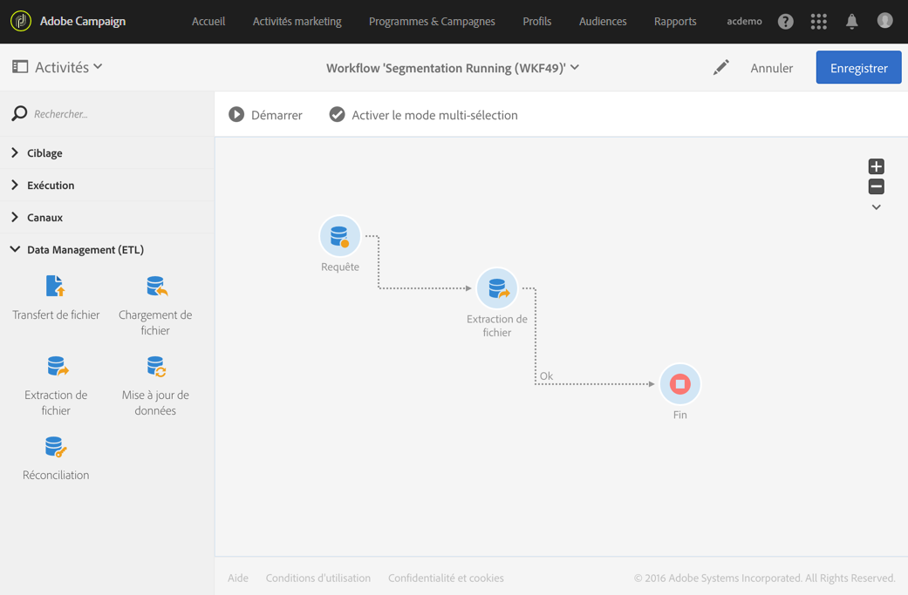
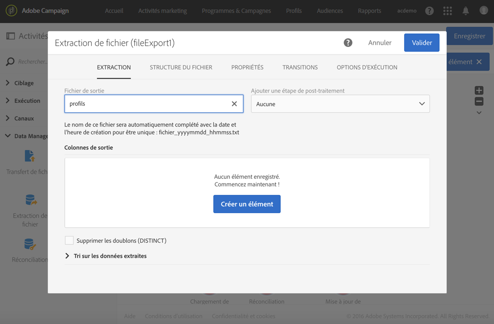
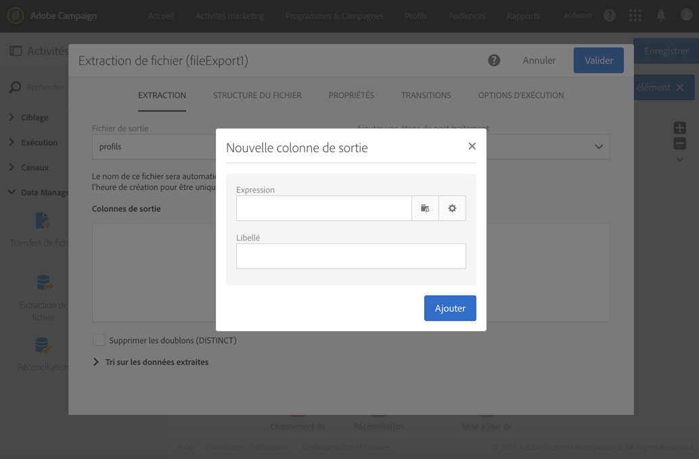
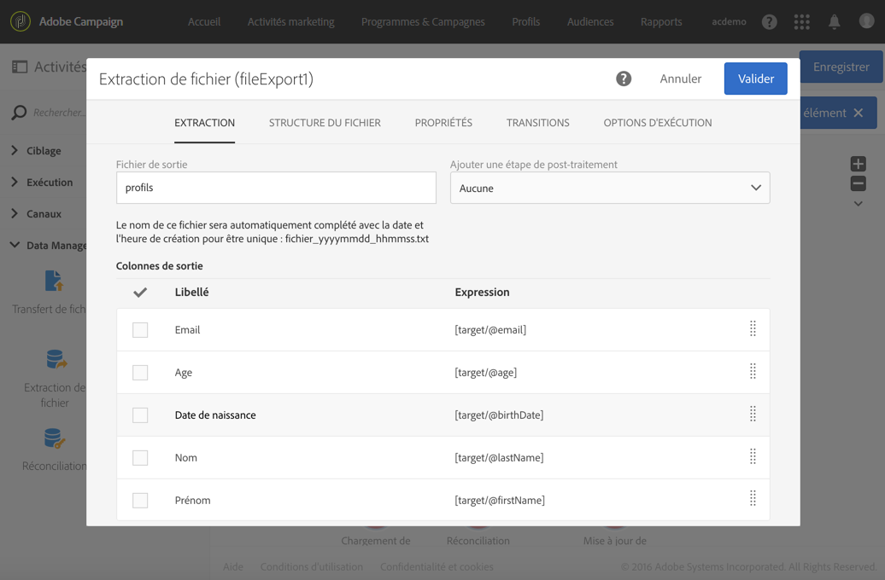
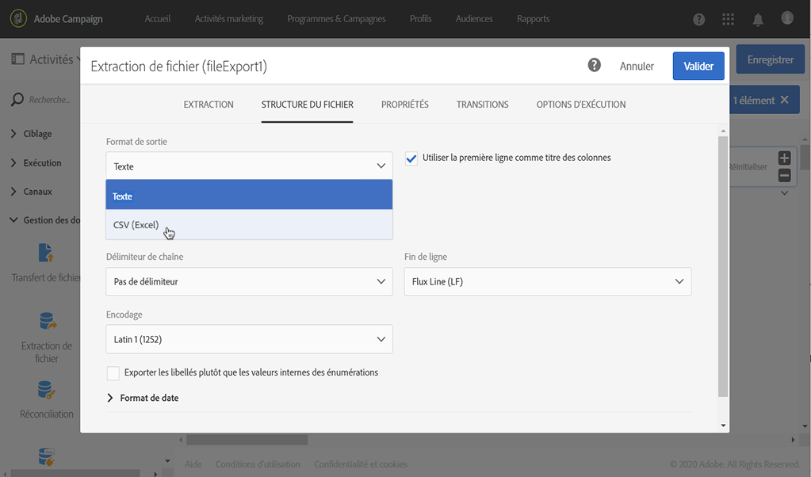
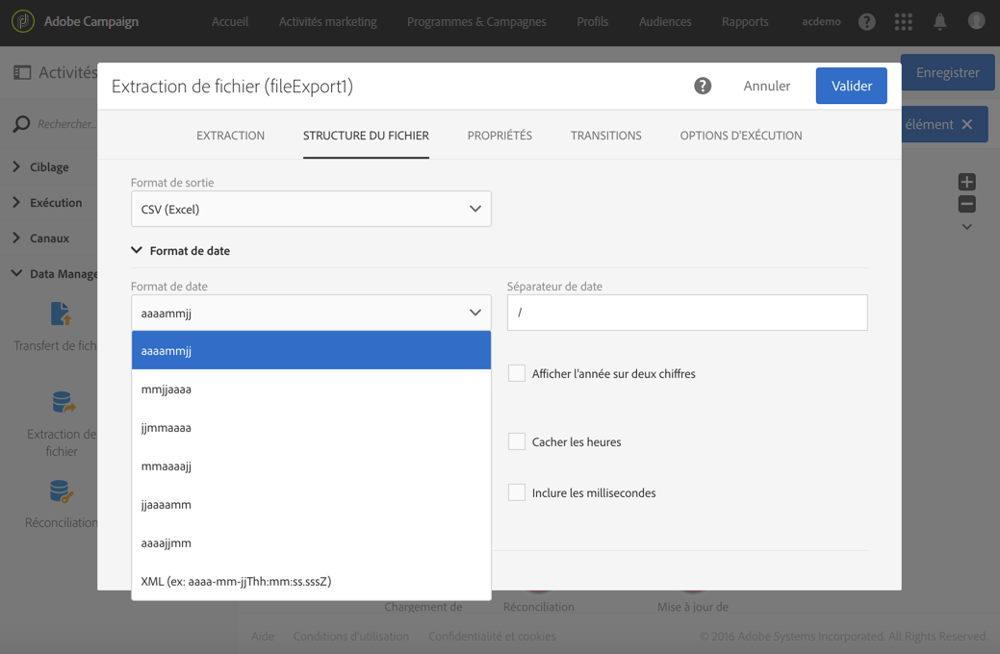
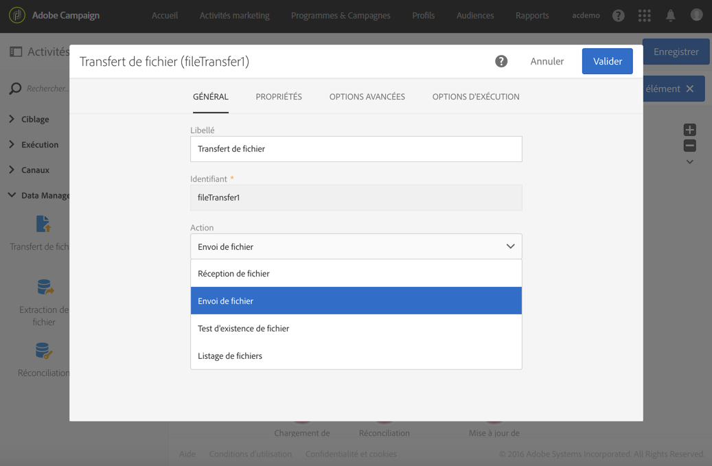
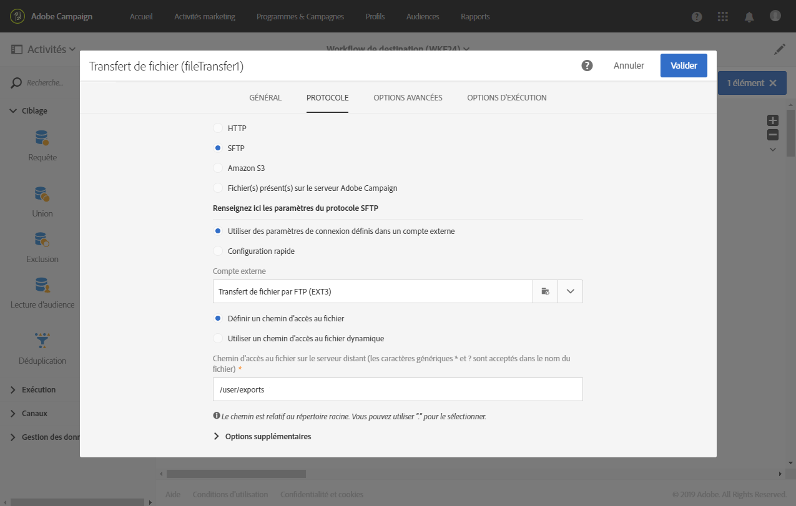

# Extraction de fichier{#extract-file}

## Description {#description}

L'activité **[!UICONTROL Extraction de fichier]permet d'exporter des données présentes dans Adobe Campaign sous la forme d'un fichier externe.**

## Contexte d'utilisation {#context-of-use}

La façon dont les données seront extraites est définie lors du paramétrage de l'activité.

>[!CAUTION]
>
>L'activité **[!UICONTROL Extraction de fichier]** doit être obligatoirement placée à la suite d'une activité **Requête]pour pouvoir être utilisée.[!UICONTROL **

## Configuration {#configuration}

1. Placez une activité **[!UICONTROL Extraction de fichier]dans votre workflow.**

   

1. Sélectionnez l'activité puis ouvrez-la à l'aide du bouton 
1. Indiquez le libellé du **Fichier de sortie**. Le libellé du fichier sera automatiquement complété avec la date et l'heure de création pour être unique. Par exemple : destinataires_20150815_081532.txt pour un fichier généré le 15 août 2015 à 08h15 et 32 secondes.

   >[!NOTE]
   >
   >Il est possible d'utiliser la fonction **[!UICONTROL formatDate]dans ce champ pour spécifier le nom du fichier.**

1. Si vous le souhaitez, vous pouvez compresser le fichier de sortie en sélectionnant **[!UICONTROL Compression]** au niveau du champ **Ajouter une étape de pré-traitement.** Le fichier de sortie sera compressé dans un fichier GZIP (.gz).
1. Sélectionnez le bouton  ou **Ajouter un élément]pour ajouter une colonne de sortie.[!UICONTROL **

   

   Une nouvelle fenêtre s'affiche.

   

1. Composez une expression. Pour cela, vous pouvez sélectionner une expression existante ou en créer une nouvelle avec l'**éditeur d'expression**.
1. Validez votre expression.

   L'expression est ajoutée aux colonnes de sortie.

1. Créez autant de colonnes que nécessaire. Vous pouvez éditer les colonnes en cliquant sur leur expression et leur libellé.

   Si vous exportez des profils et si vous souhaitez les utiliser dans un outil externe, veillez à exporter un identifiant unique. Par défaut, tous les profils ne disposent pas d'un identifiant unique. Cela dépend de la façon dont ils ont été ajoutés dans la base de données. Pour plus d'informations, voir la section [Générer un identifiant unique pour les profils](../../developing/using/configuring-the-resource-s-data-structure.md#generating-a-unique-id-for-profiles-and-custom-resources).

1. Cliquez sur l'onglet **[!UICONTROL Structure de fichier]pour paramétrer les formats de sortie, des dates et des nombres du fichier qui sera exporté.**

   Cochez l'option **[!UICONTROL Exporter les libellés plutôt que les valeurs internes des énumérations]si vous exportez des valeurs d'énumération.** Cette option permet de récupérer des libellés plus courts qui sont compréhensibles à la place d'identifiants.

1. Dans l'onglet **[!UICONTROL Propriétés]**, sélectionnez l'option **Ne pas générer de fichier si la transition entrante est vide]pour éviter de créer et télécharger des fichiers vides sur les serveurs SFTP si la transition entrante est vide.[!UICONTROL **
1. Validez le paramétrage de l'activité et enregistrez le workflow.

## Exemple {#example}

L'exemple suivant illustre le paramétrage d'une activité de type **[!UICONTROL Extraction de fichier]** suivant une activité de type **Requête[!UICONTROL .]**

Le but de ce workflow est d'exporter une liste de profils sous la forme d'un fichier externe afin d'en utiliser les données hors d'Adobe Campaign.

1. Placez une activité de type **[!UICONTROL Extraction de fichier]** à la suite d'une activité de type **Requête[!UICONTROL .]**

   Dans cet exemple, la requête porte sur tous les profils dont l'âge se situe entre 18 et 30 ans inclus.

1. Ouvrez l'activité pour l'éditer.
1. Nommez le fichier de sortie.
1. Ajoutez les colonnes de sortie.

   Dans cet exemple, l'email, l'âge, la date de naissance, le nom et le prénom des profils ciblés sont ajoutés comme colonnes de sortie.

   

1. Cliquez sur l'onglet **[!UICONTROL Structure du fichier]pour définir :**

   * le format de sortie CSV.

      

   * Format de date

      

1. Validez votre activité.
1. Placez une activité de type **[!UICONTROL Transfert de fichier]** à la suite de l'activité **Extraction de fichier]pour récupérer le fichier extrait sur un compte externe.[!UICONTROL **
1. Ouvrez l'activité et choisissez l'action **[!UICONTROL Envoi de fichier].**

   

1. Sélectionnez le compte externe et spécifiez le chemin du dossier sur le serveur.

   

1. Validez votre activité et sauvegardez votre workflow.
1. Démarrez le workflow.

   Lorsque le workflow s'est correctement exécuté, le fichier extrait est disponible sur le compte externe.

