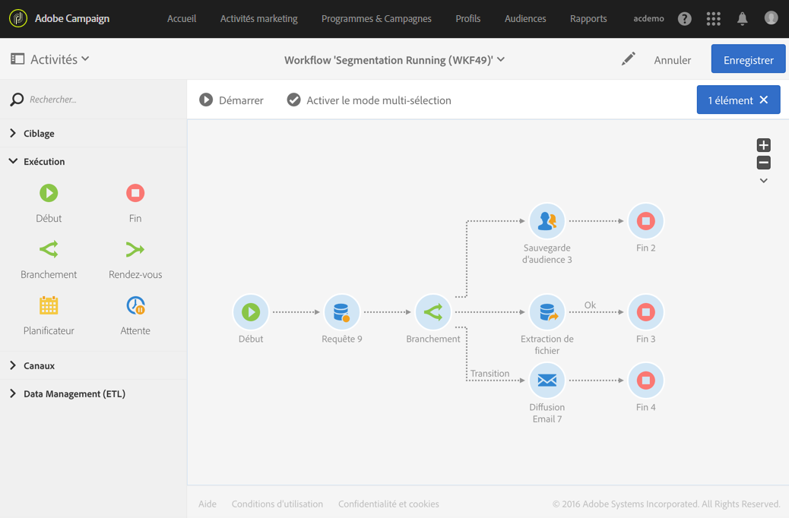

# Branchement{#fork}

## Description {#description}

L&#39;activité **[!UICONTROL Branchement]** permet de créer des transitions sortantes afin de lancer plusieurs activités en parallèle.

## Contexte d&#39;utilisation {#context-of-use}

L&#39;activité **[!UICONTROL Branchement]** permet de réaliser, au sein d&#39;un même workflow, plusieurs exécutions distinctes de manière indépendante.

## Configuration {#configuration}

1. Placez une activité **[!UICONTROL Branchement]** dans votre workflow.
1. Connectez-la à la suite d&#39;autres activités telles que des requêtes.
1. Sélectionnez l’activité puis ouvrez-la à l’aide du bouton , disponible dans les actions rapides qui s’affichent.
1. Définissez le nombre de transitions sortantes en créant, supprimant ou dupliquant des transitions. Vous pouvez également leur attribuer un nom et un libellé.
1. Validez le paramétrage de l’activité et enregistrez le workflow.

## Exemple {#example}

L&#39;exemple suivant montre l&#39;intersection de deux activités de requête visant à cibler les profils de la base Adobe Campaign qui sont des femmes habitant à Paris. Le branchement permet alors de lancer en parallèle plusieurs activités : d&#39;une part une sauvegarde d&#39;audience permettant de garder en mémoire la population calculée, et d&#39;autre part une segmentation permettant d&#39;envoyer deux emails différents avec du contenu ciblé pour chaque segment. Le premier email est envoyé aux femmes parisiennes dont l&#39;âge est compris entre 18 et 40 ans et le second aux femmes parisiennes de plus de 40 ans.

